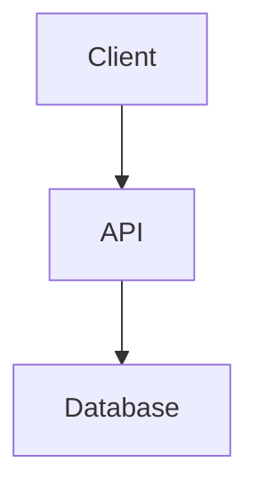

# How to Contribute

Спасибо за желание внести вклад в эту базу знаний.

**Цель проекта** — собрать структурированные материалы для подготовки к техническим собеседованиям по направлениям `Frontend`, `Backend`, `System Design` и `AI-tools`. Мы стремимся создавать контент, который помогает не просто запоминать ответы, а понимать принципы, компромиссы и реальные сценарии использования технологий.


## Какие материалы приветствуются

Мы принимаем:

* ответы на популярные вопросы и задачи с собеседований;
* разборы концепций;
* сравнительные обзоры технологий;
* практические примеры;
* схемы и диаграммы;
* подборки полезных ресурсов.

---

## Формат статей

Каждая статья должна быть посвящена одному вопросу или концепции и оформляться в формате раскрывающегося блока (`details`).

Рекомендуемая структура:

````markdown
<details>
<summary><b>Вопрос?</b></summary>

Краткий ответ на вопрос в 1–3 предложениях.

Основные тезисы:

- пункт 1
- пункт 2
- пункт 3

При необходимости — пример кода:

```typescript
// пример
```

Если тема предполагает сравнение, добавьте таблицу или список отличий.

Если вопрос часто встречается на собеседованиях, укажите типичные уточняющие вопросы и подводные камни.

</details>
````

### Рекомендации по содержанию

Хороший ответ должен:

* начинаться с краткого определения;
* объяснять не только **что это**, но и **зачем используется**;
* раскрывать внутренний механизм работы, если это важно для интервью;
* содержать преимущества, недостатки и ограничения;
* приводить практические примеры;
* включать типичные вопросы, которые могут задать как продолжение темы.

### Код и примеры

* Используйте минимальные, но рабочие примеры.
* Всегда указывайте язык в markdown-блоках.
* Отдавайте предпочтение TypeScript для Frontend и AI-разделов.
* Для архитектурных тем используйте Mermaid-диаграммы.

Пример:

````markdown

````

### Заголовки разделов

Внутри категории (`frontend`, `backend`, `system-design`, `AI`) рекомендуется группировать материалы по тематическим разделам:

```markdown
# Общая теория

<details>...</details>

# Компоненты

<details>...</details>

# Dependency Injection

<details>...</details>
```

Каждый раздел объединяет несколько связанных вопросов, а каждый вопрос оформляется отдельным блоком `<details>`.


---

## Требования к контенту

### Хорошая статья

* объясняет тему простыми словами;
* содержит примеры;
* показывает практические сценарии;
* раскрывает компромиссы и ограничения;
* помогает подготовиться к интервью.

### Плохая статья

* состоит только из копипаста документации;
* содержит неподтвержденную информацию;
* не имеет структуры;
* не объясняет причин и следствий;
* не помогает понять тему глубже.

---

## Правила оформления

### Заголовки

Используйте Markdown-заголовки последовательно:

```markdown
# Заголовок

## Раздел

### Подраздел
```

### Код

Всегда указывайте язык:

````markdown
```typescript
const message = "Hello";
```
````

### Диаграммы

Для диаграмм предпочтительно использовать Mermaid:

````markdown

````

---

## Именование файлов

Используйте понятные имена в kebab-case:

```text
frontend/react-rendering.md
backend/database-indexes.md
system-design/url-shortener.md
AI/rag-architecture.md
```

---

## Pull Request Process

1. Создайте отдельную ветку формата `feature/some-topic-title`.
2. Добавьте или обновите материал.
3. Проверьте форматирование.
4. Убедитесь, что ссылки работают.
5. Создайте Pull Request.

Название PR должно кратко описывать изменение:

```text
feat: Add article about React rendering lifecycle

feat: Improve URL Shortener system design guide

feat: Add RAG interview questions
```

---

## Чек-лист перед отправкой

Перед созданием Pull Request убедитесь, что:

* материал относится к одной из существующих категорий;
* тема не дублирует существующую статью;
* текст структурирован;
* примеры корректны;
* код отформатирован;
* ссылки работают;
* статья помогает подготовиться к собеседованию.

---

## Рекомендации по содержанию

При подготовке материалов старайтесь отвечать не только на вопрос «Что это?», но и на вопросы:

* Почему это работает именно так?
* Какие существуют альтернативы?
* Какие есть компромиссы?
* Когда это решение подходит?
* Какие вопросы по этой теме часто задают на собеседованиях?

Именно такие знания обычно отличают сильного кандидата на интервью.

Спасибо за ваш вклад в развитие базы знаний.
