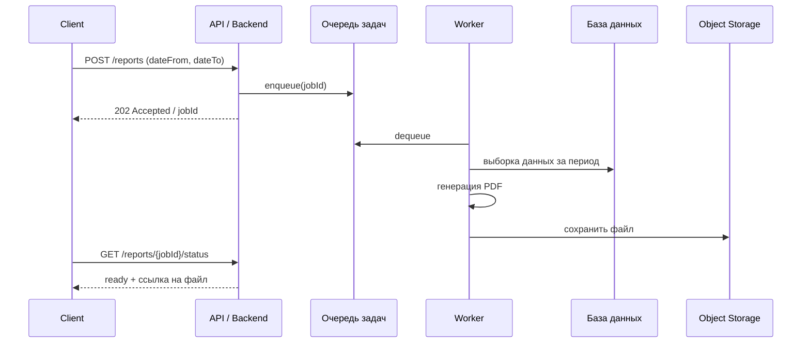

# Диагностика и troubleshooting

<details>
<summary><b>Есть страница с двумя полями (дата начала и дата окончания) и кнопкой формирования отчёта. По нажатию уходит запрос на сервер, и через некоторое время пользователь получает PDF-отчёт. Проблема: пользователи жалуются, что отчёты иногда формируются слишком долго, иногда не формируются вовсе, а иногда запрос падает по таймауту. Есть доступ к backend, frontend и облачной инфраструктуре, где всё развёрнуто. Требуется предложить подход к диагностике проблемы и возможные направления решения.</b></summary>

Симптомы указывают не на единичный баг, а на проблему с производительностью и надёжностью асинхронного пайплайна под нагрузкой/на больших диапазонах дат — нужен системный подход к диагностике, а не угадывание.

Типичная архитектура такого флоу:



Если вместо этого запрос синхронный (клиент держит открытое HTTP-соединение до готовности PDF) — это уже архитектурная причина таймаутов сама по себе, и первый шаг диагностики — понять, какая из схем реализована сейчас.

**План диагностики (от менее инвазивного к более глубокому):**

1. **Логи и трейсинг конкретных провалившихся запросов.**
   - Найти по `requestId`/`jobId`, на каком этапе request застревает: ожидание в очереди, выполнение SQL-запроса, рендеринг PDF, запись в storage, сетевой вызов наружу.
   - Проверить, есть ли вообще запись о том, что job был создан — если жалоба «отчёт не формируется вовсе», возможно, job вообще не доехал до очереди (ошибка на API, потерянное сообщение, silent fail в error handler).

2. **Метрики по стадиям пайплайна** (если трейсинга нет — завести).
   - Время в очереди (queue wait time) — если растёт, проблема в недостатке воркеров/конкурентности, а не в самой генерации.
   - Время генерации PDF в зависимости от размера диапазона дат / объёма данных — если растёт нелинейно, вероятна проблема с запросом к БД или с рендерингом (например, вся выборка грузится в память целиком).
   - Ошибки/retries на уровне воркера и API.

3. **База данных.**
   - Проверить план запроса (`EXPLAIN ANALYZE`) для выборки за произвольный диапазон дат — часто причина: нет индекса по полю даты, полный скан таблицы, которая со временем выросла.
   - Проверить, не блокируется ли запрос конкурентными транзакциями/локами.
   - Проверить пул соединений — если он маленький, а генерация отчётов конкурентна, запросы будут вставать в очередь на уровне пула, а не видно в бизнес-логах.

4. **Ресурсы воркеров / инфраструктура.**
   - CPU/memory на инстансах, генерирующих PDF — рендеринг больших PDF (особенно через headless-браузер типа Puppeteer) может быть CPU- и memory-heavy; OOM-килл воркера объяснит «отчёт не формируется вовсе» без видимой ошибки у пользователя.
   - Автоскейлинг: если воркеров мало и они не масштабируются под пиковую нагрузку, в часы пик очередь растёт — отсюда «иногда долго».
   - Таймауты на разных уровнях (load balancer, API gateway, сам HTTP-клиент фронтенда) — часто они меньше, чем нужно для генерации больших отчётов, и режут соединение раньше, чем закончится работа на бэкенде.

5. **Frontend.**
   - Как фронт ждёт результат: держит соединение открытым (риск таймаута прокси/браузера) или поллит статус задачи? Если первое — это и есть корень проблемы с таймаутами.
   - Обрабатывает ли фронт ошибки/потерю job (например, при перезапуске воркера мидфлайт) — покажет ли он честную ошибку или просто «зависнет»?

**Возможные направления решения:**

- Перевести флоу на асинхронную модель: API сразу отвечает `202 Accepted` + `jobId`, генерация идёт в фоне через очередь, клиент поллит статус или получает уведомление (WebSocket/SSE/email со ссылкой на готовый файл). Это убирает саму возможность HTTP-таймаута.
- Добавить индекс на поле даты (и/или партиционирование таблицы по дате), если выборка — это full scan.
- Ограничить/предупреждать пользователя о слишком широких диапазонах дат (пагинация отчёта, лимит по количеству строк, streaming-генерация PDF вместо загрузки всего в память).
- Увеличить количество воркеров / включить автоскейлинг очереди по её длине, добавить retry с backoff и dead-letter queue для job'ов, которые падают, чтобы они не терялись молча.
- Кэшировать промежуточные данные для часто запрашиваемых периодов.
- Добавить алерты на длину очереди, memory usage воркеров и p95/p99 времени генерации, чтобы обнаруживать деградацию до жалоб пользователей.

**Типичные уточняющие вопросы на собеседовании:**

- Как отличить проблему в БД от проблемы в воркере, не имея трейсинга? (ответ: временные метки в логах на входе/выходе каждой стадии, даже без полноценного APM)
- Что делать, если баг не воспроизводится стабильно? (искать корреляцию с размером диапазона дат, временем суток, нагрузкой на систему в момент жалобы)
- Как построить SLA для таких асинхронных операций?

</details>

<details>
<summary><b>Есть большой набор данных по заказам. Нужно получить отчёты за большой период, и текущая реализация использует пагинацию через LIMIT/OFFSET, из-за чего запросы работают медленно. Нужно предложить, как переписать получение данных, чтобы улучшить производительность, и какие ещё оптимизации вокруг базы данных можно применить.</b></summary>

Проблема `LIMIT/OFFSET` в том, что база данных не может напрямую «перепрыгнуть» к нужной странице: чтобы отдать строки с 100 000-й по 100 020-ю, ей приходится отсканировать и отсортировать (или пройти по индексу) все 100 020 строк, отбросив первые 100 000. Чем дальше страница — тем дороже запрос, деградация линейная по глубине пагинации, а на большом периоде по заказам это как раз худший случай.

```sql
-- медленно на глубоких страницах: БД читает и отбрасывает 100 000 строк
SELECT * FROM orders
WHERE created_at BETWEEN :from AND :to
ORDER BY created_at, id
LIMIT 20 OFFSET 100000;
```

**Переход на keyset (cursor-based) пагинацию.**

Вместо `OFFSET` запоминаем значение ключа сортировки последней строки предыдущей страницы и продолжаем с него — это позволяет использовать индекс напрямую (`index range scan`) без сканирования пропускаемых строк:

```sql
-- быстро: используется индекс (created_at, id), нет сканирования лишних строк
SELECT * FROM orders
WHERE created_at BETWEEN :from AND :to
  AND (created_at, id) > (:last_created_at, :last_id)
ORDER BY created_at, id
LIMIT 20;
```

- Обязательно нужен составной индекс `(created_at, id)` — сортировка и фильтр должны покрываться одним индексом, иначе БД всё равно уйдёт в sort/scan.
- `id` (или другой уникальный столбец) добавляется в ключ и в `ORDER BY`, чтобы разрывать ничьи между строками с одинаковым `created_at` — иначе можно потерять или задвоить строки на границе страниц.
- Курсор (`last_created_at`, `last_id`) отдаётся клиенту как непрозрачный токен, а не как номер страницы — это заодно защищает от «прыжков» на произвольную страницу, которые всё равно ломают идею курсора.
- Компромисс: keyset-пагинация не даёт перейти сразу на «страницу 500» — она рассчитана на последовательный проход (лента, экспорт, бесконечный скролл), что для отчёта за период обычно и требуется.

**Другие оптимизации вокруг БД для отчётов по большому объёму заказов:**

- **Партиционирование таблицы `orders` по дате** (`created_at`) — отчёт за период тогда затрагивает только нужные партиции (partition pruning), а не всю таблицу целиком; также упрощает удаление/архивацию старых данных.
- **Покрывающий индекс (covering index)** под конкретный отчётный запрос — если индекс включает все нужные для отчёта столбцы, БД может ответить только по индексу, не обращаясь к самим строкам таблицы (index-only scan).
- **Материализованные представления / предрасчитанные агрегаты** для тяжёлых отчётов (суммы по дням/неделям), которые пересчитываются по расписанию или инкрементально, вместо агрегации сырых данных на каждый запрос.
- **Вынос отчётной нагрузки на read-реплику** или отдельное аналитическое хранилище (OLAP/columnar, например ClickHouse), чтобы тяжёлые отчётные запросы не конкурировали за ресурсы с транзакционной нагрузкой (OLTP) на основной БД.
- **Потоковая выгрузка (streaming/cursor на уровне драйвера)** вместо загрузки всего результата в память бэкенда — особенно важно, если отчёт формируется как CSV/PDF по большому числу заказов.
- **Кэширование** результатов для часто запрашиваемых периодов (например, «отчёт за прошлый месяц» после его закрытия уже не меняется и может кэшироваться бессрочно).

**Типичные уточняющие вопросы на собеседовании:**

- Как обеспечить стабильную сортировку при keyset-пагинации, если сортировочный столбец не уникален? (добавить уникальный столбец-тайбрейкер, например `id`, в индекс и в условие сравнения)
- Что делать, если нужен произвольный доступ к странице (не только «дальше»)? (гибрид: keyset для основного сценария + отдельный, более дорогой путь с `OFFSET` только для явного перехода на страницу — либо предпосчитанные "снимки" курсоров для фиксированных страниц)
- Чем партиционирование отличается от шардирования и когда нужно второе? (партиционирование — деление данных внутри одной БД/инстанса; шардирование — распределение между разными инстансами/узлами, нужно при исчерпании вертикального масштабирования одной БД)

</details>
