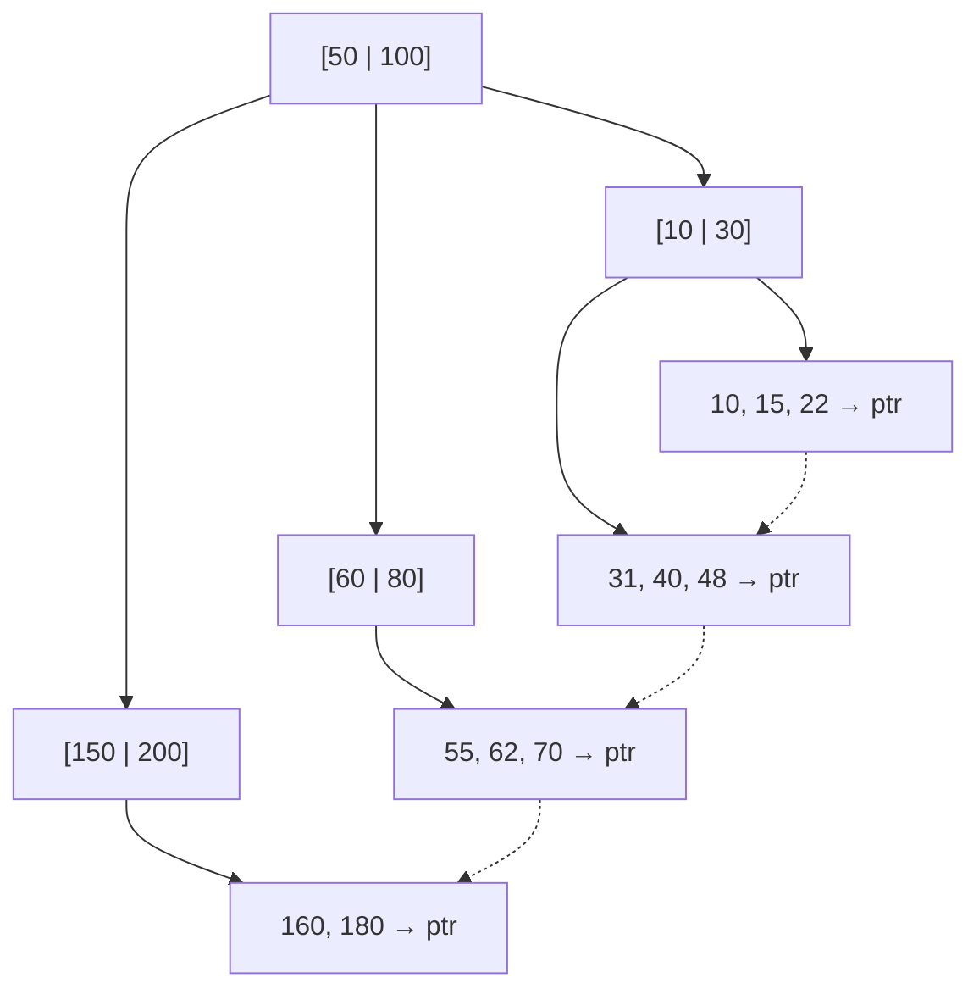
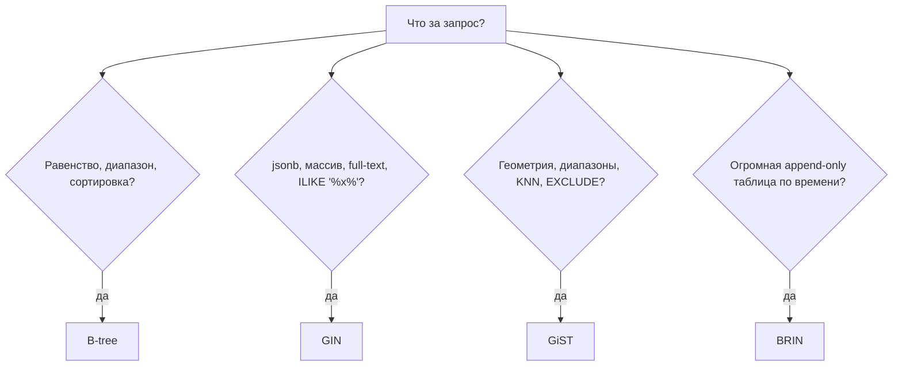

# Индексы

<details>
<summary><b>Что такое индексы в базах данных и для чего они нужны?</b></summary>

Индекс — это отдельная структура данных (чаще всего B-tree), которая хранит значения одной или нескольких колонок в упорядоченном виде вместе со ссылками на строки таблицы. Нужен он для того, чтобы находить строки за `O(log n)` вместо полного перебора таблицы (`O(n)`), то есть чтобы ускорить чтение по условию.

---

### Зачем это нужно

Без индекса СУБД делает **Seq Scan (Full Table Scan)** — читает все страницы таблицы и проверяет условие для каждой строки. На таблице в 10 млн строк это десятки тысяч чтений с диска даже ради одной строки.

С индексом СУБД спускается по дереву от корня к листу: 3–4 обращения к страницам вместо всей таблицы.

```sql
-- без индекса: Seq Scan, читаются все строки
SELECT * FROM users WHERE email = 'ivan@example.com';

CREATE INDEX idx_users_email ON users (email);

-- с индексом: Index Scan, 3-4 чтения
EXPLAIN ANALYZE SELECT * FROM users WHERE email = 'ivan@example.com';
```

---

### Как устроен B-tree индекс



- Значения хранятся отсортированными, дерево сбалансировано — глубина одинакова для всех ключей.
- В листьях лежат ключи и указатели на физическое расположение строки (в PostgreSQL — `ctid`, в InnoDB — значение первичного ключа).
- Листья связаны в двусвязный список, поэтому индекс работает не только на `=`, но и на диапазонах (`>`, `<`, `BETWEEN`), сортировке (`ORDER BY`) и префиксном `LIKE 'abc%'`.

---

### Какие задачи решает индекс

- **Поиск по условию** в `WHERE` и `JOIN` (соединение по индексированному ключу вместо Nested Loop по всей таблице).
- **Сортировка** — данные в индексе уже упорядочены, `ORDER BY` не требует отдельного шага сортировки.
- **Уникальность** — `UNIQUE INDEX` физически гарантирует отсутствие дублей, это ограничение целостности, а не только оптимизация.
- **Covering index** — если все нужные запросу колонки есть в индексе, СУБД читает только индекс и вообще не идёт в таблицу (`Index Only Scan`).

---

### Цена индексов

Индекс — это всегда размен «быстрое чтение за медленную запись и место».

| Что | Влияние |
|---|---|
| `SELECT` по индексированной колонке | быстрее на порядки |
| `INSERT` / `UPDATE` / `DELETE` | медленнее: каждый индекс нужно перестроить |
| Дисковое пространство | +индекс к размеру таблицы (иногда сопоставимо с ней) |
| Планировщик | больше вариантов плана, дольше планирование |

Поэтому индексы не ставят «на всякий случай» на все колонки — их добавляют под реальные запросы, видимые в логах медленных запросов или в `EXPLAIN`.

---

### Когда индекс не поможет

- Низкая **селективность**: индекс по колонке `is_active` (два значения) чаще всего будет проигнорирован — планировщику дешевле прочитать таблицу целиком, чем прыгать по случайным страницам.
- Запрос возвращает большую долю таблицы (условно >10–20%) — снова выигрывает Seq Scan.
- Условие «прячет» колонку под функцией или приведением типа:

```sql
-- индекс по created_at НЕ используется
SELECT * FROM orders WHERE DATE(created_at) = '2024-01-01';

-- используется
SELECT * FROM orders
WHERE created_at >= '2024-01-01' AND created_at < '2024-01-02';
```

- `LIKE '%abc'` (поиск по суффиксу) — обычный B-tree бесполезен, нужен GIN/trigram.
- Маленькая таблица — она и так целиком лежит в кэше.

---

### Типичные уточняющие вопросы на собеседовании

- **Чем отличаются clustered и non-clustered индексы?** Clustered задаёт физический порядок строк на диске (в InnoDB это первичный ключ, сама таблица и есть индекс), non-clustered хранит только ключ и ссылку. Clustered индекс может быть только один.
- **Что такое составной индекс и правило левого префикса?** Индекс `(a, b, c)` работает для условий по `a`, `(a, b)`, `(a, b, c)`, но не по `b` или `c` отдельно — потому что сортировка по `b` имеет смысл только внутри одинаковых `a`.
- **Почему индекс может не использоваться?** Низкая селективность, устаревшая статистика (`ANALYZE`), функция над колонкой, несовпадение типов.
- **Какие ещё бывают типы индексов?** Hash (только `=`), GIN (полнотекстовый поиск, `jsonb`, массивы), GiST (геоданные, диапазоны), BRIN (огромные таблицы с естественным порядком, например по времени).
- **Что такое частичный индекс?** `CREATE INDEX ... WHERE is_deleted = false` — индексируется только часть строк, индекс меньше и быстрее.

</details>
<details>
<summary><b>Какие типы индексов существуют в PostgreSQL и чем они отличаются?</b></summary>

В PostgreSQL шесть встроенных типов индексов: **B-tree** (по умолчанию), **Hash**, **GiST**, **SP-GiST**, **GIN** и **BRIN**. Они отличаются внутренней структурой и, как следствие, набором операторов, которые умеют ускорять: B-tree работает со сравнением и порядком, GIN — с составными значениями (массивы, `jsonb`, полнотекстовый поиск), GiST — с геометрией и диапазонами, BRIN — с огромными таблицами, где данные физически упорядочены.

Тип задаётся через `USING`:

```sql
CREATE INDEX idx_docs_search ON documents USING GIN (search_vector);
```

---

### Сравнительная таблица

| Тип | Структура | Ускоряет операторы | Типичный случай | Размер |
|---|---|---|---|---|
| **B-tree** | сбалансированное дерево | `=`, `<`, `>`, `BETWEEN`, `IN`, `IS NULL`, `LIKE 'abc%'`, `ORDER BY` | 95% задач: id, email, даты, статусы | средний |
| **Hash** | хеш-таблица | только `=` | длинные строки/URL, где нужен строгий поиск по равенству | меньше B-tree |
| **GiST** | сбалансированное дерево с «обобщённым» предикатом | `&&`, `<@`, `@>`, `<->` (KNN) | геоданные (PostGIS), диапазоны `tsrange`, поиск ближайших | средний |
| **SP-GiST** | несбалансированное дерево (quad-tree, radix-tree) | `=`, `<<`, `>>`, префиксный поиск | IP-адреса (`inet`), телефонные префиксы, точки | небольшой |
| **GIN** | инвертированный индекс | `@>`, `?`, `@@`, `&&` | `jsonb`, массивы, full-text search | большой |
| **BRIN** | min/max по диапазонам страниц | `=`, `<`, `>`, `BETWEEN` | append-only таблицы логов/метрик по времени | крошечный |

---

### B-tree — дефолт

Создаётся при `CREATE INDEX` без `USING`, а также автоматически для `PRIMARY KEY` и `UNIQUE`.

- Умеет всё, что связано с упорядоченностью: равенство, диапазоны, сортировку, `MIN`/`MAX`, `Index Only Scan`.
- Поддерживает составные индексы и правило левого префикса.
- Если сомневаетесь, какой тип нужен — нужен B-tree.

---

### Hash — почти всегда не нужен

- Хранит хеш значения, поэтому знает только «равно / не равно»: ни диапазонов, ни сортировки, ни составных индексов, ни `UNIQUE`.
- До PostgreSQL 10 не писался в WAL и не переживал репликацию/крэш — отсюда историческая репутация «не используйте hash». С 10-й версии это исправлено.
- Реальный выигрыш небольшой: индекс компактнее B-tree на длинных ключах (хранится 4-байтный хеш, а не сама строка). B-tree всё равно предпочтительнее, потому что универсальнее.

---

### GiST — «обобщённое» дерево

GiST — это не индекс, а фреймворк: дерево, в узлах которого лежит предикат вида «все потомки удовлетворяют условию X». Конкретный тип данных подставляет свою реализацию.

```sql
-- нет пересекающихся броней по одной комнате
ALTER TABLE bookings
  ADD CONSTRAINT no_overlap
  EXCLUDE USING GiST (room_id WITH =, during WITH &&);
```

- Основные пользователи: PostGIS (`geometry`), диапазонные типы (`tsrange`, `int4range`), `EXCLUDE`-ограничения.
- Умеет **KNN-поиск** (`ORDER BY point <-> '(0,0)' LIMIT 10`) — «найди 10 ближайших», чего B-tree не может в принципе.
- Дерево может быть с потерями (lossy): индекс отдаёт кандидатов, а точная проверка идёт по таблице (`Recheck Cond` в `EXPLAIN`).

---

### SP-GiST — для несбалансированных структур

- Space-Partitioned GiST: разбивает пространство на непересекающиеся области — quad-tree, k-d tree, radix-tree.
- Хорош там, где данные естественно иерархичны и неравномерны: IP-подсети (`inet`), префиксы строк, точки на плоскости.
- Не поддерживает многоколоночные индексы (до PG 14) и в целом используется редко — нишевый инструмент.

---

### GIN — для «много значений в одной строке»

Инвертированный индекс: ключ → список строк, где он встречается. Ровно то, что нужно, когда в одной ячейке лежит множество элементов.

```sql
-- поиск по jsonb
CREATE INDEX idx_props ON products USING GIN (properties);
SELECT * FROM products WHERE properties @> '{"color": "red"}';

-- full-text search
CREATE INDEX idx_fts ON articles USING GIN (to_tsvector('russian', body));
SELECT * FROM articles WHERE to_tsvector('russian', body) @@ plainto_tsquery('индексы');

-- поиск подстроки в середине — то, что не умеет B-tree
CREATE EXTENSION pg_trgm;
CREATE INDEX idx_name_trgm ON users USING GIN (name gin_trgm_ops);
SELECT * FROM users WHERE name ILIKE '%иван%';
```

- Читает очень быстро, но **пишет медленно**: одна вставка строки может задеть сотни ключей. Смягчается буфером `fastupdate` (`gin_pending_list_limit`).
- Индекс крупный — часто больше самой колонки.

---

### BRIN — минимальный размер за счёт точности

Block Range INdex хранит не ссылки на строки, а min/max значения для каждого блока страниц (по умолчанию 128 страниц = 1 МБ).

```sql
CREATE INDEX idx_events_time ON events USING BRIN (created_at);
```

- Индекс на таблицу в 100 ГБ занимает единицы мегабайт.
- При поиске отбрасывает целые диапазоны страниц, а внутри оставшихся делает перебор — это компромисс «крошечный индекс за менее точный поиск».
- **Критическое условие**: физический порядок строк должен коррелировать со значением колонки. Идеально для append-only логов, где `created_at` растёт вместе со вставкой. Если данные вставляются вперемешку — BRIN бесполезен.

---

### Как выбирать



---

### Типичные уточняющие вопросы на собеседовании

- **GIN или GiST для full-text search?** GIN быстрее ищет, GiST быстрее обновляется и меньше весит. Для статики и преимущественно чтения — GIN, для часто меняющихся данных — GiST.
- **Почему hash-индекс не поддерживает `UNIQUE`?** Из-за коллизий: одинаковый хеш не означает одинаковое значение, а проверка уникальности потребовала бы обращения к таблице; реализация просто этого не делает.
- **Что такое класс операторов (`opclass`)?** Набор операторов и функций, говорящий индексу, как сравнивать конкретный тип: `gin_trgm_ops`, `jsonb_path_ops`, `text_pattern_ops` (нужен для `LIKE 'abc%'` в не-C локали).
- **Чем `jsonb_path_ops` отличается от дефолтного `jsonb_ops`?** Индексирует только пути целиком — меньше размер и быстрее `@>`, но не поддерживает оператор существования ключа `?`.
- **Что такое покрывающий индекс через `INCLUDE`?** `CREATE INDEX ... ON t (a) INCLUDE (b)` — `b` кладётся только в листья, не участвует в поиске, но позволяет `Index Only Scan`. Поддерживается B-tree и GiST.

</details>

# Оптимизация запросов

<details>
<summary><b>Что такое проблема N+1 запросов и как её решать?</b></summary>

N+1 — это когда приложение делает 1 запрос за списком сущностей, а затем ещё по одному запросу за связанными данными для каждой из N строк. Проблема не в самих запросах (они обычно быстрые и по индексу), а в том, что каждый из них — отдельный round-trip к базе, и суммарная задержка растёт линейно с размером списка.

---

### Как это выглядит в коде

```typescript
// 1 запрос: получаем пользователей
const users = await db.user.findMany({ take: 100 });

// + N запросов: по одному на каждого пользователя
for (const user of users) {
  user.posts = await db.post.findMany({ where: { authorId: user.id } });
}
// итого 101 запрос вместо одного-двух
```

Опасность в том, что код выглядит идеально: цикл по массиву и обычный `await` внутри. То же самое незаметно возникает в ORM при lazy loading (обращение к полю `user.posts` само дёргает базу) и в GraphQL-резолверах, где резолвер поля вызывается отдельно для каждого элемента списка.

---

### Почему это дорого

Дело в latency, а не в стоимости запросов:

- запрос по индексу выполняется за ~0.2 мс, но round-trip до базы — 1–2 мс (а через сеть в другую зону доступности, AZ — availability zone, — порядка нескольких миллисекунд);
- 100 последовательных `await` = 100 × latency, то есть 100–1000 мс, где хватило бы 2 мс;
- запросы идут **последовательно**: пока не вернулся предыдущий, следующий не отправлен;
- каждый запрос занимает соединение из пула — под нагрузкой пул исчерпывается, и запросы начинают ждать друг друга ещё и в очереди.

Индексы здесь не спасают: они ускоряют каждый отдельный запрос, но их количество остаётся тем же.

---

### Способы решения

**1. `JOIN` / eager loading — забрать всё одним запросом**

```typescript
// Prisma
const users = await db.user.findMany({ take: 100, include: { posts: true } });

// TypeORM
const users = await repo.find({ take: 100, relations: ["posts"] });
```

```sql
SELECT u.*, p.*
FROM users u
LEFT JOIN posts p ON p.author_id = u.id
WHERE u.id IN (...);
```

Цена: строки пользователя дублируются на каждый его пост, и по сети едет больше данных. Если подтянуть сразу две коллекции (`posts` и `comments`), получится **cartesian explosion**: 10 постов × 20 комментариев = 200 строк на одного пользователя. Поэтому многие ORM для коллекций сами разбивают выборку на несколько запросов вместо одного `JOIN`.

**2. Батчинг: один запрос `IN (...)` + группировка в приложении**

```typescript
const users = await db.user.findMany({ take: 100 });
const posts = await db.post.findMany({
  where: { authorId: { in: users.map((u) => u.id) } },
});

const byAuthor = new Map<string, Post[]>();
for (const post of posts) {
  const list = byAuthor.get(post.authorId) ?? [];
  list.push(post);
  byAuthor.set(post.authorId, list);
}
for (const user of users) {
  user.posts = byAuthor.get(user.id) ?? [];
}
```

Два запроса вместо N+1, без дублирования строк. Ограничение — размер списка в `IN`: несколько тысяч id стоит резать на чанки.

**3. DataLoader — стандартное решение для GraphQL**

Резолвер поля вызывается для каждого элемента списка, и переписать это в «один запрос» напрямую нельзя. DataLoader ставит вызовы в очередь и собирает их в один батч в конце текущего тика event loop (`process.nextTick`), после чего выполняет одну функцию-загрузчик на все ключи сразу:

```typescript
const postsLoader = new DataLoader<string, Post[]>(async (authorIds) => {
  const posts = await db.post.findMany({
    where: { authorId: { in: [...authorIds] } },
  });
  // порядок результата должен строго соответствовать порядку ключей
  return authorIds.map((id) => posts.filter((p) => p.authorId === id));
});

// в резолвере: 100 вызовов схлопнутся в один запрос к базе
const resolvers = {
  User: { posts: (user) => postsLoader.load(user.id) },
};
```

Плюс DataLoader кэширует результат по ключу в рамках одного HTTP-запроса, поэтому повторные обращения к тому же id базу не трогают. Инстанс загрузчика создаётся **на каждый запрос**, иначе кэш станет глобальным и пользователи начнут видеть чужие устаревшие данные.

**4. Денормализация и кэш**

Оправданы, когда связанные данные читаются на порядки чаще, чем меняются: счётчик `posts_count` в таблице пользователя, агрегаты в отдельной таблице, кэш в Redis. Цена — риск рассинхронизации, поэтому это последний шаг, а не первый.

---

### Сравнение подходов

| Подход | Запросов | Когда подходит | Минусы |
|---|---|---|---|
| Наивный цикл | N+1 | никогда осознанно | latency × N |
| `JOIN` / eager loading | 1 | связь «один-к-одному», одна коллекция | дублирование строк, cartesian explosion |
| Батчинг `IN (...)` | 2 | коллекции, несколько связей | ручная группировка в коде |
| DataLoader | 2 | GraphQL, произвольная вложенность | нужен инстанс на запрос |
| Денормализация / кэш | 0–1 | чтений намного больше, чем записей | рассинхронизация данных |

---

### Как обнаружить

- Включить лог SQL у ORM (`log: ['query']` в Prisma, `logging: true` в TypeORM) и посмотреть, что реально уходит в базу на один HTTP-запрос.
- Счётчик запросов на запрос: middleware, который считает обращения к базе и пишет warning при превышении порога — самый дешёвый способ поймать регрессию в CI.
- APM/трейсинг (OpenTelemetry, Datadog): на waterfall-диаграмме N+1 виден мгновенно — «лесенка» из одинаковых коротких спанов.
- Признак в проде: время ответа растёт линейно с размером страницы (limit 10 — 50 мс, limit 100 — 500 мс).

---

### Типичные уточняющие вопросы на собеседовании

- **Чем eager loading отличается от lazy loading?** Eager — связанные данные грузятся сразу вместе с основной сущностью (явным `include`/`relations`); lazy — при первом обращении к полю. Lazy удобнее в коде и именно он чаще всего порождает N+1 незаметно.
- **Почему `JOIN` не всегда лучше двух запросов?** Из-за дублирования: при `JOIN` по коллекции данные родителя повторяются в каждой строке, а два `JOIN`а к разным коллекциям перемножаются. Два запроса передают меньше данных и группируются в приложении дешевле, чем база строит широкий результат.
- **Как N+1 связан с GraphQL?** Клиент сам задаёт вложенность, а резолвер поля вызывается для каждого элемента списка — N+1 возникает по самой архитектуре, поэтому DataLoader (или его аналог в конкретном сервере) считается обязательным, а не оптимизацией.
- **Решает ли проблему кэш?** Только частично: он убирает повторные запросы, но первый «холодный» запрос всё равно даст N обращений, а инвалидация добавит свой класс багов.
- **Как это связано с пулом соединений?** N+1 держит соединение дольше и умножает число обращений; при 100 RPS × 100 запросов пул на 10 соединений становится узким местом раньше, чем сама база.

</details>
