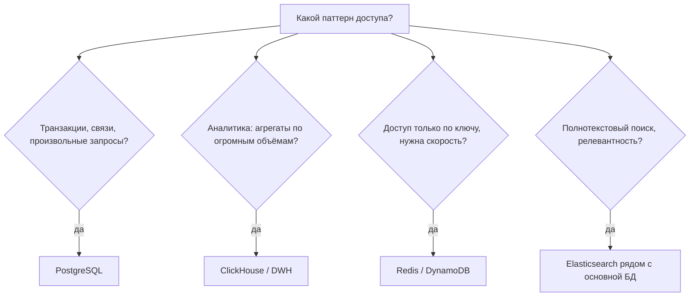
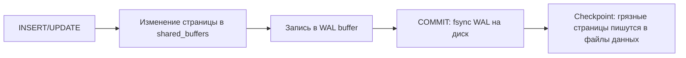
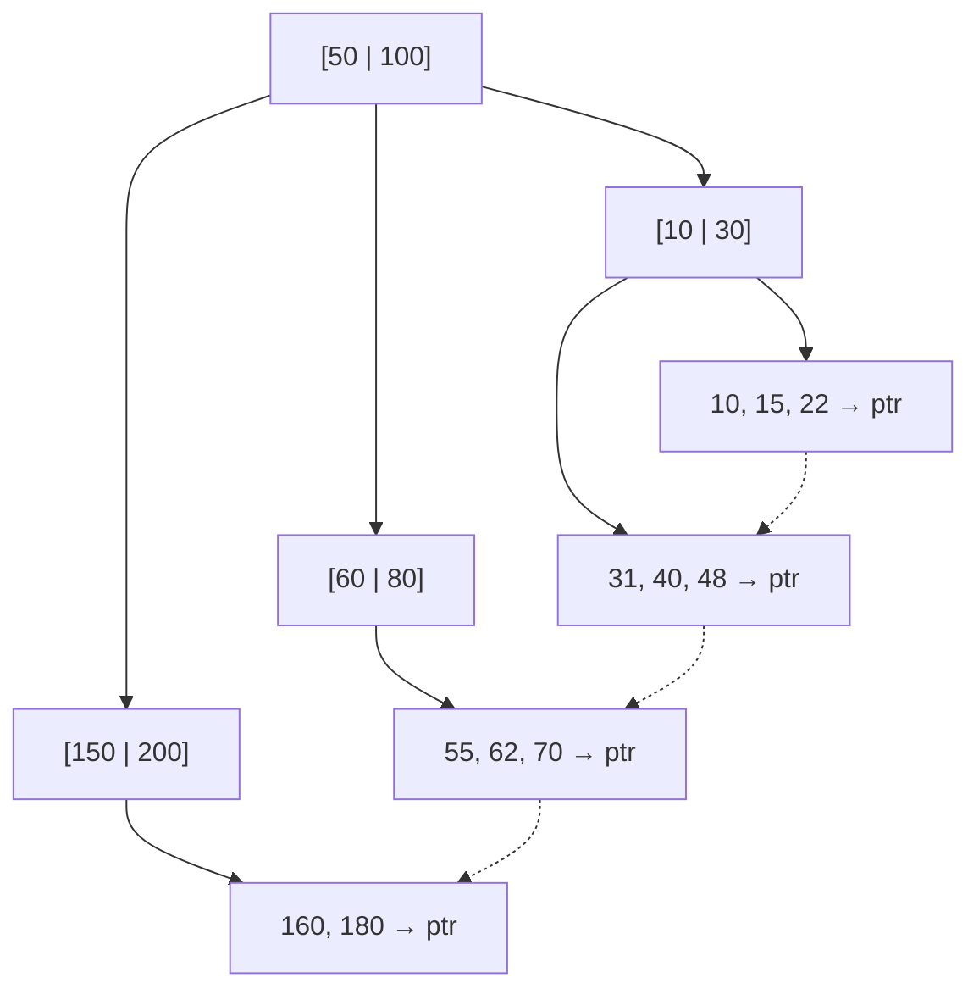
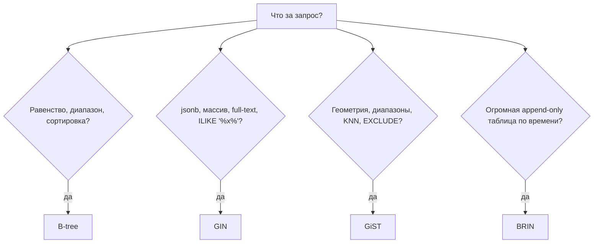
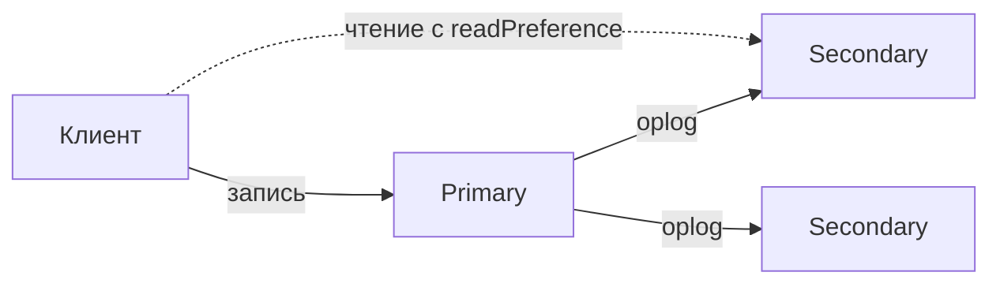
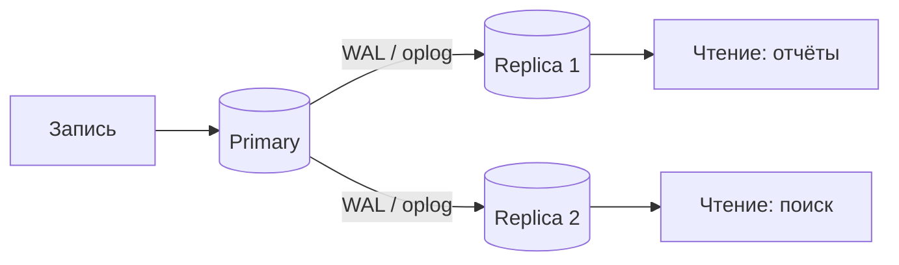

# Виды баз данных и выбор хранилища

<details>
<summary><b>Какие бывают виды баз данных и как выбрать подходящую под задачу?</b></summary>

Базы данных различаются моделью данных и тем, какие запросы они умеют делать дёшево: реляционные (PostgreSQL, MySQL) — строки и связи, документные (MongoDB) — вложенные документы, key-value (Redis) — быстрый доступ по ключу, колоночные (ClickHouse) — аналитика по миллиардам строк, графовые (Neo4j) — обход связей, time-series (TimescaleDB) — метрики по времени. Выбор делается от **паттерна доступа**, а не от моды.

---

### Сравнение

| Тип | Представители | Модель данных | Сильная сторона | Слабая сторона |
|---|---|---|---|---|
| **Реляционные (OLTP)** | PostgreSQL, MySQL | таблицы, строгая схема, JOIN | транзакции, целостность, гибкие запросы | горизонтальное масштабирование записи |
| **Документные** | MongoDB, DocumentDB | JSON-документы | схема «на лету», агрегат целиком одним чтением | связи между документами, аналитика |
| **Key-value** | Redis, DynamoDB | ключ → значение | микросекундные чтения, кэш, счётчики, локи | нет запросов «по содержимому» |
| **Колоночные (OLAP)** | ClickHouse, BigQuery | колонки, сжатие | агрегаты по миллиардам строк | точечные `UPDATE`/`DELETE`, транзакции |
| **Графовые** | Neo4j | узлы и рёбра | обход связей произвольной глубины | всё остальное |
| **Time-series** | TimescaleDB, InfluxDB | (время, метрика) | запись потока метрик, retention-политики | нетиповые запросы |
| **Поисковые** | Elasticsearch, OpenSearch | инвертированный индекс | полнотекстовый поиск, фасеты | не источник правды (нет строгой консистентности) |

---

### Как выбирать на практике



Практическое правило: **начинать с PostgreSQL**. Он закрывает реляционные данные, документы (`jsonb`), очереди (`SKIP LOCKED`), полнотекстовый поиск (`tsvector`), гео (PostGIS) и time-series (TimescaleDB) — и только когда упирается конкретная метрика (объём аналитики, latency кэша, качество поиска), рядом ставится специализированное хранилище.

### Полиглотное хранение

В реальной системе обычно несколько БД одновременно: PostgreSQL как источник правды, Redis как кэш и хранилище сессий, ClickHouse для аналитики, Elasticsearch для поиска. Цена такого решения — **синхронизация данных** (CDC, outbox, репликация) и отсутствие транзакций между хранилищами.

### Типичные уточняющие вопросы на собеседовании

- **Что такое OLTP и OLAP?** OLTP — много коротких транзакций с точечным чтением/записью (интернет-магазин), OLAP — редкие тяжёлые аналитические запросы по большим срезам (отчёты, BI).
- **Почему для аналитики колоночное хранение быстрее?** Разница в том, как данные лежат на диске (на страницах/блоках). В строчном хранении (PostgreSQL, MySQL) одна страница содержит целые строки — все колонки подряд, поэтому запрос вида `SUM(amount)` по миллиарду строк вынужден читать с диска и колонки, которые ему не нужны. В колоночном хранении (ClickHouse, BigQuery) каждая колонка физически хранится отдельно от других: страница содержит только значения одной колонки, поэтому аналитический запрос читает с диска только те колонки, что участвуют в запросе — на порядок меньше I/O. Дополнительный выигрыш — однотипные соседние значения в колонке (даты, статусы, суммы) сжимаются намного эффективнее, чем вперемешку лежащие значения разных колонок в строке.
- **Что такое CAP-теорема и как её применяют?** При сетевом разделении система выбирает между консистентностью и доступностью. На практике полезнее PACELC: даже без разделения есть размен между latency и консистентностью.
- **Можно ли использовать PostgreSQL как очередь?** Да, `SELECT ... FOR UPDATE SKIP LOCKED` — рабочий паттерн для умеренных нагрузок, при десятках тысяч сообщений в секунду уже нужен брокер.

</details>

<details>
<summary><b>PostgreSQL или MongoDB: чем они отличаются и что выбрать под конкретный проект?</b></summary>

PostgreSQL — реляционная СУБД со строгой схемой, полноценными транзакциями и JOIN. MongoDB — документная БД, где данные хранятся агрегатами (BSON-документами) и оптимизирована под чтение/запись целого документа. Ключевое отличие не «SQL против NoSQL», а **где живут связи**: в PostgreSQL их разрешает СУБД через JOIN, в MongoDB их обычно «схлопывают» в документ на этапе моделирования.

---

### Сравнение по существенным пунктам

| Критерий | PostgreSQL | MongoDB |
|---|---|---|
| Схема | строгая, миграции обязательны | гибкая, но `$jsonSchema`-валидация желательна |
| Связи | `JOIN`, внешние ключи | вложенность или `$lookup` (медленнее, ограниченнее) |
| Транзакции | ACID по умолчанию, много таблиц | ACID внутри документа; многодокументные есть с 4.0, но дороже |
| Масштабирование записи | вертикально + шардинг «руками» (Citus, партиционирование) | встроенный шардинг по ключу |
| Запросы | SQL, оконные функции, CTE, произвольные агрегаты | Aggregation Pipeline, слабее в произвольной аналитике |
| Целостность | FK, `CHECK`, `UNIQUE`, констрейнты | почти всё на стороне приложения |
| Гибкие данные | `jsonb` + GIN-индексы | нативно |

### Когда MongoDB действительно уместен

- Данные естественно **агрегат**: документ читается и пишется целиком (карточка товара с атрибутами, профиль с настройками, лог события).
- Схема заранее неизвестна или сильно разнится между записями (интеграции, формы, CMS).
- Нужен простой горизонтальный шардинг «из коробки» при огромном потоке записи.

### Когда PostgreSQL лучше почти всегда

- Есть деньги, остатки, статусы — то есть нужны транзакции на несколько сущностей.
- Данные связаны много-ко-многим и запросы заранее не известны: в MongoDB под каждый новый запрос приходится либо менять модель, либо делать `$lookup`.
- Нужны отчёты и аналитика в той же базе.

Важный аргумент: у PostgreSQL есть `jsonb` с GIN-индексами, поэтому «гибкая часть» схемы прекрасно живёт в реляционной БД, а вот транзакций и JOIN в MongoDB не появится.

```sql
-- гибкие атрибуты в PostgreSQL без потери транзакционности
ALTER TABLE products ADD COLUMN attrs jsonb NOT NULL DEFAULT '{}';
CREATE INDEX idx_products_attrs ON products USING GIN (attrs jsonb_path_ops);

SELECT * FROM products WHERE attrs @> '{"color": "red"}';
```

### Частый миф

«MongoDB быстрее» — верно только для сценария «прочитать/записать один документ целиком без связей». Как только появляются `$lookup`, транзакции и произвольные агрегаты, PostgreSQL обычно выигрывает.

### Типичные уточняющие вопросы на собеседовании

- **Как в MongoDB обеспечить целостность между коллекциями?** Только на стороне приложения либо многодокументной транзакцией внутри replica set — внешних ключей нет.
- **Что такое write concern и read concern?** Параметры надёжности записи (`w: 1`, `w: "majority"`, `j: true`) и свежести чтения (`local`, `majority`, `linearizable`). Дефолтные значения — самое частое место, где теряют данные.
- **Как хранить в PostgreSQL полуструктурированные данные?** `jsonb` (бинарный, индексируемый) вместо `json` (текст); `jsonb` не сохраняет порядок ключей и дубли, зато поддерживает `@>`, `?`, `->>` с GIN-индексами.

</details>

# Внутреннее устройство PostgreSQL

<details>
<summary><b>Как PostgreSQL физически хранит данные на диске?</b></summary>

Каждая таблица — это набор файлов из **страниц (page) по 8 КБ**. Внутри страницы лежат заголовок, массив указателей на строки и сами версии строк (tuples), растущие с конца страницы. Такое хранилище называется **heap**: строки лежат в произвольном порядке, а порядок чтения задают индексы.

---

### Структура страницы

```
┌──────────────────────────────────────────────┐
│ PageHeader (24 байта)                        │
├──────────────────────────────────────────────┤
│ ItemId[] — указатели на строки (line pointer)│
│ ↓ растёт вниз                                │
│                                              │
│              свободное место                 │
│                                              │
│ ↑ растёт вверх                               │
│ Tuple N ... Tuple 2, Tuple 1                 │
└──────────────────────────────────────────────┘
```

- **ctid** — физический адрес версии строки `(номер страницы, номер указателя)`. Именно `ctid` хранится в листьях индексов.
- Указатель (`ItemId`) — уровень косвенности: строку можно подвинуть внутри страницы, не трогая индексы.
- Таблица бьётся на файлы по 1 ГБ (`relfilenode`, `relfilenode.1`, …).

### TOAST — что делать со строками больше страницы

Значение не может пересекать границу страницы, поэтому длинные `text`, `jsonb`, `bytea` уезжают в отдельную TOAST-таблицу:

- значение сжимается (`pglz`/`lz4`), и если всё ещё не влезает — режется на чанки по ~2 КБ;
- в самой строке остаётся указатель;
- TOAST-значение детоастится для каждой колонки из `SELECT *`, даже если приложению эти данные фактически не требуются на этом шаге (оверфетчинг) — одна из причин перечислять колонки явно.

### Fill factor и HOT-обновления

- В PostgreSQL `UPDATE` не меняет строку на месте — он **создаёт новую версию** (см. MVCC).
- Если новая версия влезает в ту же страницу и не менялись индексируемые колонки, срабатывает **HOT-update (Heap-Only Tuple)**: индексы не обновляются, что резко дешевле.
- Чтобы место в странице оставалось, у часто обновляемых таблиц снижают `fillfactor` (например, до 80–90).

```sql
ALTER TABLE orders SET (fillfactor = 85);
SELECT pg_size_pretty(pg_total_relation_size('orders')); -- таблица + индексы + TOAST
```

### Порядок колонок и выравнивание

Значения в строке выравниваются по границам типов, поэтому чередование `bool, bigint, bool, bigint` тратит больше места, чем сгруппированные по размеру колонки. На больших таблицах экономия достигает единиц процентов — на собеседовании это вопрос «на внимательность».

### Типичные уточняющие вопросы на собеседовании

- **Почему `SELECT *` дороже перечисления колонок?** Читаются TOAST-значения и передаётся лишний трафик; исчезает возможность `Index Only Scan`.
- **Что такое visibility map и free space map?** Служебные карты рядом с таблицей: первая помечает страницы, где все версии видимы всем (нужна для `Index Only Scan`), вторая хранит свободное место для вставок.
- **Чем heap-таблица отличается от index-organized (InnoDB)?** В InnoDB данные лежат внутри кластерного индекса по первичному ключу, вторичные индексы хранят значение PK; в PostgreSQL таблица и индексы всегда раздельны, поэтому нет «бесплатного» clustered-индекса, но и обновление PK дешевле.

</details>

<details>
<summary><b>Что такое MVCC в PostgreSQL и зачем нужен VACUUM?</b></summary>

**MVCC (Multi-Version Concurrency Control)** — механизм, при котором каждое изменение строки создаёт новую версию, а старая остаётся до тех пор, пока её видит хоть одна транзакция. Благодаря этому **читающие не блокируют пишущих, а пишущие — читающих**. Плата за это — мёртвые версии строк, которые убирает `VACUUM`.

---

### Как это работает

У каждой версии строки есть служебные поля:

- `xmin` — id транзакции, создавшей версию;
- `xmax` — id транзакции, удалившей/обновившей версию (0, если версия жива).

Транзакция видит версию, если `xmin` уже зафиксирован и виден её снимку, а `xmax` — нет.

```sql
SELECT xmin, xmax, ctid, * FROM orders WHERE id = 1;
```

| Операция | Что происходит физически |
|---|---|
| `INSERT` | новая версия с `xmin = txid` |
| `UPDATE` | старой версии проставляется `xmax`, создаётся новая версия |
| `DELETE` | версии проставляется `xmax`, строка остаётся на диске |

Отсюда следствие: **`UPDATE` в PostgreSQL — это `DELETE` + `INSERT`**, и он всегда дороже, чем кажется.

### Bloat и VACUUM

Мёртвые версии занимают место и замедляют сканы — это **раздувание (bloat)**.

- **`VACUUM`** помечает место мёртвых версий как свободное для повторного использования (файл не уменьшается) и чистит соответствующие записи в индексах.
- **`VACUUM FULL`** физически переписывает таблицу и возвращает место ОС, но берёт `ACCESS EXCLUSIVE` — на проде так нельзя, используют `pg_repack`.
- **Autovacuum** делает это автоматически, но его настройки по умолчанию слишком «ленивые» для нагруженных таблиц (`autovacuum_vacuum_scale_factor` 0.2 = 20% таблицы).
- **`ANALYZE`** обновляет статистику для планировщика — без неё планы деградируют.

```sql
SELECT relname, n_live_tup, n_dead_tup, last_autovacuum
FROM pg_stat_user_tables
ORDER BY n_dead_tup DESC
LIMIT 10;

ALTER TABLE orders SET (autovacuum_vacuum_scale_factor = 0.02);
```

### Долгие транзакции — главный враг

Пока открыта транзакция (в том числе праздно висящая `idle in transaction`), `VACUUM` не может удалить версии новее её снимка. Одна забытая транзакция на несколько часов раздувает таблицу на гигабайты.

### Transaction ID wraparound

Счётчик транзакций 32-битный, и XID сравниваются по модулю 2^32: без вмешательства строка со «старым» xmin после переполнения счётчика вдруг начинает казаться вставленной «в будущем» и становится невидимой для всех транзакций — данные физически на месте, но пропадают из выборок (тихая потеря данных). Поэтому старые версии нужно периодически «замораживать» (`FREEZE`) — `FREEZE` присваивает строке специальный `FrozenTransactionId`, который всегда считается «старым» и не участвует в сравнении по модулю. Если autovacuum не справляется, PostgreSQL сначала предупреждает, а затем **останавливает запись** в базу, чтобы не допустить эту тихую потерю данных. Мониторинг `age(datfrozenxid)` — обязательная метрика на проде.

### Типичные уточняющие вопросы на собеседовании

- **Почему `COUNT(*)` в PostgreSQL медленный?** Нужно проверить видимость каждой версии строки; счётчика строк, как в MyISAM, нет.
- **Чем MVCC в PostgreSQL отличается от Oracle/MySQL?** Там старые версии хранятся в отдельном undo-сегменте, а таблица содержит актуальную строку; поэтому нет bloat, но откат транзакции дороже и возможна ошибка «snapshot too old».
- **Как найти раздутую таблицу?** По `pg_stat_user_tables` и расширению `pgstattuple`; косвенно — рост `pg_total_relation_size` при неизменном числе строк.
- **Что такое HOT-update и почему он важен?** Обновление без изменения индексируемых колонок в пределах страницы не трогает индексы — меньше bloat индексов.

</details>

<details>
<summary><b>Что такое WAL и как PostgreSQL гарантирует, что данные не потеряются?</b></summary>

**WAL (Write-Ahead Log)** — журнал, в который любое изменение записывается **до** того, как попадёт в файлы данных. При коммите достаточно сбросить на диск запись WAL (последовательная запись), а грязные страницы уходят на диск позже. После падения PostgreSQL проигрывает WAL с последней контрольной точки и восстанавливает согласованное состояние.

---

### Путь записи



Ключевая идея: **последовательная запись в журнал дешевле случайной записи страниц**, поэтому durability достигается без ожидания записи самих данных.

### Checkpoint

Контрольная точка сбрасывает все грязные страницы и отмечает в WAL позицию, с которой начнётся восстановление.

- Слишком редкие checkpoint → долгое восстановление после падения и всплеск I/O;
- слишком частые → лишняя запись full-page images (первое изменение страницы после checkpoint пишется в WAL целиком).
- Регулируется `checkpoint_timeout`, `max_wal_size`, `checkpoint_completion_target`.

### Настройки надёжности, которые спрашивают

| Параметр | Значение | Риск |
|---|---|---|
| `fsync = off` | не сбрасывать данные на диск | потеря/повреждение базы при сбое, **никогда на проде** |
| `synchronous_commit = off` | коммит не ждёт fsync WAL | теряются последние ~`wal_writer_delay` мс транзакций, база остаётся целой; допустимо для некритичных данных |
| `full_page_writes = off` | не писать полные образы страниц | повреждение при частичной записи страницы (torn page) |
| `wal_level = replica/logical` | объём журнала | нужен для репликации и PITR |

### Что ещё даёт WAL

- **Физическая репликация**: реплика применяет тот же поток WAL (streaming replication).
- **PITR (Point-in-Time Recovery)**: базовый бэкап + архив WAL позволяют восстановиться на любой момент времени.
- **Логическая репликация и CDC**: декодирование WAL в логические изменения (`wal2json`, Debezium) — основа синхронизации с другими хранилищами.

### Типичные уточняющие вопросы на собеседовании

- **Что такое слот репликации и чем он опасен?** Слот гарантирует, что WAL не удалится, пока реплика не прочитает его. Забытый неактивный слот забивает диск WAL-файлами до отказа базы.
- **Синхронная или асинхронная репликация?** Синхронная (`synchronous_standby_names`) не теряет транзакции при падении мастера, но каждая транзакция ждёт сеть; асинхронная быстрее, но допускает потерю последних коммитов.
- **Чем `pg_dump` отличается от физического бэкапа?** `pg_dump` — логический снимок (портируемый, медленный, без PITR), `pg_basebackup` + архив WAL — физическая копия кластера с возможностью восстановления на точку времени.

</details>

<details>
<summary><b>Какие уровни изоляции транзакций существуют и какие аномалии они предотвращают?</b></summary>

Стандарт SQL описывает четыре уровня: `READ UNCOMMITTED`, `READ COMMITTED`, `REPEATABLE READ`, `SERIALIZABLE`. Чем выше уровень, тем меньше аномалий и тем больше конфликтов и ожиданий. В PostgreSQL по умолчанию — `READ COMMITTED`.

---

### Аномалии и уровни

| Уровень | Грязное чтение | Неповторяющееся чтение | Фантомы | Аномалия сериализации |
|---|---|---|---|---|
| `READ UNCOMMITTED` | возможно по стандарту (в PG = `READ COMMITTED`) | да | да | да |
| `READ COMMITTED` | нет | да | да | да |
| `REPEATABLE READ` | нет | нет | нет в PG (снимок на всю транзакцию) | да |
| `SERIALIZABLE` | нет | нет | нет | нет |

- **Грязное чтение** — прочитали незакоммиченные данные. В PostgreSQL невозможно ни на одном уровне.
- **Неповторяющееся чтение** — тот же `SELECT` по той же строке в одной транзакции вернул разные значения.
- **Фантомы** — повторный `SELECT` по условию вернул новые строки.
- **Аномалия сериализации** — каждый по отдельности корректен, но вместе результат невозможен ни при каком последовательном порядке (write skew).

### Особенности PostgreSQL

- `REPEATABLE READ` реализован через снимок на всю транзакцию, поэтому **фантомов нет** (стандарт этого не требует).
- Конкурирующее обновление одной строки на `REPEATABLE READ`/`SERIALIZABLE` даёт ошибку `could not serialize access due to concurrent update` — приложение обязано уметь **повторить транзакцию**.
- `SERIALIZABLE` использует SSI (Serializable Snapshot Isolation): не блокирует, а отслеживает опасные зависимости и откатывает одну из транзакций.

### Пример write skew

```sql
-- правило: хотя бы один врач должен остаться на дежурстве
-- транзакция A и B выполняются одновременно
BEGIN ISOLATION LEVEL REPEATABLE READ;
SELECT count(*) FROM doctors WHERE on_call = true; -- обе видят 2
UPDATE doctors SET on_call = false WHERE id = 1;   -- A
-- B делает то же для id = 2
COMMIT; -- в итоге на дежурстве никого
```

Лечится либо `SERIALIZABLE`, либо явной блокировкой (`SELECT ... FOR UPDATE`), либо ограничением на уровне БД.

### Типичные уточняющие вопросы на собеседовании

- **Что видит `READ COMMITTED` внутри одного запроса?** Снимок берётся на начало **каждого запроса**, поэтому длинный `SELECT` консистентен, а два `SELECT` подряд могут различаться.
- **Как ведёт себя `UPDATE` при конкуренции на `READ COMMITTED`?** Ждёт блокировку, а затем **перечитывает** строку и заново проверяет условие `WHERE` — это специфичное поведение, о котором часто спрашивают.
- **Почему `SERIALIZABLE` не всегда включают?** Растёт число откатов при конкуренции, нужен retry-механизм; накладные расходы на отслеживание зависимостей.
- **Как реализовать «прочитал — проверил — записал» безопасно?** `SELECT ... FOR UPDATE` (пессимистично) или версионирование строки с проверкой в `WHERE` (оптимистично).

</details>

<details>
<summary><b>Как работает планировщик запросов и как читать вывод EXPLAIN ANALYZE?</b></summary>

PostgreSQL — СУБД со **стоимостным планировщиком**: он перебирает варианты выполнения запроса, оценивает стоимость каждого по статистике распределения данных и выбирает самый дешёвый. `EXPLAIN` показывает выбранный план с оценками, `EXPLAIN ANALYZE` — ещё и фактическое время и число строк.

---

### Как читать план

```sql
EXPLAIN (ANALYZE, BUFFERS, FORMAT TEXT)
SELECT u.email, count(*)
FROM users u JOIN orders o ON o.user_id = u.id
WHERE o.created_at >= now() - interval '7 days'
GROUP BY u.email;
```

```
HashAggregate  (cost=1250.10..1260.30 rows=1020 width=40) (actual time=45.2..45.8 rows=980 loops=1)
  ->  Hash Join  (cost=210.00..1200.00 rows=10000 width=32) (actual time=5.1..40.3 rows=9800 loops=1)
        Hash Cond: (o.user_id = u.id)
        ->  Index Scan using idx_orders_created_at on orders o  (actual rows=9800 loops=1)
        ->  Hash  (actual rows=5000 loops=1)
              ->  Seq Scan on users u  (actual rows=5000 loops=1)
Planning Time: 0.8 ms
Execution Time: 46.5 ms
```

- План читается **снизу вверх и изнутри наружу**.
- `cost=start..total` — условные единицы, а не миллисекунды; важно соотношение, а не абсолют.
- `rows=` — оценка, `actual rows=` — факт. **Расхождение в разы — главный сигнал**: устарела статистика (`ANALYZE`) или коррелирующие условия.
- `loops=` — сколько раз узел выполнялся; фактическое время узла = `actual time × loops`.
- `BUFFERS` показывает реальные чтения: `shared hit` (из кэша) против `shared read` (с диска).

### Способы доступа и соединения

| Узел | Когда выбирается | Признак проблемы |
|---|---|---|
| `Seq Scan` | таблица маленькая или нужна большая доля строк | на большой таблице с селективным фильтром — нет индекса или предикат не sargable (от search argument able — не может использовать индекс, например обёрнут в функцию или приведение типа) |
| `Index Scan` | селективное условие | — |
| `Index Only Scan` | все колонки есть в индексе и visibility map актуальна | много `Heap Fetches` → нужен `VACUUM` |
| `Bitmap Heap Scan` | средняя селективность, много строк по индексу | `Recheck Cond` с `lossy` — мало `work_mem` |
| `Nested Loop` | мало строк во внешней таблице + индекс во внутренней | миллионы `loops` — недооценка строк |
| `Hash Join` | большие наборы, есть память | `Batches > 1` — хэш не влез в `work_mem` |
| `Merge Join` | оба входа отсортированы | лишний `Sort` перед ним |
| `Sort` | `ORDER BY`, `Merge Join` | `Sort Method: external merge Disk` — не хватило `work_mem` |

### Почему план бывает плохим

- Устаревшая статистика → `ANALYZE`, увеличение `default_statistics_target`.
- Коррелирующие колонки (город и страна) → расширенная статистика `CREATE STATISTICS`.
- Функция над колонкой, несовпадение типов → предикат не индексируемый.
- Параметризованные запросы: generic plan вместо custom plan (`plan_cache_mode`).

### Типичные уточняющие вопросы на собеседовании

- **Чем `EXPLAIN` отличается от `EXPLAIN ANALYZE`?** Второй реально выполняет запрос (для `UPDATE`/`DELETE` его запускают внутри транзакции с `ROLLBACK`).
- **Как понять, что не хватает индекса?** `Seq Scan` + `Filter: ...` с `rows removed by filter`, сильно превышающим результат.
- **Можно ли заставить PostgreSQL использовать индекс?** Хинтов нет (в отличие от Oracle/MySQL); влияют через статистику, переписывание запроса, `enable_seqscan = off` только для диагностики.
- **Что такое `work_mem` и чем опасно большое значение?** Память на узел сортировки/хэша на каждое соединение — при сотнях сессий умножается и приводит к OOM.

</details>

<details>
<summary><b>Какие бывают блокировки в PostgreSQL и как возникает deadlock?</b></summary>

PostgreSQL использует блокировки двух уровней: **на таблицу** (нужны DDL и обслуживанию) и **на строку** (нужны конкурирующим `UPDATE`). Обычные чтения блокировок не берут — их защищает MVCC. **Deadlock** возникает, когда две транзакции ждут блокировки, удерживаемые друг другом; PostgreSQL обнаруживает цикл и откатывает одну из них.

---

### Блокировки строк

```sql
SELECT * FROM accounts WHERE id = 1 FOR UPDATE;        -- эксклюзивно, другие ждут
SELECT * FROM accounts WHERE id = 1 FOR NO KEY UPDATE; -- слабее, не мешает FK-проверкам
SELECT * FROM accounts WHERE id = 1 FOR SHARE;         -- запрещает изменение, разрешает чтение
SELECT * FROM jobs WHERE status = 'new'
    ORDER BY id LIMIT 10 FOR UPDATE SKIP LOCKED;       -- очередь задач: пропустить занятые
SELECT * FROM accounts WHERE id = 1 FOR UPDATE NOWAIT; -- упасть сразу, а не ждать
```

`SKIP LOCKED` — стандартный способ сделать надёжную очередь задач прямо в PostgreSQL: воркеры разбирают разные строки без конфликтов.

### Блокировки таблиц и опасность DDL

- `ALTER TABLE`, `DROP INDEX`, `VACUUM FULL` берут `ACCESS EXCLUSIVE` — блокируют даже `SELECT`.
- Опасность в очереди ожидания: DDL ждёт долгий `SELECT`, а все новые запросы выстраиваются **за DDL**, и таблица встаёт целиком.
- Поэтому на проде миграции запускают с `lock_timeout` и ретраями:

```sql
SET lock_timeout = '3s';
ALTER TABLE orders ADD COLUMN note text;
```

### Deadlock

```
Транзакция A: UPDATE accounts SET ... WHERE id = 1;  -- взяла блокировку 1
Транзакция B: UPDATE accounts SET ... WHERE id = 2;  -- взяла блокировку 2
Транзакция A: UPDATE accounts SET ... WHERE id = 2;  -- ждёт B
Транзакция B: UPDATE accounts SET ... WHERE id = 1;  -- ждёт A → deadlock
```

PostgreSQL через `deadlock_timeout` (по умолчанию 1 с) ищет цикл и откатывает одну транзакцию с ошибкой `deadlock detected`.

**Как избегать:**

- всегда брать блокировки в **одном и том же порядке** (например, по возрастанию `id`);
- держать транзакции короткими, не делать в них внешних HTTP-вызовов;
- обновлять строки одним запросом с детерминированным `ORDER BY` вместо цикла в приложении;
- обрабатывать ошибку и повторять транзакцию — deadlock нельзя исключить полностью.

### Диагностика

```sql
SELECT pid, state, wait_event_type, wait_event, query, now() - xact_start AS duration
FROM pg_stat_activity
WHERE state <> 'idle'
ORDER BY duration DESC;

SELECT * FROM pg_locks WHERE NOT granted;
```

### Типичные уточняющие вопросы на собеседовании

- **Что такое advisory lock?** Произвольная именованная блокировка (`pg_advisory_lock(key)`), не связанная с таблицами. Удобна для «выполнить джобу только на одном инстансе».
- **Блокирует ли `SELECT` обычный `UPDATE`?** Нет — читатели и писатели не мешают друг другу благодаря MVCC. Мешают только явные `FOR UPDATE`/`FOR SHARE` и DDL.
- **Что такое `idle in transaction` и чем оно опасно?** Транзакция открыта, но ничего не делает: держит блокировки и снимок, мешает `VACUUM`. Лечится `idle_in_transaction_session_timeout`.

</details>

<details>
<summary><b>Почему PostgreSQL нужен пул соединений и как работает PgBouncer?</b></summary>

В PostgreSQL **на каждое соединение создаётся отдельный процесс ОС** с собственной памятью. Несколько сотен соединений — это сотни процессов, борьба за CPU и память, деградация из-за переключений контекста. Пул соединений держит небольшой набор реальных соединений к БД и мультиплексирует между ними тысячи клиентских.

---

### Два уровня пулинга

| Где | Пример | Что решает |
|---|---|---|
| В приложении | `pg` Pool, HikariCP, Prisma pool | переиспользование соединений внутри одного процесса |
| Внешний прокси | PgBouncer, Odyssey, pgcat | ограничение общего числа соединений от всех инстансов приложения |

Внешний пул обязателен, когда инстансов приложения много: 20 подов × пул на 10 = 200 соединений к базе, даже если реально нужно 30.

### Режимы PgBouncer

| Режим | Когда соединение возвращается в пул | Что ломается |
|---|---|---|
| `session` | при отключении клиента | ничего, но пулинг слабый |
| `transaction` | по завершении транзакции | **самый частый выбор**: нельзя `SET` на сессию, prepared statements требуют аккуратности, `LISTEN/NOTIFY` не работает |
| `statement` | после каждого запроса | нельзя многозапросные транзакции |

### Сколько соединений нужно

Ориентир: `max_connections` в БД считают не «сколько клиентов», а «сколько запросов реально может выполняться параллельно» — обычно порядка `2–4 × количество ядер` плюс запас. Всё остальное должно ждать в пуле, а не в базе: очередь в пуле дешевле, чем тысяча процессов на сервере.

### Serverless и короткоживущие процессы

Лямбды и edge-функции создают соединение на каждый вызов — без пула база «съедается» мгновенно. Решение: PgBouncer/pgcat перед базой или HTTP-прокси (например, data proxy у управляемых провайдеров).

### Типичные уточняющие вопросы на собеседовании

- **Почему нельзя просто поднять `max_connections` до 5000?** Каждый бэкенд — процесс с собственным стеком, `work_mem` умножается на число активных операций, растут накладные расходы планировщика и снимков.
- **Что ломается в transaction pooling?** Всё, что живёт в рамках сессии: `SET`, временные таблицы, advisory locks, `LISTEN/NOTIFY`, серверные prepared statements (нужен `statement_cache` или отключение).
- **Как понять, что упираемся в соединения?** Ошибки `too many clients already`, рост `wait_event_type = Client`, время ожидания в пуле приложения.

</details>

# Индексы

<details>
<summary><b>Что такое индексы в базах данных и для чего они нужны?</b></summary>

Индекс — это отдельная структура данных (чаще всего B-tree), которая хранит значения одной или нескольких колонок в упорядоченном виде вместе со ссылками на строки таблицы. Нужен он для того, чтобы находить строки за `O(log n)` вместо полного перебора таблицы (`O(n)`), то есть чтобы ускорить чтение по условию.

---

### Зачем это нужно

Без индекса СУБД делает **Seq Scan (Full Table Scan)** — читает все страницы таблицы и проверяет условие для каждой строки. На таблице в 10 млн строк это десятки тысяч чтений с диска даже ради одной строки.

С индексом СУБД спускается по дереву от корня к листу: 3–4 обращения к страницам вместо всей таблицы.

```sql
-- без индекса: Seq Scan, читаются все строки
SELECT * FROM users WHERE email = 'ivan@example.com';

CREATE INDEX idx_users_email ON users (email);

-- с индексом: Index Scan, 3-4 чтения
EXPLAIN ANALYZE SELECT * FROM users WHERE email = 'ivan@example.com';
```

---

### Как устроен B-tree индекс



- Значения хранятся отсортированными, дерево сбалансировано — глубина одинакова для всех ключей.
- В листьях лежат ключи и указатели на физическое расположение строки (в PostgreSQL — `ctid`, в InnoDB — значение первичного ключа).
- Листья связаны в двусвязный список, поэтому индекс работает не только на `=`, но и на диапазонах (`>`, `<`, `BETWEEN`), сортировке (`ORDER BY`) и префиксном `LIKE 'abc%'`.

---

### Какие задачи решает индекс

- **Поиск по условию** в `WHERE` и `JOIN` (соединение по индексированному ключу вместо Nested Loop по всей таблице).
- **Сортировка** — данные в индексе уже упорядочены, `ORDER BY` не требует отдельного шага сортировки.
- **Уникальность** — `UNIQUE INDEX` физически гарантирует отсутствие дублей, это ограничение целостности, а не только оптимизация.
- **Covering index** — если все нужные запросу колонки есть в индексе, СУБД читает только индекс и вообще не идёт в таблицу (`Index Only Scan`).

---

### Цена индексов

Индекс — это всегда размен «быстрое чтение за медленную запись и место».

| Что | Влияние |
|---|---|
| `SELECT` по индексированной колонке | быстрее на порядки |
| `INSERT` / `UPDATE` / `DELETE` | медленнее: каждый индекс нужно перестроить |
| Дисковое пространство | +индекс к размеру таблицы (иногда сопоставимо с ней) |
| Планировщик | больше вариантов плана, дольше планирование |

Поэтому индексы не ставят «на всякий случай» на все колонки — их добавляют под реальные запросы, видимые в логах медленных запросов или в `EXPLAIN`.

---

### Когда индекс не поможет

- Низкая **селективность**: индекс по колонке `is_active` (два значения) чаще всего будет проигнорирован — планировщику дешевле прочитать таблицу целиком, чем прыгать по случайным страницам.
- Запрос возвращает большую долю таблицы (условно >10–20%) — снова выигрывает Seq Scan.
- Условие «прячет» колонку под функцией или приведением типа:

```sql
-- индекс по created_at НЕ используется
SELECT * FROM orders WHERE DATE(created_at) = '2024-01-01';

-- используется
SELECT * FROM orders
WHERE created_at >= '2024-01-01' AND created_at < '2024-01-02';
```

- `LIKE '%abc'` (поиск по суффиксу) — обычный B-tree бесполезен, нужен GIN/trigram.
- Маленькая таблица — она и так целиком лежит в кэше.

---

### Типичные уточняющие вопросы на собеседовании

- **Чем отличаются clustered и non-clustered индексы?** Clustered задаёт физический порядок строк на диске (в InnoDB это первичный ключ, сама таблица и есть индекс), non-clustered хранит только ключ и ссылку. Clustered индекс может быть только один.
- **Что такое составной индекс и правило левого префикса?** Индекс `(a, b, c)` работает для условий по `a`, `(a, b)`, `(a, b, c)`, но не по `b` или `c` отдельно — потому что сортировка по `b` имеет смысл только внутри одинаковых `a`.
- **Почему индекс может не использоваться?** Низкая селективность, устаревшая статистика (`ANALYZE`), функция над колонкой, несовпадение типов.
- **Какие ещё бывают типы индексов?** Hash (только `=`), GIN (полнотекстовый поиск, `jsonb`, массивы), GiST (геоданные, диапазоны), BRIN (огромные таблицы с естественным порядком, например по времени).
- **Что такое частичный индекс?** `CREATE INDEX ... WHERE is_deleted = false` — индексируется только часть строк, индекс меньше и быстрее.

</details>
<details>
<summary><b>Какие типы индексов существуют в PostgreSQL и чем они отличаются?</b></summary>

В PostgreSQL шесть встроенных типов индексов: **B-tree** (по умолчанию), **Hash**, **GiST**, **SP-GiST**, **GIN** и **BRIN**. Они отличаются внутренней структурой и, как следствие, набором операторов, которые умеют ускорять: B-tree работает со сравнением и порядком, GIN — с составными значениями (массивы, `jsonb`, полнотекстовый поиск), GiST — с геометрией и диапазонами, BRIN — с огромными таблицами, где данные физически упорядочены.

Тип задаётся через `USING`:

```sql
CREATE INDEX idx_docs_search ON documents USING GIN (search_vector);
```

---

### Сравнительная таблица

| Тип | Структура | Ускоряет операторы | Типичный случай | Размер |
|---|---|---|---|---|
| **B-tree** | сбалансированное дерево | `=`, `<`, `>`, `BETWEEN`, `IN`, `IS NULL`, `LIKE 'abc%'`, `ORDER BY` | 95% задач: id, email, даты, статусы | средний |
| **Hash** | хеш-таблица | только `=` | длинные строки/URL, где нужен строгий поиск по равенству | меньше B-tree |
| **GiST** | сбалансированное дерево с «обобщённым» предикатом | `&&`, `<@`, `@>`, `<->` (KNN) | геоданные (PostGIS), диапазоны `tsrange`, поиск ближайших | средний |
| **SP-GiST** | несбалансированное дерево (quad-tree, radix-tree) | `=`, `<<`, `>>`, префиксный поиск | IP-адреса (`inet`), телефонные префиксы, точки | небольшой |
| **GIN** | инвертированный индекс | `@>`, `?`, `@@`, `&&` | `jsonb`, массивы, full-text search | большой |
| **BRIN** | min/max по диапазонам страниц | `=`, `<`, `>`, `BETWEEN` | append-only таблицы логов/метрик по времени | крошечный |

---

### B-tree — дефолт

Создаётся при `CREATE INDEX` без `USING`, а также автоматически для `PRIMARY KEY` и `UNIQUE`.

- Умеет всё, что связано с упорядоченностью: равенство, диапазоны, сортировку, `MIN`/`MAX`, `Index Only Scan`.
- Поддерживает составные индексы и правило левого префикса.
- Если сомневаетесь, какой тип нужен — нужен B-tree.

---

### Hash — почти всегда не нужен

- Хранит хеш значения, поэтому знает только «равно / не равно»: ни диапазонов, ни сортировки, ни составных индексов, ни `UNIQUE`.
- До PostgreSQL 10 не писался в WAL и не переживал репликацию/крэш — отсюда историческая репутация «не используйте hash». С 10-й версии это исправлено.
- Реальный выигрыш небольшой: индекс компактнее B-tree на длинных ключах (хранится 4-байтный хеш, а не сама строка). B-tree всё равно предпочтительнее, потому что универсальнее.

---

### GiST — «обобщённое» дерево

GiST — это не индекс, а фреймворк: дерево, в узлах которого лежит предикат вида «все потомки удовлетворяют условию X». Конкретный тип данных подставляет свою реализацию.

```sql
-- нет пересекающихся броней по одной комнате
ALTER TABLE bookings
  ADD CONSTRAINT no_overlap
  EXCLUDE USING GiST (room_id WITH =, during WITH &&);
```

- Основные пользователи: PostGIS (`geometry`), диапазонные типы (`tsrange`, `int4range`), `EXCLUDE`-ограничения.
- Умеет **KNN-поиск** (`ORDER BY point <-> '(0,0)' LIMIT 10`) — «найди 10 ближайших», чего B-tree не может в принципе.
- Дерево может быть с потерями (lossy): индекс отдаёт кандидатов, а точная проверка идёт по таблице (`Recheck Cond` в `EXPLAIN`).

---

### SP-GiST — для несбалансированных структур

- Space-Partitioned GiST: разбивает пространство на непересекающиеся области — quad-tree, k-d tree, radix-tree.
- Хорош там, где данные естественно иерархичны и неравномерны: IP-подсети (`inet`), префиксы строк, точки на плоскости.
- Не поддерживает многоколоночные индексы (до PG 14) и в целом используется редко — нишевый инструмент.

---

### GIN — для «много значений в одной строке»

Инвертированный индекс: ключ → список строк, где он встречается. Ровно то, что нужно, когда в одной ячейке лежит множество элементов.

```sql
-- поиск по jsonb
CREATE INDEX idx_props ON products USING GIN (properties);
SELECT * FROM products WHERE properties @> '{"color": "red"}';

-- full-text search
CREATE INDEX idx_fts ON articles USING GIN (to_tsvector('russian', body));
SELECT * FROM articles WHERE to_tsvector('russian', body) @@ plainto_tsquery('индексы');

-- поиск подстроки в середине — то, что не умеет B-tree
CREATE EXTENSION pg_trgm;
CREATE INDEX idx_name_trgm ON users USING GIN (name gin_trgm_ops);
SELECT * FROM users WHERE name ILIKE '%иван%';
```

- Читает очень быстро, но **пишет медленно**: одна вставка строки может задеть сотни ключей. Смягчается буфером `fastupdate` (`gin_pending_list_limit`).
- Индекс крупный — часто больше самой колонки.

---

### BRIN — минимальный размер за счёт точности

Block Range INdex хранит не ссылки на строки, а min/max значения для каждого блока страниц (по умолчанию 128 страниц = 1 МБ).

```sql
CREATE INDEX idx_events_time ON events USING BRIN (created_at);
```

- Индекс на таблицу в 100 ГБ занимает единицы мегабайт.
- При поиске отбрасывает целые диапазоны страниц, а внутри оставшихся делает перебор — это компромисс «крошечный индекс за менее точный поиск».
- **Критическое условие**: физический порядок строк должен коррелировать со значением колонки. Идеально для append-only логов, где `created_at` растёт вместе со вставкой. Если данные вставляются вперемешку — BRIN бесполезен.

---

### Как выбирать



---

### Типичные уточняющие вопросы на собеседовании

- **GIN или GiST для full-text search?** GIN быстрее ищет, GiST быстрее обновляется и меньше весит. Для статики и преимущественно чтения — GIN, для часто меняющихся данных — GiST.
- **Почему hash-индекс не поддерживает `UNIQUE`?** Из-за коллизий: одинаковый хеш не означает одинаковое значение, а проверка уникальности потребовала бы обращения к таблице; реализация просто этого не делает.
- **Что такое класс операторов (`opclass`)?** Набор операторов и функций, говорящий индексу, как сравнивать конкретный тип: `gin_trgm_ops`, `jsonb_path_ops`, `text_pattern_ops` (нужен для `LIKE 'abc%'` в не-C локали).
- **Чем `jsonb_path_ops` отличается от дефолтного `jsonb_ops`?** Индексирует только пути целиком — меньше размер и быстрее `@>`, но не поддерживает оператор существования ключа `?`.
- **Что такое покрывающий индекс через `INCLUDE`?** `CREATE INDEX ... ON t (a) INCLUDE (b)` — `b` кладётся только в листья, не участвует в поиске, но позволяет `Index Only Scan`. Поддерживается B-tree и GiST.

</details>

# MongoDB

<details>
<summary><b>Как устроена MongoDB внутри: хранение, индексы, репликация, шардирование?</b></summary>

MongoDB хранит документы в формате **BSON** внутри коллекций, движок хранения по умолчанию — **WiredTiger** (B+-дерево, сжатие, документный уровень блокировок, MVCC-снимки). Надёжность обеспечивается **journal** и **replica set** с автоматическим выбором нового primary, масштабирование записи — **шардированием по ключу**.

---

### Хранение

- **BSON** — бинарный JSON с типами (`ObjectId`, `Date`, `Decimal128`, `int64`), которых нет в обычном JSON.
- Лимит документа — **16 МБ**; файлы больше кладут в GridFS.
- WiredTiger: данные и индексы в B+-деревьях, сжатие блоков (snappy/zstd) и префиксное сжатие индексов, кэш в оперативной памяти (по умолчанию ~50% RAM).
- Обновление документа, который «вырос», может привести к перезаписи — поэтому безграничный рост массива внутри документа считается антипаттерном.

### Индексы

- По умолчанию есть только индекс по `_id`.
- Поддерживаются составные, многоключевые (по массивам), текстовые, TTL, частичные, `2dsphere` для гео, `wildcard` для произвольных полей.
- Работает то же правило левого префикса, что и в реляционных БД; план смотрят через `explain("executionStats")` — ключевые метрики `totalDocsExamined` и `totalKeysExamined` против `nReturned`.

```javascript
db.orders.createIndex({ userId: 1, createdAt: -1 });
db.orders.find({ userId: 42 }).sort({ createdAt: -1 }).explain("executionStats");
```

### Replica set



- Запись всегда идёт на **primary**, secondary реплицируют **oplog** (capped-коллекция операций).
- При падении primary происходит выборы (Raft-подобный протокол), новый primary выбирается за секунды.
- **Write concern** (`w: 1` / `w: "majority"` / `j: true`) определяет, сколько узлов подтвердили запись; `w: 1` без journal допускает потерю подтверждённой записи при падении primary — это классический вопрос на собеседовании.
- **Read preference** (`primary`, `secondaryPreferred`, …) позволяет читать с реплик ценой отставания данных.

### Шардирование

- Данные разбиваются на **чанки** по **shard key**, роутинг делает `mongos`, метаданные хранит config server.
- Ключ шардирования выбирается один раз и определяет всё: hashed-ключ равномерно раскладывает записи, но убивает диапазонные запросы; монотонный ключ (`ObjectId`, время) создаёт «горячий шард».
- Запрос без shard key превращается в **scatter-gather** по всем шардам.

### Транзакции

Многодокументные ACID-транзакции появились в 4.0 (replica set) и 4.2 (sharded cluster). Они работают, но дороже реляционных: удерживают снимки, имеют лимит по времени (`transactionLifetimeLimitSeconds`, по умолчанию 60 с) и провоцируют `WriteConflict` при конкуренции. Правильный подход в MongoDB — **проектировать данные так, чтобы атомарности одного документа хватало**.

### Типичные уточняющие вопросы на собеседовании

- **Что такое oplog и почему его размер важен?** Кольцевой журнал операций; если реплика отстала сильнее, чем длина oplog, ей нужна полная пересинхронизация.
- **Чем `updateOne` атомарен?** Операция над одним документом всегда атомарна, включая `$inc`, `$push`, `$set` — на этом строится большинство паттернов без транзакций.
- **Как работает Aggregation Pipeline?** Последовательность стадий (`$match`, `$group`, `$lookup`, `$facet`); `$match` и `$sort` в начале позволяют использовать индексы, поэтому порядок стадий влияет на производительность.
- **Что такое TTL-индекс?** Индекс по дате с `expireAfterSeconds` — фоновый процесс удаляет просроченные документы; удобно для сессий и логов.

</details>

<details>
<summary><b>Как моделировать данные в MongoDB: встраивать документы или хранить ссылки?</b></summary>

Правило простое: **встраивать, если данные читаются и пишутся вместе и объём ограничен**; выносить в отдельную коллекцию со ссылкой, если данные растут неограниченно, переиспользуются или обновляются независимо. В отличие от реляционной БД, модель проектируется от **запросов**, а не от сущностей.

---

### Встраивание (embedding)

```javascript
// заказ с позициями — читается и пишется целиком
{
  _id: ObjectId("..."),
  userId: ObjectId("..."),
  status: "paid",
  items: [
    { productId: ObjectId("..."), title: "Клавиатура", qty: 1, price: 4990 },
    { productId: ObjectId("..."), title: "Мышь",       qty: 2, price: 1490 }
  ],
  total: 7970,
  createdAt: ISODate("2024-05-01T10:00:00Z")
}
```

Плюсы: одно чтение вместо джойна, атомарность обновления всего агрегата.
Минусы: дублирование (`title`, `price` — намеренный снимок на момент заказа), рост документа.

### Ссылки (referencing)

```javascript
{ _id: ObjectId("..."), orderId: ObjectId("..."), text: "комментарий", createdAt: ISODate("...") }
```

Нужны, когда:

- количество вложенных элементов неограниченно (комментарии, события, история) — иначе упрёмся в 16 МБ;
- сущность используется многими другими (пользователь, товар);
- вложенные данные обновляются гораздо чаще родителя.

### Типовые паттерны

| Паттерн | Суть | Когда применять |
|---|---|---|
| **Extended Reference** | хранить рядом со ссылкой пару часто нужных полей (`userId` + `userName`) | чтобы не делать `$lookup` ради имени |
| **Subset** | во встроенном массиве держать первые N элементов, остальное — в отдельной коллекции | последние 10 комментариев на карточке |
| **Computed** | заранее посчитанные агрегаты (`ordersCount`, `avgRating`) в документе | дорогие агрегаты на каждый показ |
| **Bucket** | группировать поток мелких записей в документы-корзины (например, по часу) | метрики, IoT, логи |
| **Outlier** | особый флаг и вынос данных для аномально больших документов | пост со 100 тыс. лайков |

### Цена денормализации

Дублированные поля нужно обновлять в нескольких местах — это ответственность приложения. Поэтому дублируют либо неизменяемые снимки (цена в заказе), либо данные, для которых допустима «догоняющая» согласованность (имя пользователя обновится фоновым джобом).

### Типичные уточняющие вопросы на собеседовании

- **Что такое `$lookup` и почему им злоупотреблять не стоит?** Аналог left join в агрегации; работает без оптимизаций уровня SQL-планировщика и плохо масштабируется в шардированном кластере.
- **Как обеспечить уникальность (например, email)?** Уникальным индексом — единственный механизм целостности, доступный на стороне БД.
- **Чем `ObjectId` удобен и чем опасен?** Содержит таймстемп (можно сортировать по времени создания), но монотонно растёт — плохой shard key для равномерного распределения записи.

</details>

# Паттерны работы с базами данных

<details>
<summary><b>Что такое репликация и шардирование, и какие проблемы они решают?</b></summary>

**Репликация** — копии одних и тех же данных на нескольких серверах: масштабирует чтение и даёт отказоустойчивость. **Шардирование** — разбиение данных на непересекающиеся части по разным серверам: масштабирует запись и объём. Это ортогональные вещи, и в больших системах их применяют вместе.

---

### Репликация



| Вид | Гарантия | Цена |
|---|---|---|
| Асинхронная | реплика отстаёт (replication lag) | при падении primary теряются последние транзакции |
| Синхронная | коммит подтверждён репликой | каждая транзакция ждёт сеть, падение реплики тормозит запись |

**Главная ловушка — replication lag**: пользователь создал заказ (запись на primary) и сразу открыл список (чтение с реплики), где заказа ещё нет. Решения: read-your-writes (читать с primary в течение N секунд после записи пользователя), sticky-роутинг по сессии, ожидание LSN.

### Шардирование

Данные бьются по **ключу шардирования**:

| Стратегия | Плюс | Минус |
|---|---|---|
| По хэшу ключа | равномерность | диапазонные запросы идут по всем шардам |
| По диапазону | эффективные диапазоны | «горячие» шарды при монотонном ключе |
| По географии/тенанту | локальность данных, изоляция | перекос при неравномерных тенантах |

Проблемы, которые появляются вместе с шардированием: нет глобальных транзакций и JOIN между шардами, уникальность обеспечивается только внутри шарда, ресharding — дорогая операция. Поэтому шардируют **последним**, когда исчерпаны вертикальное масштабирование, реплики для чтения, индексы, кэш и партиционирование.

### Партиционирование ≠ шардирование

Партиционирование — разбиение таблицы на секции **внутри одного сервера** (в PostgreSQL — `PARTITION BY RANGE/LIST/HASH`). Оно ускоряет запросы за счёт partition pruning и делает удаление старых данных мгновенным (`DETACH PARTITION` вместо `DELETE`), но не добавляет ни ёмкости, ни CPU.

```sql
CREATE TABLE events (id bigserial, created_at timestamptz NOT NULL, payload jsonb)
PARTITION BY RANGE (created_at);

CREATE TABLE events_2024_05 PARTITION OF events
    FOR VALUES FROM ('2024-05-01') TO ('2024-06-01');
```

### Типичные уточняющие вопросы на собеседовании

- **Чем логическая репликация отличается от физической?** Физическая копирует WAL побайтово (реплика идентична, только чтение), логическая передаёт изменения строк — можно реплицировать отдельные таблицы, между разными версиями и в другие системы (CDC).
- **Что такое failover и split-brain?** Переключение на реплику при падении primary; split-brain — ситуация, когда два узла считают себя primary. Защита — кворум и fencing (принудительная изоляция узла, ошибочно считающего себя primary, от записи/сети — например через STONITH — чтобы предотвратить split-brain; реализуется в Patroni, etcd).
- **Как выбрать ключ шардирования?** По самому частому запросу: он должен быть в большинстве запросов, давать равномерное распределение и не быть монотонно растущим.

</details>

<details>
<summary><b>Как безопасно обновлять данные при конкурентном доступе: оптимистическая или пессимистическая блокировка?</b></summary>

**Пессимистическая блокировка** заранее захватывает строку (`SELECT ... FOR UPDATE`), и конкуренты ждут. **Оптимистическая** ничего не блокирует, но при записи проверяет, что данные не изменились с момента чтения (версия или условие в `WHERE`), и при конфликте повторяет операцию. Выбор зависит от вероятности конфликта и от того, сколько длится «бизнес-пауза» между чтением и записью.

---

### Проблема: lost update

```sql
-- оба процесса прочитали balance = 100 и записали 100 - 30 = 70,
-- хотя должно быть 40
SELECT balance FROM accounts WHERE id = 1;   -- 100
UPDATE accounts SET balance = 70 WHERE id = 1;
```

### Три рабочих решения

```sql
-- 1. атомарное обновление одним запросом — лучший вариант, когда возможно
UPDATE accounts
SET balance = balance - 30
WHERE id = 1 AND balance >= 30
RETURNING balance;

-- 2. пессимистично: захватить строку на время транзакции
BEGIN;
SELECT balance FROM accounts WHERE id = 1 FOR UPDATE;
-- ... расчёты в приложении ...
UPDATE accounts SET balance = $new WHERE id = 1;
COMMIT;

-- 3. оптимистично: версия строки
UPDATE accounts
SET balance = $new, version = version + 1
WHERE id = 1 AND version = $read_version;
-- 0 обновлённых строк → конфликт, читаем заново и повторяем
```

### Сравнение

| Критерий | Пессимистическая | Оптимистическая |
|---|---|---|
| Конкуренция за одну строку | высокая — предпочтительнее | низкая — предпочтительнее |
| Ожидание | другие транзакции блокируются | никто не ждёт, но возможны ретраи |
| Длинная пауза (ожидание пользователя) | недопустимо: блокировка держится в транзакции | подходит: транзакции нет |
| Риск | deadlock, рост числа ожиданий | «живой» откат работы при частых конфликтах |
| Работает через HTTP-запросы | нет (транзакцию нельзя держать между запросами) | да (версия передаётся клиенту, ср. ETag/If-Match) |

### Идемпотентность как обязательное дополнение

Ретраи (клиента, балансировщика, очереди) неизбежны, поэтому операции изменения делают идемпотентными через ключ:

```sql
CREATE TABLE payments (
    id             bigserial PRIMARY KEY,
    idempotency_key text NOT NULL UNIQUE,
    amount         numeric(12,2) NOT NULL
);

INSERT INTO payments (idempotency_key, amount)
VALUES ($1, $2)
ON CONFLICT (idempotency_key) DO NOTHING
RETURNING id;
```

### Типичные уточняющие вопросы на собеседовании

- **Почему `UPDATE ... SET balance = balance - 30` безопасен без блокировки?** Внутри одного запроса СУБД берёт блокировку строки сама и перечитывает актуальное значение.
- **Что произойдёт на `REPEATABLE READ` при конкурентном `UPDATE`?** Транзакция упадёт с ошибкой сериализации — нужен retry.
- **Как реализовать оптимистическую блокировку в ORM?** В TypeORM есть встроенный механизм — `@VersionColumn` делает проверку и инкремент версии в `WHERE` автоматически. В Prisma встроенного optimistic locking нет (это открытый feature request с 2020 года): версию делают обычным `Int`-полем (`version Int @default(1)`), а проверку и инкремент в `where`/`update` пишут вручную.

</details>

<details>
<summary><b>Как атомарно сохранить данные в БД и отправить событие в брокер (паттерн Transactional Outbox)?</b></summary>

Напрямую — никак: база и брокер это два разных хранилища, общей транзакции у них нет. Паттерн **Transactional Outbox** решает проблему так: событие записывается в таблицу `outbox` **в той же транзакции**, что и бизнес-данные, а отдельный процесс потом читает эту таблицу и публикует события в брокер.

---

### Почему «просто отправить после коммита» не работает

```typescript
await db.transaction(async (tx) => {
  await tx.insert(orders).values(order);
});
await broker.publish("order.created", order); // упал процесс здесь → событие потеряно
```

Обратный порядок не лучше: опубликуем событие, а транзакция откатится — потребители обработают несуществующий заказ.

### Схема Outbox


```sql
CREATE TABLE outbox (
    id            bigserial PRIMARY KEY,
    aggregate_id  bigint NOT NULL,
    type          text NOT NULL,
    payload       jsonb NOT NULL,
    created_at    timestamptz NOT NULL DEFAULT now(),
    published_at  timestamptz
);
CREATE INDEX idx_outbox_unpublished ON outbox (id) WHERE published_at IS NULL;
```

```typescript
await db.transaction(async (tx) => {
  const order = await tx.insertOrder(data);
  await tx.insertOutbox({ type: "order.created", aggregateId: order.id, payload: order });
});
// брокер тут не участвует: транзакция либо целиком применилась, либо нет
```

Публикация отдельным воркером — с `SKIP LOCKED`, чтобы несколько инстансов не мешали друг другу:

```sql
BEGIN;
SELECT id, type, payload FROM outbox
WHERE published_at IS NULL
ORDER BY id
LIMIT 100
FOR UPDATE SKIP LOCKED;
-- публикуем в брокер
UPDATE outbox SET published_at = now() WHERE id = ANY($1);
COMMIT;
```

### Гарантия — at-least-once

Между публикацией и отметкой `published_at` процесс может упасть, поэтому событие иногда уйдёт дважды. **Потребители обязаны быть идемпотентными** (дедупликация по `event_id`). На уровне системы обычно получают at-least-once доставку + идемпотентную обработку; это даёт effectively-once бизнес-эффект.

### Альтернативы

- **CDC (Debezium)** читает WAL напрямую и публикует изменения таблиц — не нужен relay-воркер, но события получаются «строчными», а не бизнес-доменными; outbox-таблицу часто используют вместе с CDC, чтобы события были осмысленными.
- **Listen/Notify** для мгновенного пробуждения воркера (без polling), но `NOTIFY` сам по себе не даёт надёжности.
- **Inbox** — зеркальный паттерн на стороне потребителя: сохранить `event_id` обработанных сообщений, чтобы отбрасывать дубли.

### Типичные уточняющие вопросы на собеседовании

- **Как чистить таблицу outbox?** Партиционирование по времени с `DROP PARTITION` или периодический `DELETE` пачками; иначе таблица растёт и раздувается.
- **Сохраняется ли порядок событий?** Внутри агрегата — да, если публиковать по `ORDER BY id` и слать в один партишн брокера с ключом `aggregate_id`.
- **Что такое сага и как она связана с outbox?** Сага — распределённая транзакция как цепочка локальных транзакций с компенсациями; outbox — надёжный транспорт для её шагов.

</details>

<details>
<summary><b>Как выкатывать миграции схемы БД без даунтайма?</b></summary>

Ключевой принцип — **expand / contract**: сначала расширяем схему так, чтобы старая и новая версии приложения работали одновременно, потом выкатываем код, и только затем удаляем лишнее. Каждый шаг должен быть обратно совместим хотя бы с одной предыдущей версией приложения.

---

### Три фазы


### Пример: переименование колонки `name` → `full_name`

| Шаг | Действие | Совместимость |
|---|---|---|
| 1 | `ADD COLUMN full_name text` | старый код не замечает |
| 2 | Код пишет в обе колонки, читает `COALESCE(full_name, name)` | обе версии работают |
| 3 | Бэкфилл пачками: `UPDATE ... WHERE full_name IS NULL LIMIT 10000` | без долгих блокировок |
| 4 | Код читает и пишет только `full_name` | старые поды выведены |
| 5 | `DROP COLUMN name` | контракт завершён |

### Опасные операции в PostgreSQL

| Операция | Проблема | Безопасная альтернатива |
|---|---|---|
| `ADD COLUMN ... NOT NULL DEFAULT ...` | до PG 11 переписывала всю таблицу | PG 11+ делает это мгновенно; на старых версиях — nullable + бэкфилл + `SET NOT NULL` |
| `CREATE INDEX` | `SHARE`-блокировка, запись стоит | `CREATE INDEX CONCURRENTLY` |
| `ALTER COLUMN TYPE` | переписывание таблицы под `ACCESS EXCLUSIVE` | новая колонка + бэкфилл + переключение |
| `ADD CONSTRAINT ... CHECK/FK` | полное сканирование под блокировкой | `NOT VALID`, затем `VALIDATE CONSTRAINT` |
| `SET NOT NULL` | полное сканирование | сначала `CHECK (col IS NOT NULL) NOT VALID` + `VALIDATE`, потом `SET NOT NULL` (PG 12+ использует его) |

```sql
-- добавление внешнего ключа без длинной блокировки
ALTER TABLE orders ADD CONSTRAINT fk_user
    FOREIGN KEY (user_id) REFERENCES users (id) NOT VALID;
ALTER TABLE orders VALIDATE CONSTRAINT fk_user;
```

### Практические правила

- Всегда `SET lock_timeout = '3s'` перед DDL: лучше упасть и повторить, чем выстроить за собой очередь всех запросов к таблице.
- Бэкфилл — пачками с паузами, иначе одна транзакция раздувает WAL и мешает `VACUUM`.
- Миграции хранятся в репозитории и накатываются автоматически (Prisma Migrate, TypeORM migrations, Flyway), а не руками в консоли.
- Для каждой миграции продумывается откат: `DROP COLUMN` необратим, поэтому фаза contract выкатывается отдельным релизом, когда новая версия уже стабильна.

### Типичные уточняющие вопросы на собеседовании

- **Почему миграции не стоит запускать из нескольких подов одновременно?** Нужен единственный исполнитель: отдельная job или advisory lock (`pg_advisory_lock`), иначе гонка миграций.
- **Как выкатывать удаление таблицы?** Сначала перестать её использовать, дождаться нескольких релизов, переименовать (быстро и обратимо), и только затем удалять.
- **Что делать с очень долгим бэкфиллом?** Отдельный фоновый процесс с чекпоинтами по `id`, ограничение скорости, мониторинг lag реплик.

</details>

<details>
<summary><b>Как кэшировать данные поверх базы и какие проблемы это создаёт?</b></summary>

Самый распространённый паттерн — **cache-aside**: приложение сначала смотрит в кэш (обычно Redis), при промахе идёт в БД и кладёт результат в кэш с TTL. Кэш снимает нагрузку на чтение, но приносит две вечные проблемы: **инвалидация** и **согласованность**.

---

### Cache-aside

```typescript
async function getUser(id: number): Promise<User> {
  const cached = await redis.get(`user:${id}`);
  if (cached) return JSON.parse(cached);

  const user = await db.users.findById(id);
  await redis.set(`user:${id}`, JSON.stringify(user), { EX: 300 });
  return user;
}

// при изменении — удалять, а не перезаписывать
async function updateUser(id: number, data: Partial<User>) {
  await db.users.update(id, data);
  await redis.del(`user:${id}`);
}
```

Удаление ключа надёжнее перезаписи: при конкурентных обновлениях перезапись может положить в кэш устаревшее значение.

### Стратегии

| Стратегия | Как работает | Когда |
|---|---|---|
| **Cache-aside (lazy)** | приложение само читает и заполняет кэш | дефолт, простая |
| **Read-through** | кэш сам ходит в БД при промахе | когда есть библиотека/прокси |
| **Write-through** | запись идёт в кэш и БД синхронно | нужны свежие данные в кэше, запись дороже |
| **Write-behind** | запись в кэш, в БД — асинхронно | максимальная скорость, риск потери данных |

### Три классические проблемы

- **Cache stampede (dog-pile)** — популярный ключ протух, и сотни запросов одновременно идут в БД. Лечится блокировкой на пересчёт (`SET NX`), досрочным вероятностным обновлением или отдачей устаревшего значения на время пересчёта (stale-while-revalidate).
- **Cache penetration** — запросы по несуществующим ключам всегда мимо кэша. Лечится кэшированием «пустого» результата с коротким TTL или фильтром Блума.
- **Массовое одновременное протухание** — все ключи с одинаковым TTL истекают разом. Лечится джиттером: `TTL = 300 + random(0..60)`.

### Согласованность

Кэш всегда даёт **eventual consistency**. Гонка «читатель положил старое значение после инвалидации» полностью не устраняется, её сужают коротким TTL, версионированием ключа (`user:42:v7`) или инвалидацией через поток изменений (CDC из WAL).

### Чего кэшем чинить не стоит

Кэш — не замена индексам и нормальным запросам: он маскирует проблему, пока не случится массовый промах, после которого база складывается под полной нагрузкой. Сначала `EXPLAIN` и индексы, потом кэш.

### Типичные уточняющие вопросы на собеседовании

- **Какой TTL выбрать?** Столько, сколько бизнес готов видеть устаревшие данные; для справочников — часы, для остатков товара — секунды или инвалидация по событию.
- **Кэшировать в Redis или в памяти процесса?** In-memory быстрее, но у каждого инстанса свой кэш и данные расходятся; Redis общий, но добавляет сетевой хоп.
- **Что такое кэш планов и кэш буферов в самой БД?** `shared_buffers` кэширует страницы данных, а prepared statements — планы; часть нагрузки снимается без внешнего кэша.

</details>

# ORM

<details>
<summary><b>Что такое ORM, какие у него плюсы и минусы и когда стоит писать чистый SQL?</b></summary>

**ORM (Object-Relational Mapping)** — слой, который отображает таблицы на объекты языка и генерирует SQL за разработчика. Он ускоряет типовой CRUD, даёт типизацию и миграции, но прячет реальные запросы — и именно из-за этого возникает большинство проблем с производительностью.

---

### Что даёт ORM

- Типобезопасность и автодополнение (особенно в TypeScript: Prisma, Drizzle, TypeORM).
- Единые миграции схемы и версионирование в репозитории.
- Меньше рутинного кода для CRUD, маппинга полей и связей.
- Защита от SQL-инъекций за счёт параметризованных запросов.

### Чем платим

| Проблема | Суть | Лечение |
|---|---|---|
| **N+1 запросов** | связанные сущности грузятся по одной на объект | eager loading (`include`, `relations`, `JOIN FETCH`), dataloader |
| **Неожиданные запросы** | ленивая загрузка срабатывает при обращении к полю | отключать lazy loading, логировать SQL |
| **`SELECT *`** | ORM тянет все колонки, включая TOAST | явно выбирать поля (`select`) |
| **Слабые сложные запросы** | оконные функции, CTE, `LATERAL` выражаются плохо или никак | raw SQL для отчётов |
| **Абстракция протекает** | нужно всё равно понимать индексы, планы и транзакции | читать сгенерированный SQL |

### Как ловить проблемы

Включить логирование SQL в dev-режиме — обязательная практика: почти все проблемы ORM видны глазами по количеству и виду запросов.

```typescript
// Prisma: увидеть реальные запросы
const prisma = new PrismaClient({ log: ["query"] });

// N+1: на каждый заказ отдельный запрос за пользователем
const orders = await prisma.order.findMany();
for (const o of orders) await prisma.user.findUnique({ where: { id: o.userId } });

// исправление — один запрос с join
const ordersWithUser = await prisma.order.findMany({
  select: { id: true, total: true, user: { select: { email: true } } },
  take: 50,
});
```

### Когда писать SQL руками

- Отчёты и аналитика: агрегаты, оконные функции, `GROUPING SETS`.
- Массовые операции: `INSERT ... ON CONFLICT`, batch-`UPDATE ... FROM`, `DELETE` пачками.
- Всё, что требует специфики СУБД: `FOR UPDATE SKIP LOCKED`, `jsonb`-операторы, полнотекстовый поиск, `EXPLAIN`-оптимизированные запросы.

Здоровый компромисс: ORM для CRUD и транзакций, raw SQL (типизированный, через тот же клиент) — для тяжёлых чтений.

### Типичные уточняющие вопросы на собеседовании

- **Что такое Active Record и Data Mapper?** Active Record — объект сам умеет сохраняться (`user.save()`, TypeORM, Sequelize); Data Mapper — отдельный слой репозиториев/менеджера (`em.persist(user)`, MikroORM, Doctrine). Второй чище разделяет домен и хранилище.
- **Что такое Unit of Work и Identity Map?** Накопление изменений и запись их одной транзакцией; кэш загруженных объектов в рамках сессии, чтобы одна строка = один объект.
- **Как ORM работает с транзакциями?** Через явные `transaction`-обёртки; критично не делать внутри транзакции внешних HTTP-вызовов — соединение занято, а блокировки удерживаются.
- **Пример N+1 и как его увидеть в базе?** Сотни одинаковых запросов с разными параметрами в логе на один HTTP-запрос (разбор задачи — в `backend/sql.md`).

</details>

<details>
<summary><b>Какой ORM выбрать в Node.js проекте: Prisma, TypeORM, Sequelize, Drizzle или Knex?</b></summary>

Короткий ответ: **Prisma** — если нужен максимально удобный DX и типобезопасность на типовом продукте; **Drizzle** — если хочется SQL-подобный API с нулевым рантайм-оверхедом и полной типизацией; **TypeORM/MikroORM** — если нужна классическая доменная модель с сущностями и Data Mapper; **Knex** — если ORM не нужен вообще, а нужен query builder.

---

### Сравнение

| Инструмент | Тип | Сильные стороны | Ограничения |
|---|---|---|---|
| **Prisma** | ORM со своей схемой (`schema.prisma`) | лучшая типизация из коробки, удобные миграции, читаемый API | своя DSL вместо TS-типов, сложные запросы часто уходят в `$queryRaw` |
| **Drizzle** | typed query builder / lightweight ORM | схема на TypeScript, SQL-подобный API, отличная поддержка edge/serverless | молодая экосистема, меньше готовых решений |
| **TypeORM** | ORM (Active Record + Data Mapper) | декораторы, сущности, широко распространён (NestJS) | исторически нестабильные релизы, «магия» в связях и миграциях |
| **MikroORM** | Data Mapper | Unit of Work, Identity Map, строгий доменный подход | выше порог входа |
| **Sequelize** | ORM (Active Record) | зрелость, много legacy-проектов | слабая типизация TS, устаревающий API |
| **Knex** | query builder | полный контроль над SQL, минимум абстракций | нет маппинга сущностей и типов результата |

### На что смотреть при выборе

- **Тип проекта.** Продуктовая разработка с быстро меняющейся схемой — Prisma/Drizzle. Сложный домен с богатой моделью — MikroORM/TypeORM. Тяжёлые запросы и отчёты — Drizzle/Knex + raw SQL.
- **Среда исполнения.** Serverless и edge требуют лёгкого клиента и внешнего пула соединений (Drizzle и Prisma с Prisma Accelerate/PgBouncer).
- **Миграции.** Насколько инструмент умеет генерировать безопасные миграции и позволяет ли редактировать их вручную — на проде это важнее удобства API.
- **Возможность спуститься на уровень SQL.** Любой ORM рано или поздно упирается; наличие удобного типизированного raw-режима — обязательный критерий.

### Что обычно хотят услышать на собеседовании

Не название инструмента, а обоснование: понимание, что ORM не заменяет знание SQL, что связи и eager/lazy loading влияют на количество запросов, и что для отчётов и массовых операций нормально писать SQL руками.

### Типичные уточняющие вопросы на собеседовании

- **Как в Prisma избежать N+1?** Использовать `include`/`select` вместо запросов в цикле; Prisma умеет батчить запросы в одном тике, но структуру запросов это не исправляет.
- **Почему Prisma требует PgBouncer в serverless?** Каждый инстанс функции открывает свои соединения; без внешнего пула база быстро упирается в `max_connections`.
- **Нужен ли ORM вообще?** Для небольших сервисов с несколькими запросами часто достаточно драйвера (`pg`) и SQL-файлов — меньше зависимостей и полный контроль над планами.

</details>
