# Общие концепции

<details>
<summary><b>Что такое брокер сообщений и какие задачи он решает?</b></summary>

Брокер сообщений — это промежуточный сервис, через который одни компоненты системы отправляют сообщения, а другие их получают, не зная друг о друге. Он превращает синхронный вызов «сервис A дёргает сервис B и ждёт ответ» в асинхронный «сервис A положил сообщение, кто-нибудь его обработает».

---

### Какие проблемы решает

- **Развязка (decoupling)**: продюсер знает только адрес брокера и формат сообщения. Консьюмеров можно добавлять, переписывать и выключать, не трогая продюсера.
- **Сглаживание пиков (buffering)**: если приходит 10 000 запросов в секунду, а воркеры переваривают 500, брокер держит очередь, а не роняет систему. Нагрузка размазывается по времени.
- **Надёжность**: сообщение переживает падение консьюмера. Без брокера упавший HTTP-запрос — это потерянная задача.
- **Fan-out**: одно событие «заказ оплачен» получают биллинг, склад, аналитика и почтовые уведомления — без того, чтобы сервис оплаты знал о них.
- **Фоновая работа**: генерация PDF, рассылки, импорт CSV — всё, что дольше пары секунд, не должно жить в HTTP-запросе.

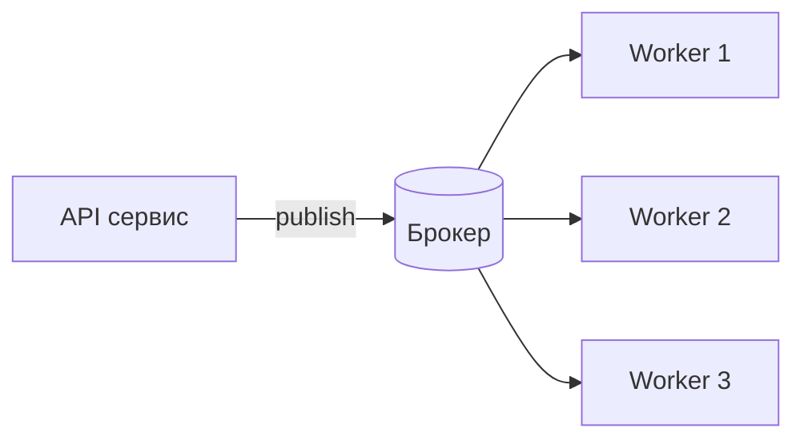

---

### Чем платим

| Плюс | Обратная сторона |
|---|---|
| Асинхронность, устойчивость к пикам | Eventual consistency: результат не готов сразу |
| Развязка сервисов | Ещё один stateful-компонент, который надо мониторить и обновлять |
| Ретраи «из коробки» | Дубликаты сообщений → нужна идемпотентность |
| Масштабирование консьюмеров | Сложнее отладка: трассировка размазана по сервисам |

Типичная ошибка — тащить брокер туда, где хватает синхронного вызова или `setTimeout`. Брокер оправдан, когда есть реальная асинхронность, разные скорости продюсера и консьюмера или несколько потребителей одного события.

---

### Типичные уточняющие вопросы на собеседовании

- **Чем брокер отличается от обычной таблицы-очереди в БД?** БД-очередь работает и часто её достаточно (`SELECT ... FOR UPDATE SKIP LOCKED`), но она не даёт роутинга, fan-out, встроенных ретраев и упирается в нагрузку на основную БД.
- **Что такое backpressure?** Механизм, который не даёт продюсеру завалить систему: ограничение неподтверждённых сообщений (prefetch), лимиты длины очереди, блокировка публикации при переполнении.
- **Что произойдёт, если консьюмеры упадут на час?** Очередь растёт — нужен мониторинг длины/лага и политика на переполнение (отбрасывать старое, отправлять в DLQ, блокировать продюсера).

</details>

<details>
<summary><b>Чем отличаются модели «очередь» (point-to-point) и «лог» (publish/subscribe)?</b></summary>

В модели очереди сообщение доставляется **одному** консьюмеру и после подтверждения удаляется (RabbitMQ, BullMQ). В модели лога сообщение пишется в персистентный журнал, живёт там до истечения retention и может быть прочитано **любым числом** независимых подписчиков, каждый со своей позицией (Kafka).

---

### Очередь: сообщение как задача

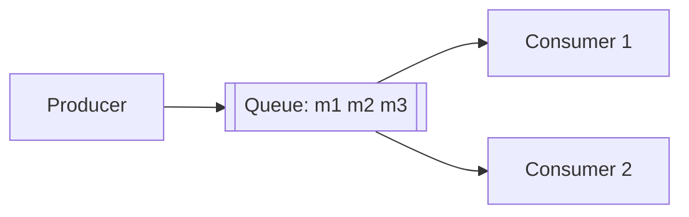

- Консьюмеры **конкурируют** за сообщения: каждое достаётся ровно одному.
- После `ack` сообщение исчезает — состояние очереди меняется при чтении.
- Естественная модель для **work queue**: «отправь письмо», «сгенерируй отчёт».
- Масштабирование = добавить воркеров. Порядок при этом теряется.

---

### Лог: сообщение как факт

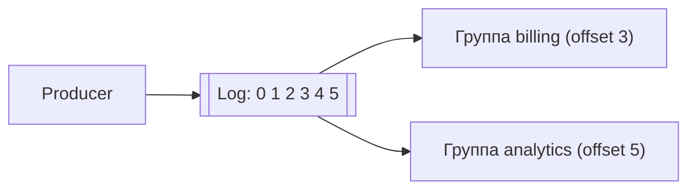

- Читатели не удаляют данные, а двигают свой **offset**. Чтение — это операция только на стороне консьюмера.
- Можно **перечитать историю**: поднять новый сервис и прогнать все события с нуля, переиграть баг после фикса.
- Естественная модель для **событий**: «заказ создан», «пользователь обновил профиль».
- Порядок гарантирован в пределах партиции, а не всего топика.

---

### Сравнение

| | Очередь (RabbitMQ, BullMQ) | Лог (Kafka) |
|---|---|---|
| Судьба сообщения | удаляется после ack | лежит до конца retention |
| Кто получит | один из консьюмеров | все группы подписчиков |
| Повторное чтение | невозможно | offset можно отмотать назад |
| Хранит состояние чтения | брокер | консьюмер (в Kafka — в `__consumer_offsets`) |
| Единица параллелизма | консьюмер | партиция |
| Роутинг | богатый (exchange, routing key) | простой (топик + партиция) |
| Смысл сообщения | «сделай задачу» | «произошёл факт» |

---

### Типичные уточняющие вопросы на собеседовании

- **Можно ли в RabbitMQ сделать pub/sub?** Да, через `fanout`-exchange и по очереди на каждого подписчика — но история всё равно не хранится, подписчик получает только то, что пришло после создания его очереди. RabbitMQ Streams (с 3.9) закрывают и этот сценарий.
- **Можно ли в Kafka сделать work queue?** Да: одна consumer group, параллелизм ограничен числом партиций. Но нет per-message ack — «застрявшее» сообщение блокирует свою партицию.
- **Что выбрать для «отправить письмо после регистрации»?** Очередь: это задача, а не факт, перечитывать её не нужно.

</details>

<details>
<summary><b>Какие бывают гарантии доставки и достижим ли exactly-once на практике?</b></summary>

Гарантий три: **at-most-once** (не больше одного раза, возможна потеря), **at-least-once** (не меньше одного раза, возможны дубликаты) и **exactly-once** (ровно один раз). В распределённой системе честный exactly-once на границе с внешним миром недостижим, поэтому в продакшене почти всегда берут at-least-once и добавляют **идемпотентность** обработчика.

---

### Откуда берутся потери и дубликаты

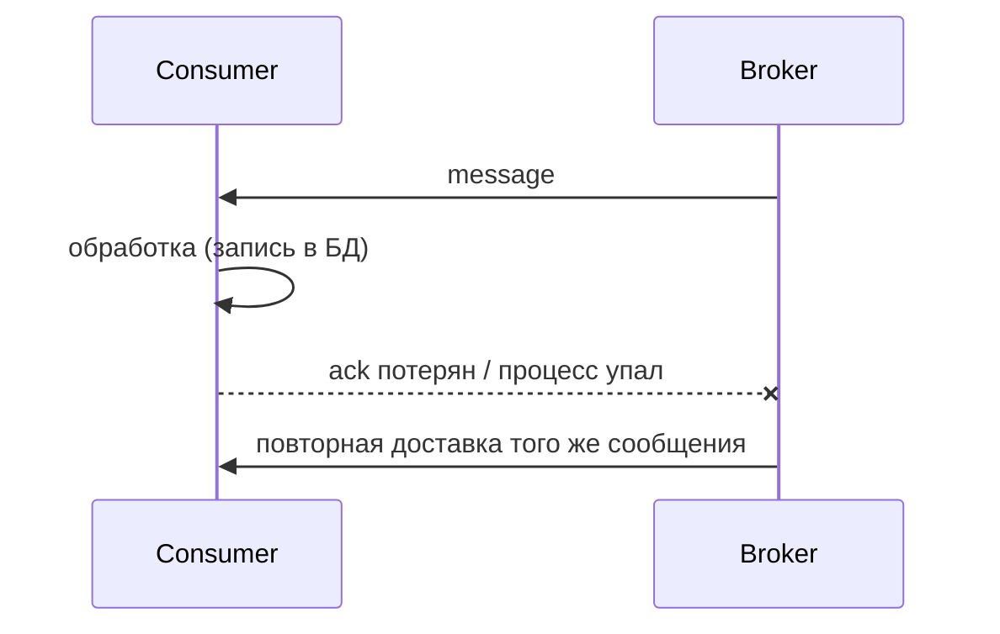

- **Ack до обработки** → сообщение считается обработанным, воркер падает, задача потеряна. Это at-most-once.
- **Ack после обработки** → воркер падает после записи в БД, но до ack; брокер отдаёт сообщение снова. Это at-least-once с дубликатом.

Правильный дефолт — всегда подтверждать **после** успешной обработки.

---

### Идемпотентность как настоящее решение

```typescript
// вместо «надеемся, что сообщение придёт один раз»
async function handlePaymentEvent(msg: PaymentEvent) {
  // ключ идемпотентности приходит от продюсера и стабилен между ретраями
  const inserted = await db.query(
    `INSERT INTO processed_events (event_id) VALUES ($1)
     ON CONFLICT (event_id) DO NOTHING RETURNING event_id`,
    [msg.eventId],
  );

  if (inserted.rowCount === 0) return; // уже обрабатывали — тихо выходим

  await creditBalance(msg.userId, msg.amount);
}
```

Другие приёмы:
- **Естественные ключи**: `UPSERT` по `order_id` вместо `INSERT` — повтор просто перезапишет то же состояние.
- **Версионирование**: применяем событие, только если его версия больше текущей.
- **Транзакция «дедупликация + бизнес-логика» в одной БД** — иначе между проверкой и записью снова окно для гонки.

---

### Что предлагают брокеры

| Механизм | Что реально даёт |
|---|---|
| RabbitMQ publisher confirms | продюсер знает, что брокер принял сообщение (нет потери на публикации) |
| RabbitMQ manual ack + `durable` + `persistent` | сообщение переживёт рестарт брокера |
| Kafka `enable.idempotence=true` | дедупликация **ретраев продюсера** внутри партиции (PID + sequence number) |
| Kafka транзакции + `isolation.level=read_committed` | атомарный read-process-write **внутри Kafka** (топик → топик + offsets) |
| BullMQ `jobId` | повторное добавление задачи с тем же id игнорируется, пока job в очереди |

Важная оговорка: exactly-once в Kafka работает, пока и вход, и выход — Kafka. Как только консьюмер пишет во внешнюю БД или дёргает платёжный API, гарантия снова становится at-least-once, и спасает только идемпотентность (или transactional outbox / two-phase паттерны).

---

### Отдельная проблема: потеря на публикации

Классическая ловушка — записали заказ в БД, а публикация в брокер упала (или наоборот). Решается паттерном **Transactional Outbox**: в одной транзакции с бизнес-данными пишем строку в таблицу `outbox`, а отдельный процесс (или CDC вроде Debezium) вычитывает её и публикует в брокер.

---

### Типичные уточняющие вопросы на собеседовании

- **Почему exactly-once невозможен в общем случае?** Задача двух генералов: подтверждение может потеряться, и отправитель не отличает «не дошло» от «дошло, но ответ пропал». Остаётся либо не повторять (риск потери), либо повторять (риск дубля).
- **Что такое poison message?** Сообщение, которое стабильно роняет обработчик и бесконечно возвращается в очередь. Лечится ограничением числа попыток и отправкой в DLQ.
- **Зачем нужен backoff при ретраях?** Мгновенный повтор сжигает CPU и добивает уже упавшую зависимость; экспоненциальная задержка с jitter даёт ей восстановиться.

</details>

# RabbitMQ

<details>
<summary><b>Как устроен RabbitMQ внутри: exchange, binding, queue, channel?</b></summary>

RabbitMQ — брокер, реализующий протокол AMQP 0-9-1. Продюсер публикует сообщение **не в очередь**, а в **exchange**; exchange по правилам **binding** копирует его в одну или несколько **очередей**; консьюмеры читают из очередей и подтверждают обработку через **ack**.

---

### Путь сообщения

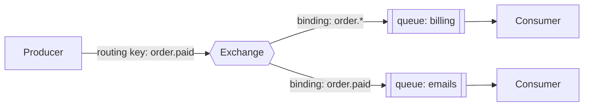

- **Exchange** — точка входа с правилом маршрутизации. Сам ничего не хранит.
- **Binding** — связь «exchange → очередь» с условием (routing key или заголовки).
- **Queue** — FIFO-буфер, который и хранит сообщения. Живёт на конкретном узле кластера.
- Если ни один binding не подошёл, сообщение **молча удаляется** (спасают флаг `mandatory` + `return`-callback или `alternate-exchange`).

---

### Connection и channel

TCP-соединение дорогое, поэтому AMQP мультиплексирует внутри него **каналы**. Правило: одно долгоживущее соединение на процесс, по каналу на поток/воркер. Канал **не потокобезопасен** — общий канал на несколько параллельных обработчиков это классический источник плавающих багов.

```typescript
import amqp from 'amqplib';

const conn = await amqp.connect('amqp://localhost');
const ch = await conn.createChannel();

await ch.assertQueue('emails', { durable: true }); // очередь переживёт рестарт

// не больше 10 неподтверждённых сообщений на этот канал
await ch.prefetch(10);

await ch.consume('emails', async (msg) => {
  if (!msg) return;
  try {
    await sendEmail(JSON.parse(msg.content.toString()));
    ch.ack(msg);                       // подтверждаем ПОСЛЕ обработки
  } catch (e) {
    ch.nack(msg, false, false);        // requeue=false → уедет в DLX
  }
}, { noAck: false });
```

---

### Prefetch — ключевая настройка

Без `prefetch` брокер выталкивает консьюмеру всё, что есть: один воркер набирает тысячу сообщений в память, остальные простаивают. `prefetch(N)` ограничивает число неподтверждённых сообщений и превращает раздачу в честный «кто освободился, тот и берёт».

- Быстрые задачи (миллисекунды) — prefetch 100–300, иначе теряем на round-trip.
- Долгие задачи (секунды) — prefetch 1–5, иначе ломается балансировка.

---

### Что делает сообщение действительно надёжным

Нужны все три условия одновременно:

1. `durable: true` у очереди — переживает рестарт брокера.
2. `persistent: true` (`deliveryMode: 2`) у сообщения — пишется на диск.
3. Ручной `ack` после обработки — брокер не забывает сообщение раньше времени.

Плюс **publisher confirms** (`confirmChannel`), чтобы продюсер знал, что брокер принял сообщение.

---

### Типичные уточняющие вопросы на собеседовании

- **Что будет, если очередь `durable`, а сообщение нет?** Очередь после рестарта останется, а сообщения в ней — нет.
- **Сохраняется ли порядок?** В пределах одной очереди и одного консьюмера — да. Несколько консьюмеров или `requeue` перемешают порядок.
- **Что такое unacked-сообщения и почему очередь «не разгружается»?** Сообщения, отданные консьюмеру, но не подтверждённые. Забытый `ack` — самая частая причина «очередь растёт, воркеры простаивают».

</details>

<details>
<summary><b>Какие бывают типы exchange в RabbitMQ и как выбрать нужный?</b></summary>

Четыре типа: **direct** (точное совпадение routing key), **fanout** (всем связанным очередям), **topic** (совпадение по шаблону с `*` и `#`) и **headers** (по заголовкам, а не по ключу). В 95% задач используются direct и topic.

---

### direct — точное совпадение

```typescript
await ch.assertExchange('tasks', 'direct', { durable: true });
await ch.bindQueue('pdf_queue', 'tasks', 'pdf');
await ch.bindQueue('xlsx_queue', 'tasks', 'xlsx');

ch.publish('tasks', 'pdf', Buffer.from(payload)); // уйдёт только в pdf_queue
```

Классика для work queue с несколькими типами задач. Дефолтный безымянный exchange (`''`) — тоже direct: routing key равен имени очереди, поэтому «публикация напрямую в очередь» на самом деле идёт через него.

---

### fanout — широковещание

Игнорирует routing key и копирует сообщение во все связанные очереди. Нужен, когда одно событие должны получить несколько независимых подписчиков: сброс кэша на всех инстансах, дублирование событий в аналитику.

---

### topic — маршрутизация по шаблону

Routing key — строка из слов через точку: `order.paid.ru`. В binding можно использовать `*` (ровно одно слово) и `#` (ноль или больше слов).

| Binding | `order.paid.ru` | `order.created` | `user.deleted` |
|---|---|---|---|
| `order.#` | да | да | нет |
| `order.*` | нет | да | нет |
| `*.paid.*` | да | нет | нет |
| `#` | да | да | да |

Самый гибкий вариант: один exchange на домен, а подписчики сами решают, насколько широко ловить события. Обычно с него и начинают.

---

### headers — по атрибутам

Маршрутизация по словарю заголовков с `x-match: all | any`. Нужен, когда критерии не укладываются в иерархическую строку (например, `format=pdf` + `priority=high`). Медленнее topic и используется редко.

---

### Как выбирать

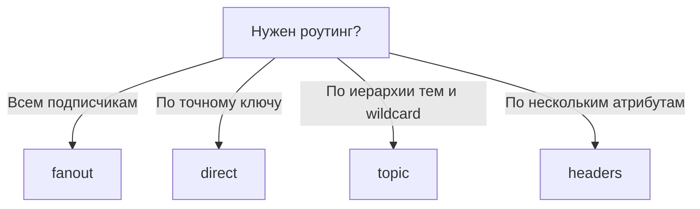

---

### Типичные уточняющие вопросы на собеседовании

- **Куда уходит сообщение, если ни один binding не подошёл?** Удаляется. Чтобы это ловить — `mandatory: true` и обработчик `return`, либо `alternate-exchange` для «мусорной» очереди.
- **Можно ли связать exchange с exchange?** Да, `exchange-to-exchange binding`: удобно строить многоуровневую маршрутизацию.
- **Чем topic дороже direct?** Матчинг по шаблону идёт через дерево префиксов — заметно дороже хеш-таблицы direct, но при разумном числе биндингов разница не критична.

</details>

<details>
<summary><b>Как в RabbitMQ реализовать ретраи и dead-letter queue?</b></summary>

Ретраи в RabbitMQ не встроены: их собирают из **dead-letter exchange (DLX)**, **TTL сообщения** и отдельной retry-очереди. Схема такая: неуспешное сообщение отклоняется с `requeue=false`, попадает по DLX в очередь-задержку с TTL, а по истечении TTL само возвращается в основную очередь.

---

### Почему нельзя просто `nack(requeue=true)`

Сообщение мгновенно вернётся в голову очереди и тут же придёт снова — получится бесконечный цикл на полной скорости CPU. Плюс отсутствует счётчик попыток: poison message будет крутиться вечно.

---

### Схема с задержкой

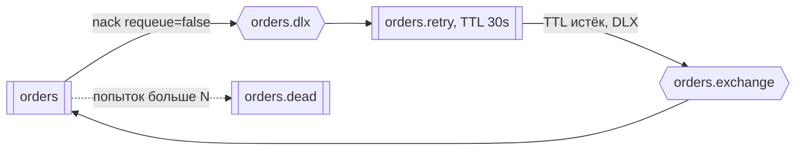

```typescript
// основная очередь: провалы уходят в DLX
await ch.assertQueue('orders', {
  durable: true,
  deadLetterExchange: 'orders.dlx',
});

// очередь-задержка: полежал 30 секунд — вернулся обратно в основной exchange
await ch.assertQueue('orders.retry', {
  durable: true,
  messageTtl: 30_000,
  deadLetterExchange: 'orders.exchange',
  deadLetterRoutingKey: 'orders',
});
```

---

### Считаем попытки

RabbitMQ сам добавляет в заголовок `x-death` историю dead-lettering — по нему можно посчитать число кругов:

```typescript
function attempts(msg: amqp.ConsumeMessage): number {
  const deaths = (msg.properties.headers?.['x-death'] ?? []) as Array<{ count: number }>;
  return deaths.reduce((sum, d) => sum + d.count, 0);
}

if (attempts(msg) >= 5) {
  ch.publish('orders.dlx', 'dead', msg.content); // в «кладбище» на разбор руками
  ch.ack(msg);
  return;
}
```

Для экспоненциального backoff делают несколько retry-очередей с разными TTL (30s / 5m / 1h) — потому что TTL задаётся на очередь, а не на попытку. Альтернатива — TTL на конкретном сообщении, но тогда работает head-of-line blocking: сообщение с большим TTL в голове очереди задержит те, у кого TTL уже истёк.

---

### Что положить в DLQ и что с ней делать

- DLQ — это не «свалка», а **алертящий** объект: рост её длины должен будить дежурного.
- Сообщение стоит обогащать: причина ошибки, stack trace, число попыток, время первой попытки.
- Нужен инструмент **replay**: после фикса кода вернуть сообщения из DLQ в основную очередь (в RabbitMQ — через `shovel` или свой скрипт).

---

### Типичные уточняющие вопросы на собеседовании

- **Когда сообщение попадает в DLX?** Три причины: `reject`/`nack` с `requeue=false`, истёк TTL, превышена максимальная длина очереди (`x-max-length`).
- **Есть ли способ проще?** Плагин `rabbitmq_delayed_message_exchange` даёт задержку прямо в exchange (`x-delay`), без retry-очередей — но это плагин, который держит расписание в памяти узла.
- **Чем это отличается от ретраев в Kafka?** В Kafka нет per-message ack, поэтому делают отдельные retry-топики и отдельного консьюмера — «покрутиться на месте» нельзя, это заблокирует партицию.

</details>

<details>
<summary><b>Как RabbitMQ обеспечивает отказоустойчивость и что такое quorum queues?</b></summary>

Очередь в RabbitMQ живёт на **одном** узле кластера, поэтому падение этого узла означает недоступность очереди. Отказоустойчивость даёт репликация: современный способ — **quorum queues** на алгоритме Raft, устаревший — classic mirrored queues (удалены в RabbitMQ 4.0).

---

### Кластер: что реплицируется, а что нет

- Метаданные (exchanges, bindings, users, vhosts) реплицируются на все узлы.
- **Содержимое обычной очереди — нет**: очередь целиком принадлежит своему узлу. Клиент может подключиться к любому узлу, запрос будет проксирован владельцу.

---

### Quorum queues

Реплицируемая очередь на Raft: одна реплика-лидер, остальные — фолловеры; запись считается принятой, когда её подтвердило большинство.

```typescript
await ch.assertQueue('payments', {
  durable: true,
  arguments: {
    'x-queue-type': 'quorum',
    'x-delivery-limit': 5, // встроенный лимит попыток → дальше в DLX
  },
});
```

- Переживает падение меньшинства узлов: кластер из 3 узлов терпит потерю одного, из 5 — двух. Число узлов берут нечётным, чтобы не было split-brain.
- Данные всегда пишутся на диск — предсказуемое поведение под нагрузкой, но выше latency, чем у in-memory classic queue.
- Есть встроенный `x-delivery-limit`, которого не хватает classic-очередям.
- Не поддерживают приоритеты сообщений и TTL на отдельное сообщение — при миграции это надо проверять.

---

### Три типа очередей

| Тип | Репликация | Когда использовать |
|---|---|---|
| **Classic** | нет (mirrored — удалены в 4.0) | несущественные задачи, dev-окружения |
| **Quorum** | Raft, большинство | всё, где потеря сообщения — деньги или инцидент |
| **Stream** | append-only лог с репликацией | нужны перечитывание истории и высокий throughput, «kafka-like» сценарии |

---

### Надёжность на стороне клиента

Кластер не спасает, если приложение написано неправильно:

- **Publisher confirms** — публикация считается успешной только после `ack` от брокера.
- **Reconnect с backoff** — соединение рвётся при переключении лидера; библиотека вроде `amqp-connection-manager` берёт это на себя.
- **Heartbeat** — иначе «мёртвые» соединения висят до TCP-таймаута.
- **Проверка ресурсов** — при достижении `vm_memory_high_watermark` или дискового лимита брокер применяет flow control и блокирует продюсеров; для приложения это выглядит как «зависшая публикация».

---

### Типичные уточняющие вопросы на собеседовании

- **Почему mirrored queues объявили устаревшими?** У них не было консенсуса: при сетевом разделении и последующем «синхронизировании» реплики могли молча терять сообщения; Raft даёт формальную гарантию.
- **Сколько узлов нужно в кластере?** Нечётное число, минимум 3. Кластер из 2 узлов не переживает ни одного отказа с сохранением кворума.
- **Что такое federation и shovel?** Способы связать разные кластеры (например, между дата-центрами) — асинхронная пересылка сообщений между брокерами; для растянутого кластера они предпочтительнее, чем один кластер поверх WAN.

</details>

# Kafka

<details>
<summary><b>Как устроена Kafka внутри: топики, партиции, offset, сегменты?</b></summary>

Kafka — это распределённый **append-only лог**. Топик делится на **партиции**, каждая партиция — упорядоченная последовательность сообщений на диске, где у каждого сообщения есть номер (**offset**). Kafka ничего не удаляет при чтении: консьюмер просто двигает свой offset.

---

### Топик и партиции

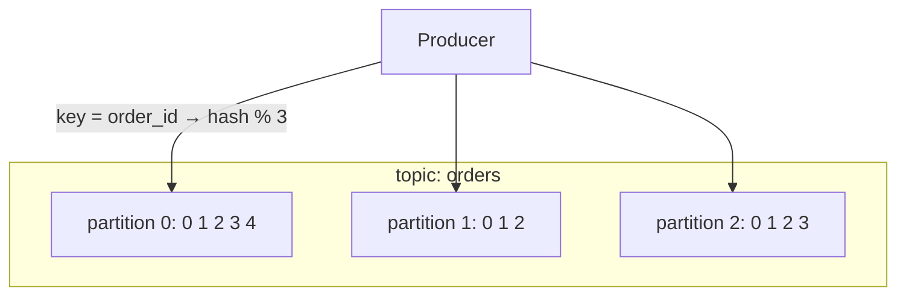

- **Партиция — единица параллелизма и порядка.** Порядок гарантирован внутри партиции, между партициями его нет.
- Партиция выбирается по хешу ключа: сообщения с одним `order_id` всегда попадают в одну партицию, значит их порядок сохранён. Без ключа — round-robin (точнее, sticky partitioning по батчам).
- Число партиций можно увеличить, но **не уменьшить**; при увеличении меняется распределение ключей, поэтому порядок «до» и «после» уже не связан.

---

### Почему это быстро

- **Последовательная запись на диск** вместо случайной: даже HDD выдаёт сотни МБ/с при линейной записи.
- **Page cache** ОС вместо своего кэша в heap: свежие сообщения читаются из памяти.
- **Zero-copy** (`sendfile`): данные идут из page cache сразу в сокет, минуя user space.
- **Батчинг и сжатие** (`lz4`, `zstd`) на стороне продюсера: сжимается пачка сообщений целиком, а не каждое отдельно.

Сама партиция на диске — это набор **сегментов** (`.log` + индексы `.index`/`.timeindex`). Удаление по retention — это удаление старых сегментов целиком, дешёвая операция.

---

### Offset и его хранение

Позиция консьюмера хранится не в памяти клиента, а во внутреннем compacted-топике `__consumer_offsets`. Поэтому перезапущенный консьюмер продолжает с того же места, а `auto.offset.reset` (`earliest`/`latest`) применяется только когда сохранённого offset нет.

```typescript
import { Kafka } from 'kafkajs';

const kafka = new Kafka({ clientId: 'billing', brokers: ['kafka:9092'] });
const consumer = kafka.consumer({ groupId: 'billing-service' });

await consumer.connect();
await consumer.subscribe({ topic: 'orders', fromBeginning: false });

await consumer.run({
  eachMessage: async ({ topic, partition, message }) => {
    await handle(JSON.parse(message.value!.toString()));
    // kafkajs коммитит offset автоматически после успешного обработчика;
    // бросили исключение — offset не сдвинется и сообщение придёт снова
  },
});
```

---

### Кто чем управляет

- **Брокер** — узел кластера, хранит часть партиций (для одних он лидер, для других фолловер).
- **Контроллер** — узел, отвечающий за метаданные и назначение лидеров. С версии 3.x это **KRaft** (Raft внутри Kafka), ZooKeeper больше не нужен.

---

### Типичные уточняющие вопросы на собеседовании

- **Сколько партиций делать?** Столько, сколько нужно параллельных консьюмеров в пике, с запасом. Слишком много партиций — больше файлов, дольше выборы лидера и ребалансировки, выше end-to-end latency.
- **Гарантирует ли Kafka глобальный порядок в топике?** Нет. Глобальный порядок — только при одной партиции, а это и потолок throughput в одного консьюмера.
- **Что такое high watermark?** Максимальный offset, реплицированный на все ISR-реплики. Консьюмеры не видят сообщения выше него, чтобы не прочитать то, что может быть потеряно при смене лидера.

</details>

<details>
<summary><b>Как работают consumer groups и ребалансировка в Kafka?</b></summary>

**Consumer group** — набор консьюмеров с общим `group.id`, между которыми Kafka распределяет партиции топика: каждая партиция в любой момент читается **ровно одним** консьюмером группы. Перераспределение партиций при изменении состава группы называется **ребалансировкой**.

---

### Распределение партиций

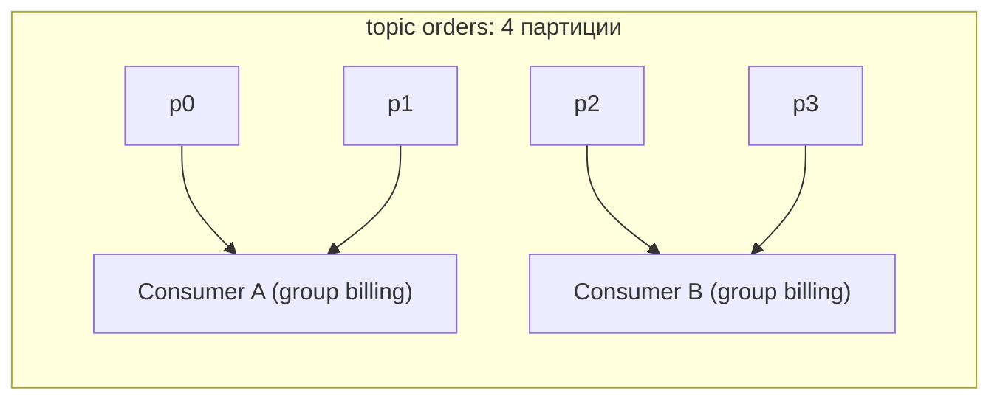

- Параллелизм группы ограничен числом партиций: **5-й консьюмер на 4 партиции будет простаивать**.
- Разные группы читают топик независимо и не мешают друг другу — это и есть pub/sub в Kafka.

---

### Когда происходит ребалансировка

- Консьюмер присоединился или ушёл (в том числе упал или не прислал heartbeat).
- Консьюмер не вызвал `poll` дольше `max.poll.interval.ms` — группа считает его зависшим и выкидывает.
- Изменилось число партиций топика.

Во время eager-ребалансировки все консьюмеры отдают свои партиции и получают новые — обработка встаёт (**stop-the-world**). Стратегия `CooperativeStickyAssignor` делает это инкрементально: переезжают только те партиции, которые действительно меняют владельца.

---

### Частые проблемы и настройки

| Симптом | Причина | Что крутить |
|---|---|---|
| Группа постоянно ребалансится | обработка одного батча дольше `max.poll.interval.ms` | уменьшить `max.poll.records`, вынести тяжёлую работу, увеличить интервал |
| Консьюмер «пропал» на секунды | `session.timeout.ms` меньше сетевых задержек | согласовать `heartbeat.interval.ms` ≈ 1/3 от `session.timeout.ms` |
| Рестарт деплоя вызывает лавину ребалансировок | каждый под уходит и приходит | `group.instance.id` (static membership) + `session.timeout.ms` больше времени рестарта |
| Дубликаты после падения | offset закоммичен реже, чем обработка | коммитить после обработки, обработчик делать идемпотентным |

---

### Коммит offset: автоматический или ручной

- `enable.auto.commit=true` коммитит по таймеру и **до** гарантированного завершения обработки → возможна потеря при падении.
- Ручной коммит после обработки батча даёт at-least-once — рабочий дефолт.
- Коммит offset в ту же транзакцию БД, куда пишем результат, даёт effectively-once для read-process-write в БД.

---

### Отставание (lag) — главная метрика

Consumer lag = `log end offset − committed offset`, то есть на сколько сообщений консьюмер отстал. Растущий lag означает, что консьюмеры не успевают: либо добавлять инстансы (до числа партиций), либо ускорять обработчик, либо увеличивать число партиций.

---

### Типичные уточняющие вопросы на собеседовании

- **Что делать, если нужно больше параллелизма, чем партиций?** Увеличить число партиций, либо внутри консьюмера раскидывать сообщения по пулу воркеров — но тогда придётся вручную следить за порядком и коммитами.
- **Как обрабатывать «застрявшее» сообщение?** Нельзя просто вернуть его в очередь — это заблокирует всю партицию. Стандартный подход: несколько попыток на месте, затем отправка в retry-топик или DLQ-топик и сдвиг offset.
- **Что даёт static membership?** Консьюмер сохраняет свою идентичность между рестартами, и короткий перезапуск (деплой) не вызывает ребалансировку.

</details>

<details>
<summary><b>Как Kafka гарантирует сохранность данных: репликация, ISR, acks?</b></summary>

Каждая партиция реплицируется на `replication.factor` брокеров: один — **лидер** (принимает записи и чтения), остальные — **фолловеры**, которые тянут данные с лидера. Фолловеры, успевающие за лидером, образуют **ISR** (In-Sync Replicas). Насколько надёжна запись, определяет продюсерская настройка `acks` вместе с `min.insync.replicas`.

---

### acks — сколько подтверждений ждать

| `acks` | Кто подтвердил | Риск | Латентность |
|---|---|---|---|
| `0` | никто, «выстрелил и забыл» | теряем при любом сбое | минимальная |
| `1` | только лидер | лидер упал до репликации → потеря | средняя |
| `all` (`-1`) | все ISR-реплики | потеря только при отказе всех ISR | выше |

`acks=all` сам по себе недостаточен: если ISR схлопнулся до одной реплики (лидера), «все ISR» — это один узел. Поэтому его всегда ставят в паре с `min.insync.replicas=2` (при `replication.factor=3`) — тогда при недостатке реплик продюсер получает ошибку вместо молчаливой потери надёжности.

---

### Продакшен-конфигурация «ничего не терять»

```typescript
const producer = kafka.producer({
  idempotent: true,   // enable.idempotence: дедупликация ретраев, acks=all и retries принудительно
  maxInFlightRequests: 5,
});

await producer.send({
  topic: 'orders',
  acks: -1,           // все ISR
  messages: [{ key: order.id, value: JSON.stringify(order) }],
});
```

На стороне брокера/топика:
- `replication.factor=3`
- `min.insync.replicas=2`
- `unclean.leader.election.enable=false` — не позволять отставшей реплике стать лидером; иначе доступность покупается ценой потери сообщений.

---

### Идемпотентный продюсер

`enable.idempotence=true` присваивает продюсеру PID и нумерует сообщения внутри партиции. Брокер отбрасывает повторы с уже виденным sequence number — то есть сетевой ретрай не создаёт дубликат. Заодно это чинит старую проблему нарушения порядка при `max.in.flight > 1` с ретраями.

---

### Что ещё влияет на durability

- **Flush на диск.** Kafka по умолчанию полагается на репликацию, а не на `fsync` каждого сообщения: несколько реплик в разных стойках надёжнее, чем один диск.
- **Rack awareness** (`broker.rack`) — раскладывать реплики по разным зонам отказа, иначе три реплики могут оказаться в одной стойке.
- **Потребитель тоже участвует**: закоммитить offset до обработки — способ потерять сообщение при полностью исправном кластере.

---

### Типичные уточняющие вопросы на собеседовании

- **Что происходит при падении лидера?** Контроллер выбирает нового лидера из ISR; клиенты получают обновлённые метаданные и переподключаются. Сообщения выше high watermark могут быть отброшены.
- **Почему реплика выпадает из ISR?** Отстала больше чем на `replica.lag.time.max.ms` — из-за нагрузки, медленного диска или сети.
- **Что такое unclean leader election и когда он допустим?** Выбор лидера из реплик вне ISR: система остаётся доступной ценой потери данных. Допустим только там, где потеря части сообщений дешевле простоя (метрики, логи).

</details>

<details>
<summary><b>Что такое retention и log compaction в Kafka и когда что использовать?</b></summary>

Kafka хранит сообщения не до прочтения, а по политике **cleanup.policy**: `delete` удаляет данные старше `retention.ms` (или сверх `retention.bytes`), `compact` вместо этого оставляет **последнее значение для каждого ключа**. Первое — про поток событий, второе — про «текущее состояние».

---

### delete — окно истории

```text
retention.ms = 604800000  # 7 дней
retention.bytes = -1      # без ограничения по размеру
segment.ms = 86400000     # новый сегмент раз в сутки
```

- Удаляются целые **сегменты**, поэтому реальное время жизни всегда чуть больше настроенного.
- Retention определяет, насколько назад можно отмотать offset: 7 дней retention = 7 дней на починку упавшего консьюмера и переигрывание.
- Kafka спокойно живёт с retention в недели и месяцы — это дисковый вопрос, а не архитектурный.

---

### compact — «таблица» в топике

При compaction Kafka в фоне схлопывает лог, оставляя для каждого ключа только последнюю запись. Получается durable key-value snapshot, который можно перечитать с нуля и восстановить полное текущее состояние.

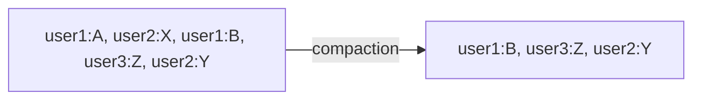

- Сообщение с `value = null` — **tombstone**, помечает ключ как удалённый; после `delete.retention.ms` исчезает и оно.
- Обязательно нужен ключ: сообщения без ключа при compaction не схлопываются.
- Compaction работает только с «неактивным хвостом» лога — свежие сегменты какое-то время содержат дубликаты, поэтому консьюмер всё равно должен корректно применять несколько версий ключа.

Так устроены `__consumer_offsets`, Kafka Connect offsets и state stores в Kafka Streams. Прикладной пример — топик `user-profiles`, из которого любой новый сервис может собрать себе локальный кэш профилей.

---

### Сравнение

| | `delete` | `compact` |
|---|---|---|
| Что хранит | все события за период | последнее значение по ключу |
| Смысл | «что происходило» | «как есть сейчас» |
| Восстановление состояния | перечитать окно | перечитать топик целиком |
| Требует ключ | нет | да |
| Типичный пример | клики, логи, заказы | профили, конфиги, справочники |

Политики комбинируются: `cleanup.policy=compact,delete` — схлопывать по ключу и при этом выкидывать всё старше retention.

---

### Типичные уточняющие вопросы на собеседовании

- **Можно ли использовать Kafka как базу данных?** Как источник истины для событий (event sourcing) — да; как БД для произвольных запросов — нет: нет индексов и выборок по значению, только последовательное чтение.
- **Что такое tiered storage?** Вынос старых сегментов в объектное хранилище (S3) — позволяет держать длинный retention без раздувания дисков брокеров.
- **Гарантирует ли compaction отсутствие дубликатов при чтении?** Нет — активный сегмент не сжимается, и один ключ может встретиться несколько раз.

</details>

# BullMQ

<details>
<summary><b>Что такое BullMQ и как он устроен поверх Redis?</b></summary>

BullMQ — Node.js-библиотека очередей задач (преемник Bull), которая использует **Redis** как хранилище. Это не отдельный брокер: очередь — это набор структур данных Redis, а атомарность операций обеспечивают **Lua-скрипты**, выполняющиеся на стороне Redis.

---

### Из чего состоит очередь в Redis

| Структура | Ключ | Роль |
|---|---|---|
| Hash | `bull:<queue>:<jobId>` | данные задачи, опции, счётчик попыток, результат |
| List | `bull:<queue>:wait` | задачи, ждущие исполнения (FIFO) |
| List | `bull:<queue>:active` | задачи, взятые воркерами в работу |
| Sorted Set | `bull:<queue>:delayed` | отложенные задачи, score = время запуска |
| Sorted Set | `bull:<queue>:prioritized` | задачи с приоритетом |
| Sorted Set | `bull:<queue>:completed` / `:failed` | завершённые (хранятся по настройке) |
| Stream | `bull:<queue>:events` | события для `QueueEvents` (progress, completed, failed) |

Воркер блокирующе ждёт задачу (`BRPOPLPUSH`-подобная логика внутри Lua), переносит её в `active`, берёт **lock** на время выполнения и по завершении атомарно перемещает в `completed` или `failed`.

---

### Минимальный пример

```typescript
import { Queue, Worker } from 'bullmq';

const connection = { host: 'localhost', port: 6379 };

const emails = new Queue('emails', { connection });

await emails.add(
  'welcome',
  { userId: 42 },
  {
    attempts: 5,
    backoff: { type: 'exponential', delay: 1000 }, // 1s, 2s, 4s, 8s, 16s
    removeOnComplete: 1000,  // держать последние 1000 успешных
    removeOnFail: 5000,
    jobId: `welcome:42`,     // дедупликация: повторный add с тем же id игнорируется
  },
);

const worker = new Worker(
  'emails',
  async (job) => {
    await sendEmail(job.data.userId);
  },
  { connection, concurrency: 10 },
);

worker.on('failed', (job, err) => logger.error({ jobId: job?.id, err }, 'job failed'));
```

---

### Stalled jobs — механизм вместо ack

У BullMQ нет ack по сети: воркер держит **lock** на задаче и продлевает его, пока работает. Если процесс упал (или заблокировал event loop дольше `lockDuration`), lock протухает, задача считается **stalled** и возвращается в `wait`. После `maxStalledCount` попыток она уходит в `failed`.

Отсюда важное следствие: **синхронная CPU-тяжёлая задача в воркере блокирует продление lock** и приводит к тому, что задача выполняется дважды. Тяжёлые вычисления выносят в sandboxed processors (отдельный процесс) или worker threads.

---

### Типичные уточняющие вопросы на собеседовании

- **Насколько это надёжно?** Ровно настолько, насколько надёжен Redis: без AOF (`appendfsync everysec`) при падении можно потерять последние задачи. Redis — не Kafka, для «денежных» событий одного его мало.
- **Работает ли BullMQ с Redis Cluster?** Да, но все ключи одной очереди должны попадать в один слот — используются hash tags (`{queueName}`), то есть очередь не шардируется между узлами.
- **Чем BullMQ отличается от Bull?** Переписан на TypeScript, разделены `Queue`/`Worker`/`QueueEvents`, добавлены flows (зависимости задач), улучшены Lua-скрипты и rate limiting.

</details>

<details>
<summary><b>Какие возможности BullMQ используют на практике и какие у него подводные камни?</b></summary>

Главная причина брать BullMQ — не сама очередь, а прикладные фичи вокруг неё: отложенный запуск, повторяющиеся задачи по cron, приоритеты, rate limiting, графы зависимых задач (flows), встроенные ретраи с backoff и готовый UI. Всё это в RabbitMQ или Kafka пришлось бы писать руками.

---

### Что даёт коробка

```typescript
// отложенный запуск: напомнить через сутки
await queue.add('reminder', { orderId }, { delay: 24 * 60 * 60 * 1000 });

// повторяющаяся задача (cron)
await queue.upsertJobScheduler(
  'nightly-report',
  { pattern: '0 3 * * *', tz: 'Europe/Moscow' },
  { name: 'report', data: { kind: 'daily' } },
);

// приоритет: меньше число — раньше выполнится
await queue.add('export', { userId }, { priority: 1 });

// rate limiting: не больше 100 задач в минуту на всю очередь
new Worker('sms', handler, {
  connection,
  limiter: { max: 100, duration: 60_000 },
});
```

**Flows** — граф задач: родитель запускается только после успеха всех детей. Удобно для пайплайнов вида «скачать файлы → обработать каждый → собрать общий отчёт».

```typescript
import { FlowProducer } from 'bullmq';

await new FlowProducer({ connection }).add({
  name: 'build-report',
  queueName: 'reports',
  children: [
    { name: 'fetch', queueName: 'fetch', data: { source: 'crm' } },
    { name: 'fetch', queueName: 'fetch', data: { source: 'billing' } },
  ],
});
```

---

### Подводные камни

- **Блокировка event loop.** Синхронный `JSON.parse` на 200 МБ или синхронная генерация PDF не дают продлить lock → задача становится stalled и выполняется повторно. Лечится sandboxed processor (`new Worker('q', path.join(__dirname, 'processor.js'))`).
- **Данные задачи лежат в Redis.** Класть в `job.data` целые файлы или гигантские payload — верный способ упереться в память Redis. Правильно: класть ссылку (`s3Key`, `recordId`).
- **Отсутствие уборки.** Без `removeOnComplete`/`removeOnFail` наборы `completed`/`failed` растут бесконечно и однажды съедают память Redis.
- **Настройки соединения.** Для `ioredis` нужен `maxRetriesPerRequest: null`, иначе блокирующие команды воркера будут падать по таймауту.
- **Ретраи не идемпотентны сами по себе.** `attempts: 5` означает, что обработчик может выполниться 5 раз — списание денег без ключа идемпотентности превратится в пять списаний.
- **Часы и timezone у repeatable jobs.** Cron считается в указанной `tz`; несколько инстансов планировщика с разными настройками дают дубликаты запусков.
- **Нет fan-out.** Задачу получает один воркер; «уведомить 3 сервиса» — это три отдельные задачи, которые кто-то должен поставить.

---

### Когда BullMQ достаточно, а когда нет

| Подходит | Не подходит |
|---|---|
| Фоновая работа внутри Node.js-монолита или пары сервисов | Полиглотная система: консьюмеры на Go/Java/Python |
| Задачи с задержкой, cron, приоритетами, лимитами | Event sourcing и перечитывание истории |
| Десятки тысяч задач в минуту | Сотни тысяч сообщений в секунду |
| Есть Redis и не хочется нового инфраструктурного компонента | Требования к durability уровня «не терять никогда» |

---

### Типичные уточняющие вопросы на собеседовании

- **Как не потерять задачу при деплое?** Graceful shutdown: `await worker.close()` дожидается завершения активных задач; в Kubernetes на это нужен адекватный `terminationGracePeriodSeconds`.
- **Как посмотреть, что происходит в очереди?** Bull Board / Taskforce — UI со списками задач, ретраями и ручным перезапуском failed.
- **Как сделать так, чтобы задача выполнялась строго один раз в кластере?** Задать стабильный `jobId` (дедупликация на уровне очереди) плюс идемпотентный обработчик — на случай stalled-повторов.

</details>

# Сравнение и выбор

<details>
<summary><b>RabbitMQ, Kafka и BullMQ: чем отличаются и что выбрать?</b></summary>

Коротко: **BullMQ** — библиотека фоновых задач для Node.js поверх Redis, **RabbitMQ** — брокер задач с богатой маршрутизацией и per-message ack, **Kafka** — распределённый лог событий с высоким throughput и возможностью перечитывать историю. Это не конкуренты «кто быстрее», а инструменты под разные модели: задача, задача с роутингом и факт.

---

### Сравнительная таблица

| | BullMQ | RabbitMQ | Kafka |
|---|---|---|---|
| Что это | библиотека + Redis | брокер (AMQP) | распределённый лог |
| Модель | work queue | work queue + routing | pub/sub лог |
| Судьба сообщения | удаляется после выполнения | удаляется после ack | живёт до конца retention |
| Перечитывание истории | нет | нет (кроме Streams) | да, offset двигается свободно |
| Порядок | нет гарантий при concurrency > 1 | в пределах очереди | в пределах партиции |
| Параллелизм | concurrency воркеров | число консьюмеров | число партиций |
| Throughput | десятки тысяч/мин | десятки тысяч/с | сотни тысяч–миллионы/с |
| Latency | миллисекунды | миллисекунды | миллисекунды–десятки мс (батчинг) |
| Ретраи/DLQ | встроены (`attempts`, `backoff`) | собираются из DLX + TTL | retry/DLQ-топики руками |
| Задержка, cron, приоритеты | встроены | плагин/TTL-хаки, приоритеты есть | нет |
| Языки | только Node.js | любые | любые |
| Операционная сложность | низкая (уже есть Redis) | средняя | высокая |

---

### Как выбирать

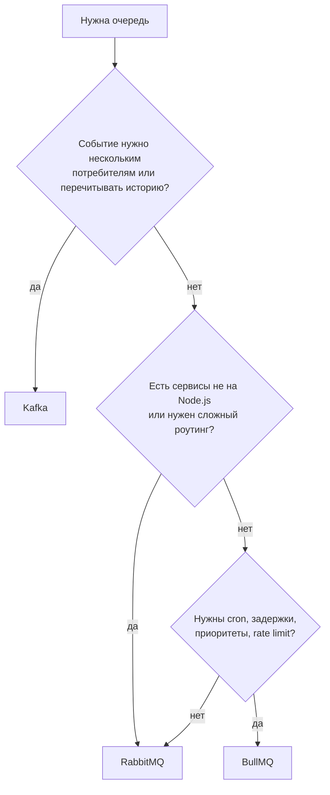

Практическое правило: начинать со **самого простого, что закрывает задачу**. Для фоновых задач Node.js-приложения BullMQ обычно достаточно, и вводить Kafka «на вырост» — это лишний кластер, который надо эксплуатировать.

---

### Частые заблуждения

- **«Kafka быстрее, значит лучше».** Высокий throughput Kafka — про потоки данных. Для «отправить 200 писем в час» он не даёт ничего, кроме операционных расходов.
- **«RabbitMQ устарел».** Нет: per-message ack, гибкий роутинг, приоритеты и quorum queues покрывают классы задач, для которых Kafka неудобна.
- **«BullMQ — это игрушка».** Он держит серьёзную нагрузку, но его durability ограничена настройками персистентности Redis, а экосистема — Node.js.

---

### Типичные уточняющие вопросы на собеседовании

- **Можно ли использовать несколько брокеров одновременно?** Да, и это норма: Kafka как шина событий между сервисами, BullMQ — для фоновых задач внутри конкретного Node.js-сервиса.
- **Что использовать для межсервисной коммуникации: очередь или gRPC?** Синхронный вызов, когда нужен немедленный ответ и вызывающий не может продолжить без него; очередь — когда важна устойчивость и допустима задержка.
- **Как мигрировать с RabbitMQ на Kafka?** Обычно параллельная публикация в оба брокера, постепенный перевод консьюмеров и сверка результатов — единовременное переключение не даёт возможности отката.

</details>

<details>
<summary><b>Какие очереди для каких задач использовать: разбор практических кейсов</b></summary>

Выбор определяется не «модностью» технологии, а тремя вопросами: **сообщение — это задача или факт**, **нужно ли перечитывать историю** и **кто консьюмеры** (один Node.js-сервис или зоопарк языков и команд).

---

### Кейс 1: отправка email и push после регистрации

**BullMQ.** Это фоновая задача одного сервиса: нужны ретраи с backoff (SMTP-провайдер отвечает 503), rate limiting под лимиты провайдера и отложенный запуск («письмо через 3 дня, если не завершил онбординг»). Ключ идемпотентности — `jobId = welcome:${userId}`, чтобы двойной вызов API не породил два письма.

---

### Кейс 2: генерация тяжёлых отчётов по запросу пользователя

**BullMQ или RabbitMQ.** API отвечает `202 Accepted` и `jobId`, задача уходит в очередь, воркеры считают. BullMQ выигрывает за счёт готового прогресса (`job.updateProgress`) и UI; RabbitMQ — если воркеры написаны не на Node.js или нужен роутинг «лёгкие/тяжёлые отчёты» по разным пулам.

Важно: prefetch/concurrency ставят низким (1–2) — задачи длинные, иначе один воркер захватит пачку и остальные будут простаивать.

---

### Кейс 3: событие «заказ оплачен», нужное биллингу, складу, аналитике и уведомлениям

**Kafka.** Это факт, у которого уже четыре потребителя, а завтра будет шестой. Kafka даёт fan-out без изменения продюсера, retention для перечитывания (новый сервис аналитики прогонит историю за месяц) и порядок по `order_id` через ключ партиционирования.

На RabbitMQ это тоже собирается через topic-exchange и очередь на подписчика, но перечитать историю после инцидента уже не получится.

---

### Кейс 4: интеграция с внешним API с жёстким лимитом (100 запросов/мин)

**BullMQ с `limiter`.** Лимит нужен глобально на все инстансы — BullMQ хранит счётчик в Redis, поэтому ограничение работает на весь кластер воркеров. В RabbitMQ такого из коробки нет: пришлось бы городить token bucket в Redis самостоятельно.

---

### Кейс 5: конвейер обработки видео (скачать → транскодировать → нарезать превью → уведомить)

**BullMQ Flows** для оркестрации внутри Node.js: родительская задача ждёт завершения детей, состояние графа хранится в Redis. Если этапы — разноязычные сервисы, лучше RabbitMQ с очередью на этап (или полноценный оркестратор вроде Temporal, когда нужны компенсации и долгие саги).

---

### Кейс 6: поток кликов и метрик, ~200 000 событий в секунду

**Kafka.** Единственный из трёх, кто держит такой объём и позволяет писать в аналитическое хранилище пачками. Здесь допустимы `acks=1` и короткий retention: потеря отдельных событий метрик дешевле, чем стоимость строгих гарантий.

---

### Сводка

| Кейс | Выбор | Решающий фактор |
|---|---|---|
| Письма, пуши | BullMQ | ретраи, rate limit, delay |
| Отчёты по запросу | BullMQ / RabbitMQ | прогресс, длинные задачи |
| Доменные события | Kafka | fan-out + перечитывание |
| Лимиты внешнего API | BullMQ | распределённый rate limiter |
| Многоэтапный пайплайн | BullMQ Flows / RabbitMQ | зависимости и разные языки |
| Поток аналитики | Kafka | throughput |

---

### Типичные уточняющие вопросы на собеседовании

- **Что сделать до выбора брокера?** Оценить объём (сообщений/с), требования к порядку, допустимость потерь и число потребителей. Без этих цифр обсуждение вырождается в спор о вкусах.
- **Как не потерять сообщение между БД и брокером?** Transactional outbox: событие пишется в БД в одной транзакции с бизнес-данными, отдельный процесс публикует его в брокер.
- **Что мониторить в любой очереди?** Длину/lag, возраст самого старого сообщения, rate обработки, число попаданий в DLQ и время обработки p95/p99.

</details>
