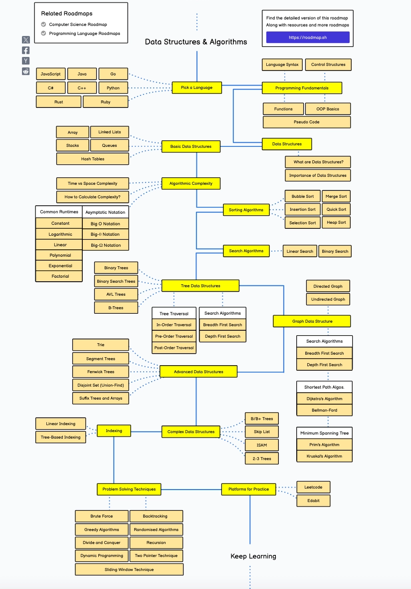

### Перед началом

Цель - научиться решать алгоритмические задачи на таком уровне, чтобы спокойно проходить собесы в 90% компаний. Яндекс можно пока оставить в покое - на подготовку в подобные компании нужно слишком много времени, а выхлоп не всегда оправдывает усилия.

Алгоритмы - это вообще огромная тема. Прям очень огромная. Вот просто забей в гугле “algorithms roadmap” и первая же картинка тебя напугает. А ведь это только верхушка айсберга. В реальности тема бесконечна: статьи, курсы, литкод с его тысячами задач, в которых легко потеряться на годы.

Хорошая новость - чтобы пройти собес, не нужно учить вообще _всё_. По [принципу Парето](https://ru.wikipedia.org/wiki/%D0%97%D0%B0%D0%BA%D0%BE%D0%BD_%D0%9F%D0%B0%D1%80%D0%B5%D1%82%D0%BE) 20% усилий дадут 80% результата. Чтобы успешно пройти алгособес достаточно выучить несколько алгоритмов и структур данных и научиться применять их в задачах. Общий план такой:

Разобраться в ключевых структурах данных

Разобраться в ключевых алгоритмах

Научиться замечать, когда и что можно применить в конкретной задаче </aside>

### Как правильно готовиться

Важная база:

Задача = Паттерн

Любая алгоритмическая задача решается каким-то конкретным способом — с помощью паттерна (шаблона, примера). Пытаться решать их без шаблонов - всё равно что прийти на ЕГЭ, не зная, какие бывают типы задач и как к ним подступаться.

Паттерн - это может быть какая-то структура данных или известный алгоритм, который нужно чуть-чуть подогнать под конкретную задачу. Наша цель - разобраться, как работают основные паттерны, и научиться применять их на практике.

С каждой новой задачей будет всё проще: ты начнёшь видеть знакомые шаблоны, быстрее понимать, что к чему, и легко писать решение. Мы будем изучать каждый паттерн сначала в теории, а потом закреплять его на практике.

Лучше всего про то, как эффективно изучать, понимать, замечать и применять паттерны, рассказал автор канала [Кодируем](https://www.youtube.com/@koduryem). Мы будем опираться на его техники и использовать его [фреймворк](https://docs.google.com/document/d/1R77kvItNbME4zAZxXZxhb33GZoeokQbETUPdynKQ_4o/edit?tab=t.0#heading=h.muggmgecwrwp), который он подробно разобрал в этих видео.

- [https://www.youtube.com/watch?v=ugGT4T5HcsI](https://www.youtube.com/watch?v=ugGT4T5HcsI)

- [https://www.youtube.com/watch?v=i3DtoLfJ96k&ab_channel=Кодируем](https://www.youtube.com/watch?v=i3DtoLfJ96k&ab_channel=%D0%9A%D0%BE%D0%B4%D0%B8%D1%80%D1%83%D0%B5%D0%BC)

Здесь стоит сделать паузу. Видео можно посмотреть целиком - оно полезное, хоть и много воды. Но если времени впритык, ниже я оставлю конкретные фрагменты, которые точно стоит глянуть.

В любом случае — обязательно посмотри эти куски внимательно и постарайся понять о чём говорит автор. Это реально поможет выстроить правильный подход к обучению.

- Таймкоды из видео(открываются по ссылке)
  - [https://youtu.be/ugGT4T5HcsI?t=2238](https://youtu.be/ugGT4T5HcsI?t=2238) 37:18 - 45:22

  - [https://youtu.be/ugGT4T5HcsI?t=7812](https://youtu.be/ugGT4T5HcsI?t=7812) 2:10:11 - 3:18:34

  - [https://youtu.be/i3DtoLfJ96k?t=2340](https://youtu.be/i3DtoLfJ96k?t=2340) 39:05 - 42:40

После просмотра видео обязательно выдели время на рефлексию - просто сядь и подумай, о чём говорилось в видосе. Попробуй разложить всё по полочкам: какие советы он дал, что ты уже делаешь, а что стоит внедрить в свой подход к обучению.

С первого раза, скорее всего, не получится всё запомнить и уложить в голове — это нормально. Поэтому возвращайся к [текстовой версии фреймворка](https://docs.google.com/document/d/1R77kvItNbME4zAZxXZxhb33GZoeokQbETUPdynKQ_4o/edit?tab=t.0#heading=h.muggmgecwrwp). Там всё расписано по шагам, и это поможет закрепить понимание.

Итого, как работать с материалом:

1. Работаем в потоке - убираем всё, что отвлекает, и полностью фокусируемся. Никаких уведомлений, чатов, видео на фоне.

2. Внимательно читаем - вникаем в материал, не пролистываем. Условия задач - не просто текст, а важная часть понимания.

3. Подключаем “быстрый” и “медленный” мозг - если тема знакомая, можно действовать быстрее. Если новая или сложная — работаем вдумчиво, не спеша.

4. “Быстрый мозг” помогает выбирать паттерн - прикидываем, какие алгоритмы или структуры данных подойдут. Перебираем варианты.

5. Нужно напрягать мозг (ментальная боль, неприятное чувство, не получается). Делать это в своих пределах (не чрезмерно сложная задача, а чуть сложнее знакомых задач, чуть за нашей зоной комфорта, но не сильно далеко - если идти по материалу так и будет). Только тогда образуются нейронные связи и мы учимся. Это "вспоминание", "припоминание", "поиск решения" и тд - это то, что нужно, а не само решение. Называется active recall

6. Порешал. Не получается никак. 30 мин. Подсмотри решение. Не полностью, кусочек. Думай дальше. Еще подсмотри. Хорошо, если это не код, а описание идеи

7. Забывается? Повтори завтра, через пару дней, через недельку. Дай нейронным связям окрепнуть.

### Список задач

Полезно повторить:

- [https://learn.javascript.ru/string](https://learn.javascript.ru/string)

- [https://learn.javascript.ru/array-methods](https://learn.javascript.ru/array-methods)

- [https://learn.javascript.ru/map-set](https://learn.javascript.ru/map-set)

- [https://learn.javascript.ru/keys-values-entries](https://learn.javascript.ru/keys-values-entries)

- [https://learn.javascript.ru/recursion](https://learn.javascript.ru/recursion)

В процессе обучения будем использовать книгу “Грокаем алгоритмы” [https://online.fliphtml5.com/mynym/cgao/#p=1](https://online.fliphtml5.com/mynym/cgao/#p=1). Ниже написано какие главы нужно изучить. При изучении глав обязательно прорешивать все приведенные алгоритмы, решать все задачи и отвечать на все вопросы (ответы даны в конце книги).

Заведи репозиторий на GitHub под задачи. Каждая практическая задача в этом курсе это задача, под каждую должен быть сделан PR.

1. [Знакомство с алгоритмами](https://online.fliphtml5.com/mynym/cgao/#p=19)
   2. [https://neetcode.io/problems/binary-search](https://neetcode.io/problems/binary-search)

   3. [https://leetcode.com/problems/search-insert-position/description/?envType=problem-list-v2&envId=binary-search](https://leetcode.com/problems/search-insert-position/description/?envType=problem-list-v2&envId=binary-search)

   4. [https://leetcode.com/problems/intersection-of-two-arrays/description/?envType=problem-list-v2&envId=binary-search](https://leetcode.com/problems/intersection-of-two-arrays/description/?envType=problem-list-v2&envId=binary-search)

2. [Сортировка выбором](https://online.fliphtml5.com/mynym/cgao/#p=41)
   6. Написать свою сортировку выбором

   7. [https://leetcode.com/problems/sort-by/description/](https://leetcode.com/problems/sort-by/description/)

3. [Рекурсия](https://online.fliphtml5.com/mynym/cgao/#p=61)
   9. [https://leetcode.com/problems/fibonacci-number/description/](https://leetcode.com/problems/fibonacci-number/description/)

   10. [https://leetcode.com/problems/flatten-deeply-nested-array/description/?envType=study-plan-v2&envId=30-days-of-javascript](https://leetcode.com/problems/flatten-deeply-nested-array/description/?envType=study-plan-v2&envId=30-days-of-javascript)

   11. [https://bigfrontend.dev/problem/create-cloneDeep](https://bigfrontend.dev/problem/create-cloneDeep)

4. [Быстрая сортировка](https://online.fliphtml5.com/mynym/cgao/#p=77)
   13. Написать свою быструю сортировку

   14. Разобрать реализацию от автора [https://www.youtube.com/watch?v=o0fe6OlUROg&ab_channel=devschacht“Девшахта”](https://www.youtube.com/watch?v=o0fe6OlUROg&ab_channel=devschacht%E2%80%9C%D0%94%D0%B5%D0%B2%D1%88%D0%B0%D1%85%D1%82%D0%B0%E2%80%9D)

5. [Хеш-таблицы](https://online.fliphtml5.com/mynym/cgao/#p=100)
   16. [https://neetcode.io/problems/duplicate-integer](https://neetcode.io/problems/duplicate-integer)

   17. [https://neetcode.io/problems/two-integer-sum](https://neetcode.io/problems/two-integer-sum)

   18. [https://neetcode.io/problems/is-anagram](https://neetcode.io/problems/is-anagram)

6. [Поиск в ширину](https://online.fliphtml5.com/mynym/cgao/#p=129)
   20. Реализовать алгоритм представленный в книге

7. Стэк
   22. [https://doka.guide/tools/structure-data-in-js/](https://doka.guide/tools/structure-data-in-js/)

   23. [https://sky.pro/wiki/javascript/realizatsiya-steka-i-ocheredi-v-java-script-dlya-algoritma](https://sky.pro/wiki/javascript/realizatsiya-steka-i-ocheredi-v-java-script-dlya-algoritma/)

   24. [https://neetcode.io/problems/minimum-stack](https://neetcode.io/problems/minimum-stack)

   25. [https://neetcode.io/problems/validate-parentheses](https://neetcode.io/problems/validate-parentheses)

   26. [https://leetcode.com/problems/unique-email-addresses/description/](https://leetcode.com/problems/unique-email-addresses/description/)

   27. [https://leetcode.com/problems/simplify-path/description/](https://leetcode.com/problems/simplify-path/description/)

8. Два указателя (two pointers) [https://javarush.com/quests/lectures/ru.javarush.python.core.lecture.level19.lecture01](https://javarush.com/quests/lectures/ru.javarush.python.core.lecture.level19.lecture01)
   29. Практика:
       30. Разобраться и прорешать задачи из теоретической части

       31. [https://leetcode.com/problems/merge-sorted-array/description/?envType=study-plan-v2&envId=top-interview-150](https://leetcode.com/problems/merge-sorted-array/description/?envType=study-plan-v2&envId=top-interview-150)

       32. [https://leetcode.com/problems/remove-element/description/?envType=study-plan-v2&envId=top-interview-150](https://leetcode.com/problems/remove-element/description/?envType=study-plan-v2&envId=top-interview-150)

       33. [https://leetcode.com/problems/remove-duplicates-from-sorted-array/description/?envType=study-plan-v2&envId=top-interview-150](https://leetcode.com/problems/remove-duplicates-from-sorted-array/description/?envType=study-plan-v2&envId=top-interview-150)

9. Связанный список
   35. Теория: [https://ru.hexlet.io/courses/basic-algorithms/lessons/linked-list/theory_unit](https://ru.hexlet.io/courses/basic-algorithms/lessons/linked-list/theory_unit)

   36. Практика:
       37. [https://leetcode.com/problems/design-linked-list/description/](https://leetcode.com/problems/design-linked-list/description/)

       38. [https://leetcode.com/problems/linked-list-cycle/description/?envType=study-plan-v2&envId=top-interview-150](https://leetcode.com/problems/linked-list-cycle/description/?envType=study-plan-v2&envId=top-interview-150)

       39. [https://leetcode.com/problems/merge-two-sorted-lists/description/?envType=study-plan-v2&envId=top-interview-150](https://leetcode.com/problems/merge-two-sorted-lists/description/?envType=study-plan-v2&envId=top-interview-150)

### Задачи на закрепление

Жесткая практика. Ниже дан список задач, которые встречаются на собеседованиях. Хорошо развивают навык “искать паттерн”, хотя и не всегда задачи решаются каким-то способом изученным выше, иногда просто задача “на подумать”.

1. [https://leetcode.com/problems/majority-element/description/?envType=study-plan-v2&envId=top-interview-150](https://leetcode.com/problems/majority-element/description/?envType=study-plan-v2&envId=top-interview-150)

2. [https://www.codewars.com/kata/541c8630095125aba6000c00](https://www.codewars.com/kata/541c8630095125aba6000c00)

3. [https://leetcode.com/problems/number-of-recent-calls/?envType=study-plan-v2&envId=leetcode-75](https://leetcode.com/problems/number-of-recent-calls/?envType=study-plan-v2&envId=leetcode-75)

4. [https://leetcode.com/problems/removing-stars-from-a-string/description/?envType=study-plan-v2&envId=leetcode-75](https://leetcode.com/problems/removing-stars-from-a-string/description/?envType=study-plan-v2&envId=leetcode-75)

5. [https://leetcode.com/problems/chunk-array/description/?envType=study-plan-v2&envId=30-days-of-javascript](https://leetcode.com/problems/chunk-array/description/?envType=study-plan-v2&envId=30-days-of-javascript)

6. [https://leetcode.com/problems/word-pattern/description/?envType=study-plan-v2&envId=top-interview-150](https://leetcode.com/problems/word-pattern/description/?envType=study-plan-v2&envId=top-interview-150)

7. [https://neetcode.io/problems/find-minimum-in-rotated-sorted-array](https://neetcode.io/problems/find-minimum-in-rotated-sorted-array)

8. [https://leetcode.com/problems/valid-palindrome/?envType=study-plan-v2&envId=top-interview-150](https://leetcode.com/problems/valid-palindrome/?envType=study-plan-v2&envId=top-interview-150)

9. [https://t.me/jsgrill/159](https://t.me/jsgrill/159)

10. [https://leetcode.com/problems/guess-number-higher-or-lower/description/?envType=study-plan-v2&envId=leetcode-75](https://leetcode.com/problems/guess-number-higher-or-lower/description/?envType=study-plan-v2&envId=leetcode-75)

11. [https://leetcode.com/problems/group-anagrams/description/](https://leetcode.com/problems/group-anagrams/description/)

12. [https://www.codewars.com/kata/595afed8c52e25d92c000072](https://www.codewars.com/kata/595afed8c52e25d92c000072)

13. [https://leetcode.com/problems/power-of-two/description/](https://leetcode.com/problems/power-of-two/description/)

14. [https://leetcode.com/problems/longest-substring-without-repeating-characters/description/](https://leetcode.com/problems/longest-substring-without-repeating-characters/description/)

15. [https://leetcode.com/problems/can-place-flowers/description/?envType=study-plan-v2&envId=leetcode-75](https://leetcode.com/problems/can-place-flowers/description/?envType=study-plan-v2&envId=leetcode-75)

16. [https://leetcode.com/problems/isomorphic-strings/description/?envType=study-plan-v2&envId=top-interview-150](https://leetcode.com/problems/isomorphic-strings/description/?envType=study-plan-v2&envId=top-interview-150)

17. [https://www.codewars.com/kata/57547f9182655569ab0008c4](https://www.codewars.com/kata/57547f9182655569ab0008c4)

18. [https://www.codewars.com/kata/5a15a4db06d5b6d33c000018](https://www.codewars.com/kata/5a15a4db06d5b6d33c000018)

19. [https://leetcode.com/problems/longest-palindromic-substring/description/](https://leetcode.com/problems/longest-palindromic-substring/description/)

20. [https://leetcode.com/problems/lru-cache/description/](https://leetcode.com/problems/lru-cache/description/)

Ниже еще список - это просто задачи на лайвкодинг — чтобы прокачать навык быстро ориентироваться и писать код в реальном времени.

В них может быть, а может и не быть один из изученных паттернов. Эти задачи уже "на подумать" — они требуют анализа, нестандартного подхода и часто встречаются на собесах.

1. [https://leetcode.com/problems/counter/description/?envType=study-plan-v2&envId=30-days-of-javascript](https://leetcode.com/problems/counter/description/?envType=study-plan-v2&envId=30-days-of-javascript)

2. [https://t.me/jsgrill/141](https://t.me/jsgrill/141)

3. [https://bigfrontend.dev/problem/implement-general-memoization-function](https://bigfrontend.dev/problem/implement-general-memoization-function)

4. [https://bigfrontend.dev/problem/implement-basic-debounce](https://bigfrontend.dev/problem/implement-basic-debounce)

5. [https://t.me/jsgrill/40](https://t.me/jsgrill/40)

6. [https://leetcode.com/problems/to-be-or-not-to-be/description/?envType=study-plan-v2&envId=30-days-of-javascript](https://leetcode.com/problems/to-be-or-not-to-be/description/?envType=study-plan-v2&envId=30-days-of-javascript)

7. [https://t.me/jsgrill/147](https://t.me/jsgrill/147)

8. [https://leetcode.com/problems/counter-ii/description/?envType=study-plan-v2&envId=30-days-of-javascript](https://leetcode.com/problems/counter-ii/description/?envType=study-plan-v2&envId=30-days-of-javascript)

9. [https://bigfrontend.dev/problem/implement-curry](https://bigfrontend.dev/problem/implement-curry)

10. [https://t.me/jsgrill/183](https://t.me/jsgrill/183)

11. [https://leetcode.com/problems/allow-one-function-call/description/?envType=study-plan-v2&envId=30-days-of-javascript](https://leetcode.com/problems/allow-one-function-call/description/?envType=study-plan-v2&envId=30-days-of-javascript)

12. [https://leetcode.com/problems/sleep/description/?envType=study-plan-v2&envId=30-days-of-javascript](https://leetcode.com/problems/sleep/description/?envType=study-plan-v2&envId=30-days-of-javascript)

13. [https://t.me/jsgrill/129](https://t.me/jsgrill/129)

14. [https://bigfrontend.dev/problem/create-an-Event-Emitter](https://bigfrontend.dev/problem/create-an-Event-Emitter)

15. [https://www.codewars.com/kata/64b771989416793927fbd2bf](https://www.codewars.com/kata/64b771989416793927fbd2bf)

16. [https://bigfrontend.dev/problem/implement-clearAllTimeout](https://bigfrontend.dev/problem/implement-clearAllTimeout)

17. [https://leetcode.com/problems/join-two-arrays-by-id/description/?envType=study-plan-v2&envId=30-days-of-javascript](https://leetcode.com/problems/join-two-arrays-by-id/description/?envType=study-plan-v2&envId=30-days-of-javascript)

18. [https://t.me/jsgrill/105](https://t.me/jsgrill/105)

19. [https://leetcode.com/problems/flatten-deeply-nested-array/description/?envType=study-plan-v2&envId=30-days-of-javascript](https://leetcode.com/problems/flatten-deeply-nested-array/description/?envType=study-plan-v2&envId=30-days-of-javascript)

20. [https://bigfrontend.dev/problem/implement-basic-throttle](https://bigfrontend.dev/problem/implement-basic-throttle)

21. [https://t.me/jsgrill/127](https://t.me/jsgrill/127)

В целом, это всё. Если придерживаться этих советов, работать вдумчиво и последовательно, двигаться по материалу и просто делать - ты довольно быстро научишься решать задачи и будешь готов к собесам. Главное - не торопиться, не сдаваться и довериться процессу. Всё получится 💪

### Быстрая подготовка

Список задач и материалов если собеседование скоро и времени совсем мало. Для начала прочитай [Как правильно готовиться](https://www.notion.so/30d484920e0581ee99c3e187646df057?pvs=21)

Задачи:

1. [Хеш-таблицы](https://online.fliphtml5.com/mynym/cgao/#p=100)
   2. [https://neetcode.io/problems/duplicate-integer](https://neetcode.io/problems/duplicate-integer)

   3. [https://neetcode.io/problems/two-integer-sum](https://neetcode.io/problems/two-integer-sum)

   4. [https://neetcode.io/problems/is-anagram](https://neetcode.io/problems/is-anagram)

2. [Рекурсия](https://online.fliphtml5.com/mynym/cgao/#p=61)
   6. [https://leetcode.com/problems/fibonacci-number/description/](https://leetcode.com/problems/fibonacci-number/description/)

   7. [https://leetcode.com/problems/flatten-deeply-nested-array/description/?envType=study-plan-v2&envId=30-days-of-javascript](https://leetcode.com/problems/flatten-deeply-nested-array/description/?envType=study-plan-v2&envId=30-days-of-javascript)

   8. [https://bigfrontend.dev/problem/create-cloneDeep](https://bigfrontend.dev/problem/create-cloneDeep)

3. Стэк
   10. Теория: 1.[https://doka.guide/tools/structure-data-in-js/](https://doka.guide/tools/structure-data-in-js/) 2.[https://sky.pro/wiki/javascript/realizatsiya-steka-i-ocheredi-v-java-script-dlya-algoritma/](https://sky.pro/wiki/javascript/realizatsiya-steka-i-ocheredi-v-java-script-dlya-algoritma/)

   11. [https://neetcode.io/problems/validate-parentheses](https://neetcode.io/problems/validate-parentheses)

   12. [https://leetcode.com/problems/unique-email-addresses/description/](https://leetcode.com/problems/unique-email-addresses/description/)

4. Два указателя (two pointers)
   14. Теория: [https://javarush.com/quests/lectures/ru.javarush.python.core.lecture.level19.lecture01](https://javarush.com/quests/lectures/ru.javarush.python.core.lecture.level19.lecture01)

   15. Разобраться и прорешать задачи из теоретической части

   16. [https://leetcode.com/problems/remove-element/description/?envType=study-plan-v2&envId=top-interview-150](https://leetcode.com/problems/remove-element/description/?envType=study-plan-v2&envId=top-interview-150)

   17. [https://leetcode.com/problems/remove-duplicates-from-sorted-array/description/?envType=study-plan-v2&envId=top-interview-150](https://leetcode.com/problems/remove-duplicates-from-sorted-array/description/?envType=study-plan-v2&envId=top-interview-150)

Закрепление:

1. [https://leetcode.com/problems/word-pattern/description/?envType=study-plan-v2&envId=top-interview-150](https://leetcode.com/problems/word-pattern/description/?envType=study-plan-v2&envId=top-interview-150)

2. [https://t.me/jsgrill/159](https://t.me/jsgrill/159)

3. [https://t.me/jsgrill/183](https://t.me/jsgrill/183)

4. [https://t.me/jsgrill/147](https://t.me/jsgrill/147)

Задачи на лайвкодинг (не алгосы)

1. [https://t.me/jsgrill/141](https://t.me/jsgrill/141)

2. [https://leetcode.com/problems/counter/description/?envType=study-plan-v2&envId=30-days-of-javascript](https://leetcode.com/problems/counter/description/?envType=study-plan-v2&envId=30-days-of-javascript)

3. [https://bigfrontend.dev/problem/implement-general-memoization-function](https://bigfrontend.dev/problem/implement-general-memoization-function)

4. [https://bigfrontend.dev/problem/implement-curry](https://bigfrontend.dev/problem/implement-curry)

5. [https://leetcode.com/problems/sleep/description/?envType=study-plan-v2&envId=30-days-of-javascript](https://leetcode.com/problems/sleep/description/?envType=study-plan-v2&envId=30-days-of-javascript)

6. [https://bigfrontend.dev/problem/implement-basic-debounce](https://bigfrontend.dev/problem/implement-basic-debounce)

7. [https://t.me/jsgrill/127](https://t.me/jsgrill/127)

### Доп мысли и материалы

- **Как долго думать над задач**ей?

  Оригинальный пост - [https://t.me/koduryem/36](https://t.me/koduryem/36)

  Как же лучше всего практиковать задачки? Как долго сидеть и думать над ней? Давайте выстроим какую-то четкую схему и поймем, почему она будет работать лучше всего.

  🚀 Первое - брутфорс. Самое тупое, циклами, рекурсиями. Хорошо найти что-то, на чем тестить. Плюс, это может дать некоторое понимание темы, что мы правильно вообще поняли условие задачи.

  Теперь, нужно определиться, сколько у нас есть времени.

  🚀 Если его много и мы не торопимся , то можем думать над задачей дольше - несколько дней. Крутить в голове всякие варианты и активно пользоваться фреймворком. Выбираться, что лучше именно вам заходит. Собирать инфо. Представлять, как данные перетекают, как мы бегаем по ним мысленным взором и ищем что-то. Просто кайфовое занятие, развивающее фантазию и мышление.

  🚀 Второе вариант - нам нужно быстрее. Тогда мы думаем минут 30. Перебираем все паттерны. Вообще никак. Нет идей. Смотрим фреймворк. Берем пару рабочих для вас пунктов. Пытаемся играть с данными, выписывая, вычисляя, составляя уравнение и т.д. Не получается. Это ок. Так у всех бывает иногда даже с тупыми задачами. Я тоже туплю часто!

  🚀 Теперь что мы делаем. Мы идем в решения и ПОДСМАТРИВАЕМ ИДЕЮ. Думаем, ага, попробую сам эту идею закодить, вроде там нет спец алгоритма какого-то. И пытаемся сами. Пытаемся это с чем-то связать, что мы знаем.

  🚀 Потом смотрим быстро код, его конструкции, не разбирая детально. Попробовать их перекрутить в голове, вдруг будут новые идеи. Кодим теперь сами на память. Не переписывайте.

  🚀 В конце уже просто разобрать решение по шагам. Тут уже очевидно, что ты просто не знаешь кого-то подхода, алго или паттерна. А некоторые вещи с нуля изобрести или оч сложно или невозможно вообще. Можно тут даже переписать код вручную, чтобы лучше понять (раз 100 😂).

  ✏️ Как бы не решили, если вы видите «о, паттерн можно похожие задачи на изи им решать» - выпишите себе и повторяйте их регулярно. Можно просто быстро подсматривать и вспоминать в голове как вы данными манипулируете. Пробегать мысленно по данным - не обязательно кодить каждый раз (разве что по-началу).

  🧠 Повторять свои паттерны регулярно. Довести до уровня, когда смотришь на называние паттерна типа "найти n самых больших чисел через heap" и сразу быстро в голове бежишь по данным оставляя в heap только самые большие, накапливая их туда, выбрасывая лишние и в конце это и есть ответ. Занимает 2-3 секунды. Подсматривать только, если забыли, как он работает. Стараться вспомнить самим.

  ❓Почему это будет работать? Потому что здесь мы используем сразу две важные техники.

  ⭐️ Первая - active recall. Мы заставляем наш мозг постоянно через "боль" вспоминать и работать. Мозг включается на полную и ищет связи, ассоциации, пытается как-то сопоставить текущие знания с проблемой, вытащить инфо. И такой процесс создаст сильные нейронные связи. В следующий раз, вспоминая и имея более сильные связи, мы сделаем это в несколько раз быстрее.

  ❗️Это очень эффективно.

  ❗️Пассивный просмотр не работает.

  ⭐️ Регулярное повторение - это space repetition. Как в anki карточки. Прикол в том, чтобы не повторять бесконечно пока не сойдешь с ума, а дойти до момента, когда ты начинаешь немного забывать. Чтобы было усилие воли вспомнить (active recall). Чтобы как раз заставлять окрепнуть нейронные связи и сделать их мощнее. Рекомендации обычно через 1 день, 3 дня, неделя, месяц и тд. Но, лучше по своим ощущениям. Чуть забываешь - повторил, прокрутив в голове.

  ❗️Это помогает тормознуть forgetting curve. Сначала забывается очень быстро, но с каждым повторением все дольше. Если вы это делаете как мульт в голове - это усиливает эффект в разы.

  🤩Не психуйте и не нервничайте. Внушите себе, что вам в кайф и интересно. Стресс может значительно замедлить обучение. Он может помочь, но дозированно и не prolonged one.

  ❗️❗️❗️Не забывать про рефлексию после решения!

  Они боятся вас больше, чем вы их ;)
