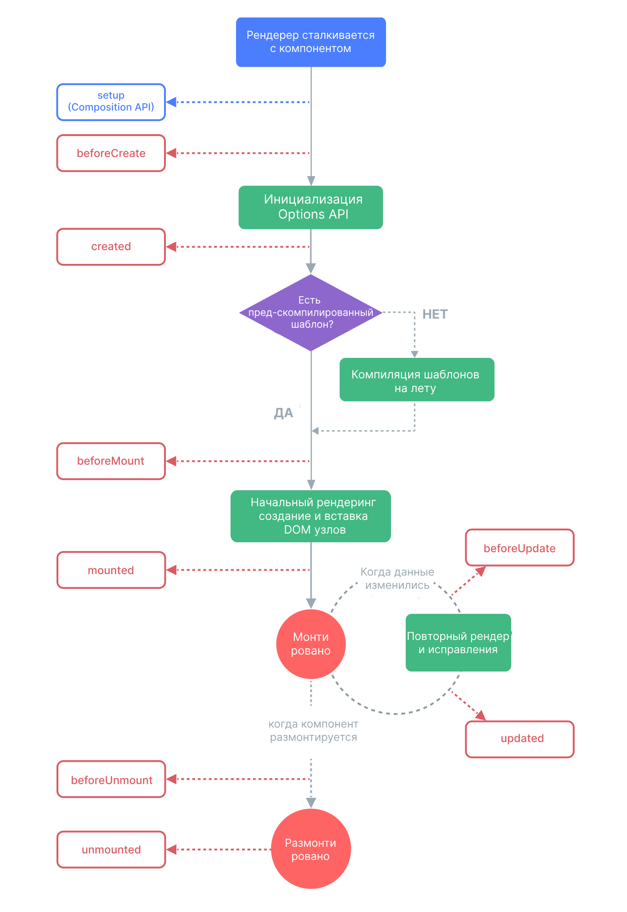

# Общая теория

<details>
<summary><b>Что такое Vue.js?</b></summary>

Vue.js - это прогрессивный JavaScript-фреймворк для создания пользовательских интерфейсов. Он прост в освоении, но при этом мощный и гибкий, что делает его отличным выбором как для небольших проектов, так и для крупных веб-приложений.

</details>

<details>
<summary><b>Основные преимущества Vue.js</b></summary>

- **Простота и удобство**

    Vue.js разработан с упором на удобвство использования. Его синтаксис интуитивно понятен, а документация детально описывает все возможности.

- **Высокая производительность**

    Размер Vue.js (~20 КВ) меньше, чем у React и Angular, а его виртуальный DOM обеспечивает быстрый рендеринг.

- **Реактивность**

    Vue использует реактивную систему данных. Если данный изменяются, Vue автоматически обновляет интерфейс без необходимости вручную манипулировать DOM.

- **Компонентный подход**

- **Двунаправленное связывание данных**

    В отличие от React, Vue поддерживает двустороннее связывание данных(v-model), что упрощает работу с формами.

- **Модульность и экосистема**

- **Хорошая документация и поддержка сообщества**

</details>

<details>
<summary><b>Что такое SFC?</b></summary>

SFC (Single File Component) - это однофайловый компонент во Vue, в котором шаблон(HTML), логика (JavaScript) и стили (CSS) объединены в один `.vue` - файл.

</details>

<details>
<summary><b>Что такое Composition API и какую проблему он решает?</b></summary>

Composition API - это набор API, который позволяет нам создавать компоненты Vue, используя импортирированные функции вместо объявлений опций. Это обобщающий термин, который охватывает следующие API:

- Reactivity API, например `ref()` и `reactive()`, что позволяет нам напрямую создавать реативное состояние, вычисляемое состояние и наблюдатели.

- Хуки жизненного цикла, например `onMounted()` и `onUnmounted()`, которые позволяют нам программно подключаться к жизненному циклу компонента.

- Инъенкция зависимостей, то есть `provide()` и `inject()`, которые позволяют нам использовать систему dependency injection при использовании Reactivity API.

Почему Composition API:

- Лучшее переиспользование логики

- Более гибкая организация кода

- Лучшее выведение типов

- Меньший размер production сборки и меньше накладных расходов

</details>

<details>
<summary><b>Что такое Composables в Vue.js?</b></summary>

Composables - это функция, использующая Composition API повторного использования логики в компонентах Vue 3.

</details>

<details>
<summary><b>Что такое Virtual DOM и для чего он нужен?</b></summary>

**Virtual DOM (VDOM)** во Vue — это лёгкое *JavaScript-представление реального DOM*, применяемое во Vue (в Vue 3 используется Proxy + компилятор, но VDOM всё равно присутствует).
Идея простая: вместо прямых частых операций с DOM фреймворк сначала работает с его виртуальной копией, а уже затем минимальными патчами обновляет настоящий DOM.

**Зачем нужен Virtual DOM**

1. **Оптимизация обновлений UI**
Реальный DOM — тяжёлый. Изменения вносятся сначала в Virtual DOM, после чего Vue вычисляет разницу (diff) и вносит *только изменённые части* в настоящий DOM.

2. **Повышение производительности**
Вместо полной перерисовки компонента Vue делает точечные обновления.
→ меньше перерисовок → быстрее интерфейс.

3. **Декларативный UI**
Ты описываешь *что* нужно отрендерить, а Vue сам решает *как это сделать эффективно*.

4. **Кроссплатформенность**
Один и тот же механизм позволяет рендерить не только HTML, но и, например, в NativeScript или SSR — потому что всё начинается с виртуального дерева.

</details>

# Script

<details>
<summary><b>Чем отличается <code>script setup</code> от классического <code>script</code>?</b></summary>

1. Классический `script` (Options API)

2. `script setup` (Composition API)

Преимущества `script setup`:

- **Лаконичность** - меньше шаблонного кода.

- **Лучшая поддержка TS** - проще типизировать props и emits.

- **Прямой доступ к Composition API** - удобнее работать с ref, reactive, computed

- **Автоматическая доступность в шаблоне** - не нужно возвращать переменные вручную

</details>

<details>
<summary><b>Как в <code>script setup</code> определить локальную переменную без реактивности?</b></summary>

В `script setup` локальную переменную без реактивности можно определить, используя обычное объявление переменной через `const`, `let`, `var`

```Vue
<script setup>
const localVar = 'This is not reactive';
</script>
```

</details>

# Реактивность

<details>
<summary><b>Что такое <code>ref</code>?</b></summary>

**`ref`** - создаёт реактивную обёртку вокруг любого значения

Доступ к значению через .value, но в шаблонах автоматически раскрывает .value.

**Когда использовать?**

- Для простых значений (число, строка, булево)

- Когда нужно перезаписывать значение целиком

</details>

<details>
<summary><b>Можно ли повесить <code>ref</code> на компонент?</b></summary>

Да

</details>

<details>
<summary><b>Что такое <code>reactive</code>?</b></summary>

**`reactive`** - создает реактивный объект/массив (без обёртки, как в ref)

Не требует .value - обращение напрямую к полям.

**Когда использовать?**

- Для сложных структур

- Когда не нужно перезаписывать объект целиком

</details>

<details>
<summary><b>Что произойдёт, если присвоить новое значение <code>reactive</code>-объекту?</b></summary>

Если мы попытаемся перезаписать полностью объект, это нарушит реактивность и мы потеряем ссылку на исходную реактивность.

</details>

<details>
<summary><b>Что такое <code>computed</code>?</b></summary>

`computed` - это реактивное вычисляемое свойство, которое автоматически обновляется при изменении своих зависимостей. Оно сочетает в себе кеширование(как свойство) и реактивность (как функция).

</details>

<details>
<summary><b>Что произойдёт, если изменить <code>computed</code> без сеттера?</b></summary>

- Присвоение будет проигноривано

- В консоль выведется warning:

```Vue
[Vue warn]: Computed property "имяСвойства" was assigned to but it has no setter.
```

</details>

<details>
<summary><b>Что такое <code>watch</code>?</b></summary>

`watch` - функция, которая отслеживает изменения явно указанных реактивных источников(ref, reactive, getter-функции или массива источников) и вызывает callback функцию только при их изменений

</details>

<details>
<summary><b>Как остановить наблюдение за переменной?</b></summary>

Для остановки наблюдения используется функция, возвращаемая watch:

```Vue
const stop = watch(() => count.value, () => {});
stop();
```

</details>

<details>
<summary><b>Какие параметры можно передать в <code>watch</code>?</b></summary>

- `immediate`: запускает обработчик сразу после инициализации.

    - Полезно, если нужно выполнить код сразу, а не только при изменении.

- `deep`: глубокое отслеживание вложенных объектов.

    - Необходим для реактивных изменений внутри объекта/массива, а не самого объекта.

</details>

<details>
<summary><b>Что такое <code>watchEffect</code>?</b></summary>

watchEffect - немедленно запускает функцию, отслеживая её зависимости с помощью системы реактивности, а затем повторно вызывает лишь при изменении этих зависимостей.

</details>

<details>
<summary><b>В чём разница между <code>watch</code> и <code>watchEffect</code>?</b></summary>

**watch:**

1. Ты явно указываешь, за чем следить

2. Функция вызывается только при изменении указанных зависимостей(если не задана опция `immediate: true`, то выполнится при первом рендере).

3. Обычно используется, когда нужно реагировать на конкретные изменения

**watchEffect**:

1. Ты не указываешь явно, за чем следить - vue автоматически отслеживает все реактивные свойства, к которым ты образаешься внутри переданной функции.

2. Эффект немедленно выполняется один раз при инициализации, а потом пересчитывается при изменении любых используемых в нём реактивных данных.

</details>

<details>
<summary><b>В чём разница между <code>computed</code> и <code>watch</code>/<code>watchEffect</code>?</b></summary>

`computed` - **когда нужно получить вычисленное выражение** на основе реактивных данных.

`watch`/`watchEffect` - когда нужно выполнить действие при изменении данных(запрос к API, логирование)

</details>

<details>
<summary><b>Что такое <code>nextTick</code> и для чего они используются?</b></summary>

**`nextTick`** - это утилита, которая позволяет отложить выполнение кода до следующего обновления DOM. Она используется, когда необходимо выполнить действие после того, как Vue обработал все изменения данных и обновил интерфейс.

Используется:

- Работа с DOM после обновления данных

- Обработка событий, связанные с DOM

- Асинхронная обработка

</details>

# Директивы

<details>
<summary><b>Что такое директивы?</b></summary>

Vue.js использует директивы - специальные атрибуты, которые управляют поведением элементов DOM. Они позволяют динамически изменять разметку, управлять событиями, связывать данные и выполнять другие важные задачи.

</details>

<details>
<summary><b>Какими способами можно реализовать двустороннее связывание для <code>input</code>?</b></summary>

1. Использование `v-model`

```Vue
<script setup>
import { ref } from 'vue';

const text = ref(''); // Реактивная переменная
</script>

<template>
  <input v-model="text" placeholder="Введите текст">
  <p>Вы ввели: {{ text }}</p>
</template>
```

2. Реализация `:value` + `@input`

```Vue
<script setup>
import { ref } from 'vue';

const inputText = ref('');

function updateText(value) {
  inputText.value = value.trim(); // Удаляем пробелы
}
</script>

<template>
  <input 
    :value="inputText" 
    @input="updateText($event.target.value)" 
    placeholder="Введите текст"
  >
  <p>Текст: {{ inputText }}</p>
</template>
```

</details>

<details>
<summary><b>Чем отличается <code>v-show</code> от <code>v-if</code>?</b></summary>

Отличается от `v-if`, так как скрывает элемент с помощью `display: none`, а не удаляет его из DOM.

</details>

<details>
<summary><b>Что произойдет, если использовать <code>v-if</code> и <code>v-for</code> вместе?</b></summary>

Обе директивы структурные. Если использовать `v-if` и `v-for` вместе, то приоритет у `v-for`. Это может привести к неэффективности. Лучше перенести `v-if` в родительский элемент.

</details>

<details>
<summary><b>Почему при использовании <code>v-for</code> нужно указывать уникальный <code>key</code>?</b></summary>

Когда Vue рендерит список с v-for, он использует алгорит сравнения, чтобы определить, какие элементы изменились

**С `key`**:

- Каждый элемент привязывается к уникальному идентификатору.

- Vue точно знает, какой элемент:

    - Переместился

    - Нуждается в обновлении

    - Можно безопасно удалить

**Без `key`**:

- Vue будет сравнивать элементы по индексу (позиция в массиве)

- Если порядок элементов изменится, Vue может:

    - Переиспользовать неправильные DOM-узлы

    - Неоптимально обновлять атрибуты/состояние элементов.

</details>

# Компоненты

<details>
<summary><b>Какие встроенные компоненты Vue знаешь и для чего они нужны?</b></summary>

В Vue.js есть несколько встроенных компонентов, которые помогают в разработке интерфейсов. Вот основные из них:

1. **`<component :is="...">`** - Динамический компонент

    Позволяет динамически переключаться между компонентами.

    ```Vue
    <component :is="currentComponent"></component>
    ```

    Для чего нужен?

    - Табы, условный рендеринг компонентов

2. **`<transition>`** и **`<transition-group>`** - Анимации

    Обеспечивают плавные переходы при появлении/исчезновении элементов.

    ```Vue
    <transition name="fade">
      <div v-if="show">Появится с анимацией</div>
    </transition>
    ```

    Для чего нужны?

    - Анимации появления/скрытия элементов.

    - Анимация списков

3. **`<keep-alive>`** - Кеширование компонентов

    Сохраняет состояние компонента, даже когда он удалён из DOM

    ```Vue
    <keep-alive>
      <component :is="currentTab"></component>
    </keep-alive>
    ```

    Для чего нужен?

    - Оптимизация производительности

    - Сохранение состояния форм при переключении

4. **`<slot>`** - контент-плейсхолдер

    Позволяет вставлять контент из родительского компонента в дочерний

    ```Vue
    <!-- Child.vue -->
    <div>
      <slot></slot>  <!-- Сюда попадёт контент из Parent -->
    </div>
    
    <!-- Parent.vue -->
    <Child>
      <p>Этот текст попадёт в slot</p>
    </Child>
    ```

    Для чего нужен?

    - Создание переиспользуемых компонентов-обёрток

5. **`<teleport>`** - перенос dom-элементов

    Рендерит содержимое в другом месте DOM (например, модалки)

    ```Vue
    <teleport to="body">
      <div class="modal">Модальное окно (будет в <body>)</div>
    </teleport>
    ```

    Для чего нужен?

    - Модальные окна, тултипы, нитификации

</details>

<details>
<summary><b>Что такое динамические компоненты, и как их использовать?</b></summary>

Динамический компонент - позволяет динамически переключатся между компонентами

</details>

<details>
<summary><b>Что такое <code>&lt;keep-alive&gt;</code>?</b></summary>

`<KeepAlive>` это встроенный компонент, который позволяет условно кэшировать экземпляры компонентов при динамическом переключении между несколькими компонентами.

Он используется, например, с `component :is` или `router-view` для повышения производительности и удобства пользователя.

</details>

<details>
<summary><b>Чем <code>&lt;transition&gt;</code> отличается от <code>&lt;transition-group&gt;</code>?</b></summary>

- **`<transition>`** - работает с одиночными элементами

- **`<transition-group>`** - работает множеством элементов

</details>

<details>
<summary><b>Что такое Provide/Inject?</b></summary>

`Provide/Inject` - это механизм передачи данных из родительского компонента в любой дочерний без необходимости прокидывать их через пропсы

</details>

# Слоты

<details>
<summary><b>Что такое слот в Vue?</b></summary>

Слоты - это механизм, позволяющий передать контент из родительского компонента в дочерний.

Виды слотов:

- **Обычные (Default)**

    Default - базовый слот, куда попадает весь контент, не указанный в именованных слотах.

    ```Vue
    <!-- Родительский компонент -->
    <ChildComponent>
      <p>Это попадёт в default-слот</p>
    </ChildComponent>
    
    <!-- Дочерний компонент -->
    <template>
      <div>
        <slot>Fallback контент (если родитель не передал)</slot>
      </div>
    </template>
    ```

- **Именованные**

    Позволяют передавать контент в конкретные области

    ```Vue
    <!-- Родительский компонент -->
    <ChildComponent>
      <template #header>
        <h1>Кастомный заголовок</h1>
      </template>
      <p>Это default-слот</p>
    </ChildComponent>
    
    <!-- Дочерний компонент -->
    <template>
      <div>
        <slot name="header"></slot>
        <slot></slot> <!-- default -->
      </div>
    </template>
    ```

- **Динамические**

    Можно динамически определять, в какой слот передавать контент.

- **Scoped-слоты (Слоты с ограниченной областью видимости)**

    Дочерний компонент может передавать данные в родительский через слот

    ```Vue
    <!-- Родительский компонент -->
    <ChildComponent>
      <template #default="{ item }">
        <span>{{ item.name }}</span>
      </template>
    </ChildComponent>
    
    <!-- Дочерний компонент -->
    <template>
      <ul>
        <li v-for="item in items">
          <slot :item="item"></slot>
        </li>
      </ul>
    </template>
    ```

</details>

<details>
<summary><b>Чем отличаются слоты от пропсов?</b></summary>

Главное отличие:

- Пропсы передают данные в компонент.

- Слоты передают разметку в компонент.

</details>

<details>
<summary><b>Можно ли передавать данные в слот?</b></summary>

Да, можно передавать данные, используя Scoped Slots(слоты с областью видимости)

```Vue
<ChildComponent>
  <template #header="{ user }">
    Привет, {{ user.name }}!
  </template>
</ChildComponent>
```

```Vue
<script setup>
const currentUser = { name: "Анна" };
</script>

<template>
  <div>
    <slot name="header" :user="currentUser" />
  </div>
</template>
```

</details>

<details>
<summary><b>Как использовать несколько слотов в одном компоненте?</b></summary>

Использование несколькими слотами, реализуются через именованные слоты:

```Vue
<slot name="header"></slot>
```

</details>

# Жизненный цикл

<details>
<summary><b>Из каких этапов состоит жизненный цикл компонента в Vue?</b></summary>



</details>

<details>
<summary><b>Что такое хуки жизненного цикла в Vue?</b></summary>

Это специальные функции, которые позволяют выполнять код на определённых этапах "жизни" компонента: от его создания до удаления. Они дают возможность управлять поведением компонента в ключевые моменты, например, при инициализации данных, обновлении DOM или перед уничтожением компонента.

</details>

<details>
<summary><b>Какие основные хуки существуют в Vue?</b></summary>

1. onBeforeMount

    - Вызывается перед монтированием компонента в DOM.

2. onMounted

    - Вызывается сразу после монтирования компонента в DOM.

3. onBeforeUpdate

    - Вызывается перед обновлением реактивных данных

4. onUpdated

    - Вызывается после обновления DOM.

5. onBeforeUnmount

    - Вызывается перед уничтожением компонента

6. onUnmounted

    - Вызывается после удаления компонента из DOM

</details>

<details>
<summary><b>Чем отличаются хуки <code>onMounted</code> и <code>onBeforeUnmount</code>?</b></summary>

- `onMounted` вызывается сразу после монтирования компонента в DOM.

- `onBeforeUnmount` вызывается перед удалением компонента из DOM.

</details>

<details>
<summary><b>В чём разница между <code>onCreated</code> и <code>onMounted</code>?</b></summary>

- **`onCreated`** выполняется до того, как компонент добавляется в DOM, и используется для подготовки данных.

- **`onMounted`** вызывается, когда компонент уже добавлен в DOM, и подходит для работы с DOM-элементами напрямую.

</details>

# Миксины

<details>
<summary><b>Что такое Миксины?</b></summary>

Миксины - способ повторного использования функциональности между компонентами. Они представляют собой объект, содержащий опции Vue(данные, методы, вычисляемые свойства), который затем включается в компонент.

</details>

<details>
<summary><b>В чем Composables отличаются от миксинов? Что лучше использовать?</b></summary>

Composables лучше:

- Легко тестировать - это обычные функции

- Нет конфликтов имён - вся логика в функции, а не вливается в компонент.

- Явный импорт и использование

- Гибкость

Composables предпочительный способ повторного использования логики в Vue 3. Они модульны, явно управляемы, не создают конфликтов имён и легко тестируются.

</details>

# Задачи

- [https://vuejs-challenges.netlify.app/challenges.html](https://vuejs-challenges.netlify.app/challenges.html#category=Built-ins)
